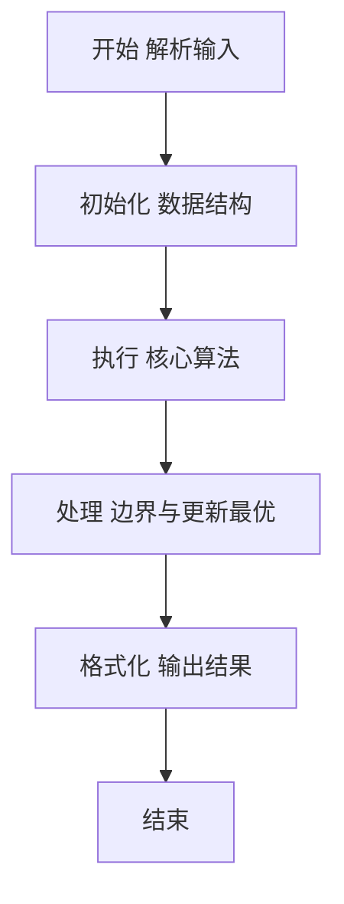
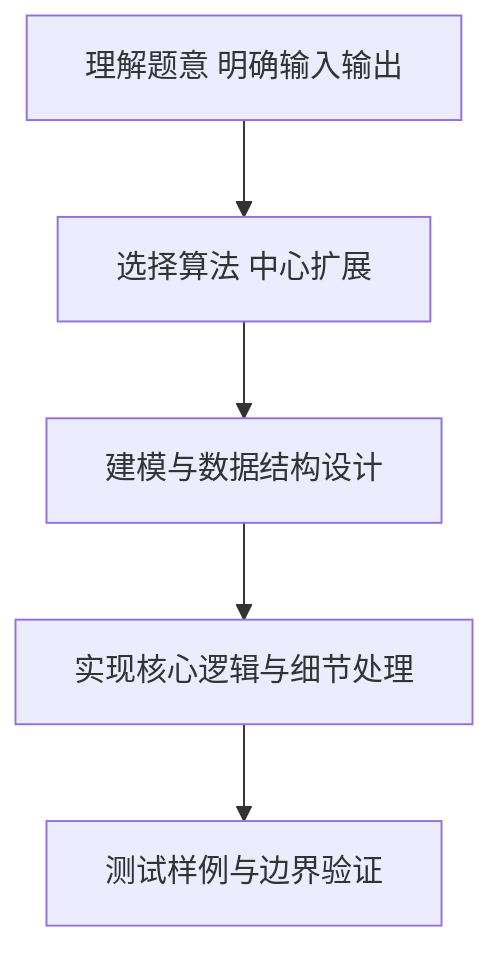

# L2-008 - 最长对称子串（25 分）

- **时间限制**: 200 ms
- **内存限制**: 65536 KB
- **代码长度限制**: 16 KB

---

## 题目描述


对给定的字符串，本题要求你输出最长对称子串的长度。例如，给定`Is PAT&TAP symmetric?`，最长对称子串为`s PAT&TAP s`，于是你应该输出11。

### 输入格式:

输入在一行中给出长度不超过1000的非空字符串。

### 输出格式:

在一行中输出最长对称子串的长度。

### 输入样例:
```in
Is PAT&TAP symmetric?
```

### 输出样例:
```out
11
```

## 示例

### 示例 1

**输入:**
```
Is PAT&TAP symmetric?
```

**输出:**
```
11
```

### 解题思路

本题要求根据给定的输入数据完成相应的判定或计算任务，以“L2-008_最长对称子串”为核心，需在约束条件下构造出满足题意的结果。以 Lua 实现为参照，其实现原理概括为：枚举每个中心并向两侧扩展，分别处理奇数和偶数长度回文。

在算法选型上，针对题目数据规模与结构特征，选择了 中心扩展 等关键技术。Lua 代码通过紧凑的表结构与迭代逻辑，将原理转化为可执行流程，既保证了正确性也兼顾了简洁性。例如代码中对输入的逐行解析、数据结构的初始化与核心循环的组织均体现了该思路。

关键在于细节处理与鲁棒性：如对空输入、重复键、边界值的正确处理，以及输出格式的精确控制。整体时间复杂度约为 O(N log N) 或 O(N)，空间复杂度 O(N)，满足题目限制（通常 1e5 级别可通过）。 结合 Lua 的快速 I/O 与表操作，能够在限制时间内完成判定并输出结果。
### 代码流程说明

1. 输入解析与预处理：按题面格式读取全部数据，将数值、字符串或图结构存入 Lua 表，必要时建立映射（如地址→节点、编号→集合）并处理边界空行。
2. 数据建模与初始化：将输入转化为内部模型（图、树、链表或数组），初始化距离、访问标记、计数器等辅助数组。
3. 中心扩展判定：枚举每个中心向两侧扩展，分别处理奇偶回文，更新最长长度，整个过程为 O(N²) 最坏但常数小。
4. 结果输出与格式化：按要求的格式拼接输出（如保留两位小数、按编号排序、输出路径或分类结果），注意末尾空格与换行控制，确保与样例一致。

### 代码实现

```lua
-- 实现原理：枚举每个中心并向两侧扩展，分别处理奇数和偶数长度回文。
local s=io.read("*l"); local best=1; for c=1,#s do local l,r=c,c; while l>=1 and r<=#s and s:sub(l,l)==s:sub(r,r) do best=math.max(best,r-l+1); l,r=l-1,r+1 end; l,r=c,c+1; while l>=1 and r<=#s and s:sub(l,l)==s:sub(r,r) do best=math.max(best,r-l+1); l,r=l-1,r+1 end end; print(best)
```

### 代码流程图



### 解题流程图



