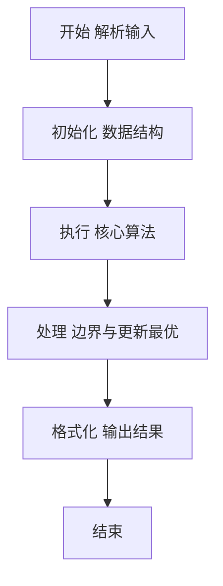
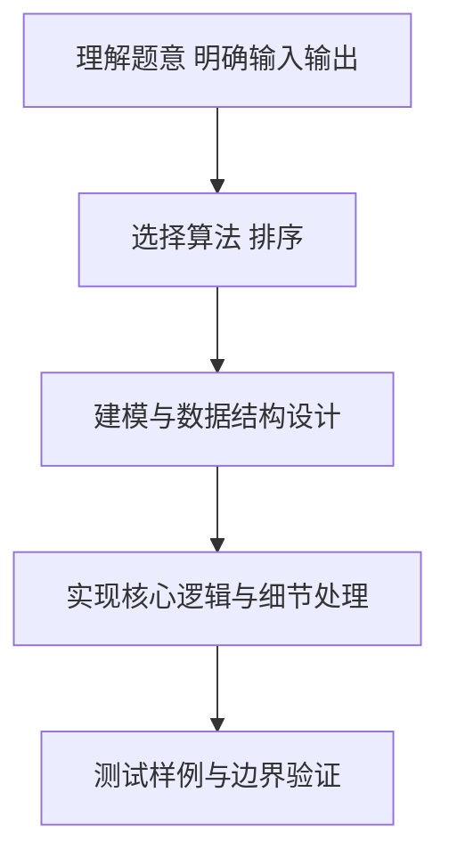

# L2-009 - 抢红包（25 分）

- **时间限制**: 300 ms
- **内存限制**: 65536 KB
- **代码长度限制**: 16 KB

---

## 题目描述


没有人没抢过红包吧…… 这里给出$N$个人之间互相发红包、抢红包的记录，请你统计一下他们抢红包的收获。

### 输入格式:

输入第一行给出一个正整数$N$（$\le 10^4$），即参与发红包和抢红包的总人数，则这些人从1到$N$编号。随后$N$行，第$i$行给出编号为$i$的人发红包的记录，格式如下：

$K\quad N_1\quad P_1\quad \cdots\quad N_K\quad P_K$

其中$K$（$0 \le K \le 20$）是发出去的红包个数，$N_i$是抢到红包的人的编号，$P_i$（$>0$）是其抢到的红包金额（以分为单位）。注意：对于同一个人发出的红包，每人最多只能抢1次，不能重复抢。

### 输出格式:

按照收入金额从高到低的递减顺序输出每个人的编号和收入金额（以元为单位，输出小数点后2位）。每个人的信息占一行，两数字间有1个空格。如果收入金额有并列，则按抢到红包的个数递减输出；如果还有并列，则按个人编号递增输出。

### 输入样例:
```in
10
3 2 22 10 58 8 125
5 1 345 3 211 5 233 7 13 8 101
1 7 8800
2 1 1000 2 1000
2 4 250 10 320
6 5 11 9 22 8 33 7 44 10 55 4 2
1 3 8800
2 1 23 2 123
1 8 250
4 2 121 4 516 7 112 9 10
```

### 输出样例:
```out
1 11.63
2 3.63
8 3.63
3 2.11
7 1.69
6 -1.67
9 -2.18
10 -3.26
5 -3.26
4 -12.32
```

## 示例

### 示例 1

**输入:**
```
10
3 2 22 10 58 8 125
5 1 345 3 211 5 233 7 13 8 101
1 7 8800
2 1 1000 2 1000
2 4 250 10 320
6 5 11 9 22 8 33 7 44 10 55 4 2
1 3 8800
2 1 23 2 123
1 8 250
4 2 121 4 516 7 112 9 10
```

**输出:**
```
1 11.63
2 3.63
8 3.63
3 2.11
7 1.69
6 -1.67
9 -2.18
10 -3.26
5 -3.26
4 -12.32
```

### 解题思路

本题要求根据给定的输入数据完成相应的判定或计算任务，以“L2-009_抢红包”为核心，需在约束条件下构造出满足题意的结果。以 Lua 实现为参照，其实现原理概括为：发红包者扣除金额，抢到者增加金额并计一次；按余额、次数、编号排序。

在算法选型上，针对题目数据规模与结构特征，选择了 排序 等关键技术。Lua 代码通过紧凑的表结构与迭代逻辑，将原理转化为可执行流程，既保证了正确性也兼顾了简洁性。例如代码中对输入的逐行解析、数据结构的初始化与核心循环的组织均体现了该思路。

关键在于细节处理与鲁棒性：如对空输入、重复键、边界值的正确处理，以及输出格式的精确控制。整体时间复杂度约为 O(N log N) 或 O(N)，空间复杂度 O(N)，满足题目限制（通常 1e5 级别可通过）。 结合 Lua 的快速 I/O 与表操作，能够在限制时间内完成判定并输出结果。
### 代码流程说明

1. 输入解析与预处理：按题面格式读取全部数据，将数值、字符串或图结构存入 Lua 表，必要时建立映射（如地址→节点、编号→集合）并处理边界空行。
2. 数据组织与排序：对关键对象按指定关键字排序（如按单价、按得分、按字典序），或构建哈希表/集合以支持 O(1) 判重与统计。
3. 核心逻辑处理：依据“发红包者扣除金额，抢到者增加金额并计一次；按余额、次数、编号排序。…”的原理进行迭代计算，完成题面要求的判定、统计或构造任务，并在循环中处理相等、冲突等特殊分支。
4. 结果输出与格式化：按要求的格式拼接输出（如保留两位小数、按编号排序、输出路径或分类结果），注意末尾空格与换行控制，确保与样例一致。

### 代码实现

```lua
-- 实现原理：发红包者扣除金额，抢到者增加金额并计一次；按余额、次数、编号排序。
local n=tonumber(io.read("*l")); local money,count={},{}; for i=1,n do money[i],count[i]=0,0 end
for sender=1,n do local v={}; for x in io.read("*l"):gmatch("%d+") do v[#v+1]=tonumber(x) end; for j=1,v[1] do local to,amount=v[2*j],v[2*j+1]; money[sender]=money[sender]-amount; money[to]=money[to]+amount; count[to]=count[to]+1 end end
local ids={}; for i=1,n do ids[i]=i end; table.sort(ids,function(a,b) return money[a]~=money[b] and money[a]>money[b] or (count[a]~=count[b] and count[a]>count[b] or a<b) end); for _,i in ipairs(ids) do print(string.format("%d %.2f",i,money[i]/100)) end
```

### 代码流程图



### 解题流程图



