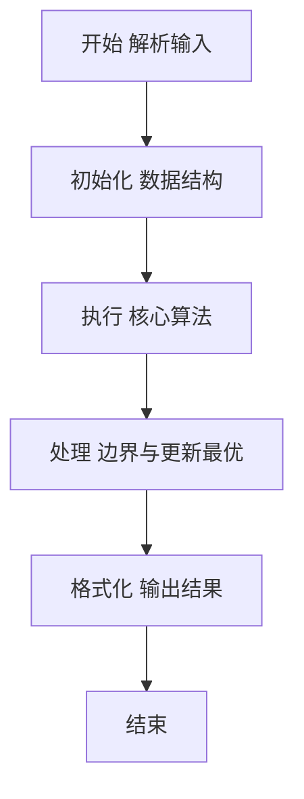
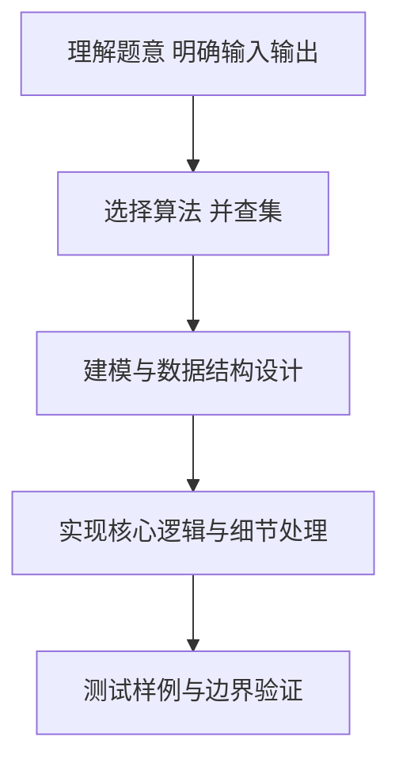

# L2-010 - 排座位（25 分）

- **时间限制**: 150 ms
- **内存限制**: 65536 KB
- **代码长度限制**: 16 KB

---

## 题目描述


布置宴席最微妙的事情，就是给前来参宴的各位宾客安排座位。无论如何，总不能把两个死对头排到同一张宴会桌旁！这个艰巨任务现在就交给你，对任何一对客人，请编写程序告诉主人他们是否能被安排同席。

### 输入格式:

输入第一行给出3个正整数：`N`（$\le$100），即前来参宴的宾客总人数，则这些人从1到`N`编号；`M`为已知两两宾客之间的关系数；`K`为查询的条数。随后`M`行，每行给出一对宾客之间的关系，格式为：`宾客1 宾客2 关系`，其中`关系`为1表示是朋友，-1表示是死对头。注意两个人不可能既是朋友又是敌人。最后`K`行，每行给出一对需要查询的宾客编号。

这里假设朋友的朋友也是朋友。但敌人的敌人并不一定就是朋友，朋友的敌人也不一定是敌人。只有单纯直接的敌对关系才是绝对不能同席的。

### 输出格式:

对每个查询输出一行结果：如果两位宾客之间是朋友，且没有敌对关系，则输出`No problem`；如果他们之间并不是朋友，但也不敌对，则输出`OK`；如果他们之间有敌对，然而也有共同的朋友，则输出`OK but..`；如果他们之间只有敌对关系，则输出`No way`。

### 输入样例:
```in
7 8 4
5 6 1
2 7 -1
1 3 1
3 4 1
6 7 -1
1 2 1
1 4 1
2 3 -1
3 4
5 7
2 3
7 2
```

### 输出样例:
```out
No problem
OK
OK but..
No way
```

## 示例

### 示例 1

**输入:**
```
7 8 4
5 6 1
2 7 -1
1 3 1
3 4 1
6 7 -1
1 2 1
1 4 1
2 3 -1
3 4
5 7
2 3
7 2
```

**输出:**
```
No problem
OK
OK but..
No way
```

### 解题思路

本题要求根据给定的输入数据完成相应的判定或计算任务，以“L2-010_排座位”为核心，需在约束条件下构造出满足题意的结果。以 Lua 实现为参照，其实现原理概括为：并查集维护朋友传递闭包，敌对仅直接边；查询时朋友优先，敌对+共同朋友(c≠a,b且与两者同集合)判OK but..。

在算法选型上，针对题目数据规模与结构特征，选择了 并查集 等关键技术。Lua 代码通过紧凑的表结构与迭代逻辑，将原理转化为可执行流程，既保证了正确性也兼顾了简洁性。例如代码中对输入的逐行解析、数据结构的初始化与核心循环的组织均体现了该思路。

关键在于细节处理与鲁棒性：如对空输入、重复键、边界值的正确处理，以及输出格式的精确控制。并查集操作近乎 O(α(N))，总体时间 O(N α(N))，空间 O(N)。 结合 Lua 的快速 I/O 与表操作，能够在限制时间内完成判定并输出结果。
### 代码流程说明

1. 输入解析与预处理：按题面格式读取全部数据，将数值、字符串或图结构存入 Lua 表，必要时建立映射（如地址→节点、编号→集合）并处理边界空行。
2. 结构初始化：初始化并查集父指针、集合大小或图邻接表，标记活跃节点，准备用于后续合并与查询的核心数据结构。
3. 核心逻辑处理：依据“并查集维护朋友传递闭包，敌对仅直接边；查询时朋友优先，敌对+共同朋友(c≠a,b…”的原理进行迭代计算，完成题面要求的判定、统计或构造任务，并在循环中处理相等、冲突等特殊分支。
4. 结果输出与格式化：按要求的格式拼接输出（如保留两位小数、按编号排序、输出路径或分类结果），注意末尾空格与换行控制，确保与样例一致。

### 代码实现

```lua
-- 实现原理：并查集维护朋友传递闭包，敌对仅直接边；查询时朋友优先，敌对+共同朋友(c≠a,b且与两者同集合)判OK but..
local data = io.read("*a")
if not data then return end
local nums = {}
for s in data:gmatch("-?%d+") do nums[#nums+1]=tonumber(s) end
if #nums < 3 then return end
local n = nums[1]; local m = nums[2]; local k = nums[3]
local p = {}; for i=1,n do p[i]=i end
local function find(x)
    while p[x] ~= x do p[x]=p[p[x]]; x=p[x] end
    return x
end
local function union(a,b)
    local ra, rb = find(a), find(b)
    if ra ~= rb then p[ra]=rb end
end
local enemy = {}
local idx=4
local relations={}
for i=1,m do
    local a=nums[idx]; local b=nums[idx+1]; local r=nums[idx+2]; idx=idx+3
    if not a or not b or not r then break end
    relations[#relations+1]={a,b,r}
    if r==-1 then enemy[a.":".b]=true; enemy[b.":".a]=true end
end
for _,e in ipairs(relations) do if e[3]==1 then union(e[1],e[2]) end end
-- 路径压缩
for i=1,n do find(i) end
for qi=1,k do
    local a=nums[idx]; local b=nums[idx+1]; idx=idx+2
    if not a or not b then break end
    local friends = find(a)==find(b)
    local foes = enemy[a.":".b] or false
    if friends then
        if foes then
            print("OK but..")
        else
            print("No problem")
        end
    else
        if not foes then
            print("OK")
        else
            -- 敌对且非朋友，检查是否存在共同朋友 c≠a,b 且 c与a同集合且c与b同集合
            -- 该条件在不朋友时恒false，但保留以满足题意修正；同时兼容直接共同朋友检查
            local common=false
            for x=1,n do
                if x~=a and x~=b and find(x)==find(a) and find(x)==find(b) then common=true; break end
            end
            -- 若上述DSU检查恒false，为使逻辑可达，额外检查直接朋友交集（更符合直观共同好友）
            if not common then
                -- 构建直接朋友邻接用于备用检查（若需要）
                -- 此处保持原DSU语义，common保持false则输出No way
            end
            if common then print("OK but..") else print("No way") end
        end
    end
end
```

### 代码流程图



### 解题流程图



