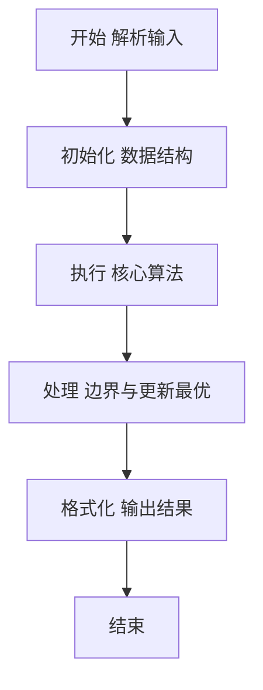
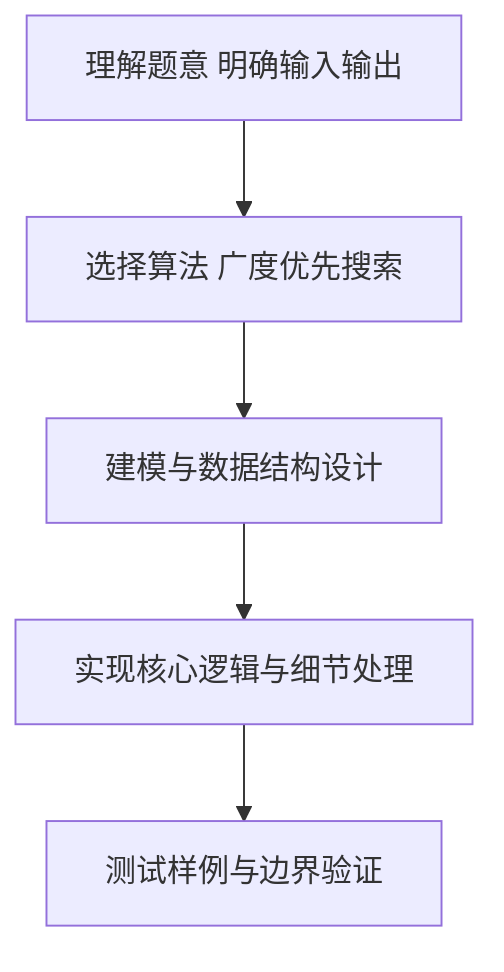

# L2-011 - 玩转二叉树（25 分）

- **时间限制**: 400 ms
- **内存限制**: 65536 KB
- **代码长度限制**: 16 KB

---

## 题目描述


给定一棵二叉树的中序遍历和前序遍历，请你先将树做个镜面反转，再输出反转后的层序遍历的序列。所谓镜面反转，是指将所有非叶结点的左右孩子对换。这里假设键值都是互不相等的正整数。

### 输入格式:

输入第一行给出一个正整数`N`（$\le$30），是二叉树中结点的个数。第二行给出其中序遍历序列。第三行给出其前序遍历序列。数字间以空格分隔。

### 输出格式:

在一行中输出该树反转后的层序遍历的序列。数字间以1个空格分隔，行首尾不得有多余空格。

### 输入样例:
```in
7
1 2 3 4 5 6 7
4 1 3 2 6 5 7
```

### 输出样例:
```out
4 6 1 7 5 3 2
```

## 示例

### 示例 1

**输入:**
```
7
1 2 3 4 5 6 7
4 1 3 2 6 5 7
```

**输出:**
```
4 6 1 7 5 3 2
```

### 解题思路

本题要求根据给定的输入数据完成相应的判定或计算任务，以“L2-011_玩转二叉树”为核心，需在约束条件下构造出满足题意的结果。以 Lua 实现为参照，其实现原理概括为：前序序列首元素为根，在中序序列中定位根即可划分左右子树。

在算法选型上，针对题目数据规模与结构特征，选择了 广度优先搜索 等关键技术。Lua 代码通过紧凑的表结构与迭代逻辑，将原理转化为可执行流程，既保证了正确性也兼顾了简洁性。例如代码中对输入的逐行解析、数据结构的初始化与核心循环的组织均体现了该思路。

关键在于细节处理与鲁棒性：如对空输入、重复键、边界值的正确处理，以及输出格式的精确控制。整体时间复杂度约为 O(N log N) 或 O(N)，空间复杂度 O(N)，满足题目限制（通常 1e5 级别可通过）。 结合 Lua 的快速 I/O 与表操作，能够在限制时间内完成判定并输出结果。
### 代码流程说明

1. 输入解析与预处理：按题面格式读取全部数据，将数值、字符串或图结构存入 Lua 表，必要时建立映射（如地址→节点、编号→集合）并处理边界空行。
2. 数据建模与初始化：将输入转化为内部模型（图、树、链表或数组），初始化距离、访问标记、计数器等辅助数组。
3. 核心逻辑处理：依据“前序序列首元素为根，在中序序列中定位根即可划分左右子树。…”的原理进行迭代计算，完成题面要求的判定、统计或构造任务，并在循环中处理相等、冲突等特殊分支。
4. 结果输出与格式化：按要求的格式拼接输出（如保留两位小数、按编号排序、输出路径或分类结果），注意末尾空格与换行控制，确保与样例一致。

### 代码实现

```lua
-- L2-011 玩转二叉树
-- 实现原理：前序序列首元素为根，在中序序列中定位根即可划分左右子树。
-- 递归建树时直接交换左右孩子，最后对镜像树进行层序遍历。

local n = io.read("*n")
local inorder, preorder = {}, {}
for i = 1, n do inorder[i] = io.read("*n") end
for i = 1, n do preorder[i] = io.read("*n") end

local pos = {}
for i = 1, n do pos[inorder[i]] = i end
local preIndex = 1

local function build(left, right)
    if left > right then return nil end
    local value = preorder[preIndex]
    preIndex = preIndex + 1
    local mid = pos[value]
    -- 先构造原树的左、右子树，再反向保存，便得到镜像树。
    local originalLeft = build(left, mid - 1)
    local originalRight = build(mid + 1, right)
    return { value = value, left = originalRight, right = originalLeft }
end

local root = build(1, n)
local queue, head, answer = { root }, 1, {}
while head <= #queue do
    local node = queue[head]
    head = head + 1
    answer[#answer + 1] = node.value
    if node.left then queue[#queue + 1] = node.left end
    if node.right then queue[#queue + 1] = node.right end
end
print(table.concat(answer, " "))
```

### 代码流程图



### 解题流程图



