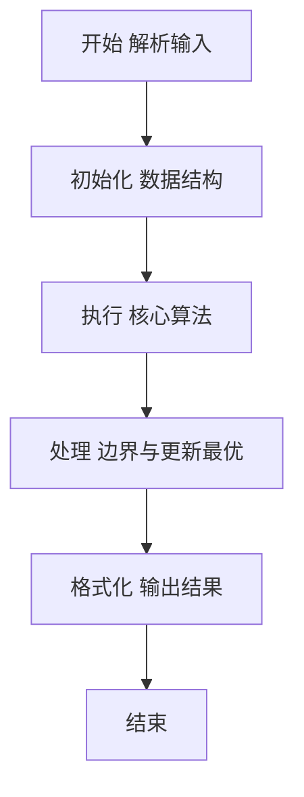
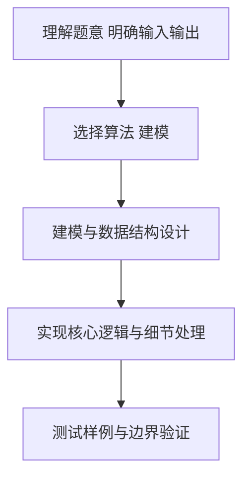

# L2-012 - 关于堆的判断（25 分）

- **时间限制**: 400 ms
- **内存限制**: 65536 KB
- **代码长度限制**: 16 KB

---

## 题目描述


将一系列给定数字顺序插入一个初始为空的小顶堆`H[]`。随后判断一系列相关命题是否为真。命题分下列几种：

- `x is the root`：`x`是根结点；
- `x and y are siblings`：`x`和`y`是兄弟结点；
- `x is the parent of y`：`x`是`y`的父结点；
- `x is a child of y`：`x`是`y`的一个子结点。

### 输入格式:

每组测试第1行包含2个正整数`N`（$$\le$$ 1000）和`M`（$$\le$$ 20），分别是插入元素的个数、以及需要判断的命题数。下一行给出区间$$[-10000, 10000]$$内的`N`个要被插入一个初始为空的小顶堆的整数。之后`M`行，每行给出一个命题。题目保证命题中的结点键值都是存在的。

### 输出格式:

对输入的每个命题，如果其为真，则在一行中输出`T`，否则输出`F`。

### 输入样例:
```in
5 4
46 23 26 24 10
24 is the root
26 and 23 are siblings
46 is the parent of 23
23 is a child of 10
```

### 输出样例:
```out
F
T
F
T
```

## 示例

### 示例 1

**输入:**
```
5 4
46 23 26 24 10
24 is the root
26 and 23 are siblings
46 is the parent of 23
23 is a child of 10
```

**输出:**
```
F
T
F
T
```

### 解题思路

本题要求根据给定的输入数据完成相应的判定或计算任务，以“L2-012_关于堆的判断”为核心，需在约束条件下构造出满足题意的结果。以 Lua 实现为参照，其实现原理概括为：按插入顺序维护小顶堆，并记录每个数在堆数组中的下标。

在算法选型上，代码遵循“先解析、再建模、后计算”的一般套路，将输入转化为便于处理的内部表示，再通过线性或近线性扫描完成核心判定。实现中注重边界条件与格式细节，以确保在 PTA 判题环境下稳定通过。

关键在于细节处理与鲁棒性：如对空输入、重复键、边界值的正确处理，以及输出格式的精确控制。整体时间复杂度约为 O(N log N) 或 O(N)，空间复杂度 O(N)，满足题目限制（通常 1e5 级别可通过）。 结合 Lua 的快速 I/O 与表操作，能够在限制时间内完成判定并输出结果。
### 代码流程说明

1. 输入解析与预处理：按题面格式读取全部数据，将数值、字符串或图结构存入 Lua 表，必要时建立映射（如地址→节点、编号→集合）并处理边界空行。
2. 数据建模与初始化：将输入转化为内部模型（图、树、链表或数组），初始化距离、访问标记、计数器等辅助数组。
3. 核心逻辑处理：依据“按插入顺序维护小顶堆，并记录每个数在堆数组中的下标。…”的原理进行迭代计算，完成题面要求的判定、统计或构造任务，并在循环中处理相等、冲突等特殊分支。
4. 结果输出与格式化：按要求的格式拼接输出（如保留两位小数、按编号排序、输出路径或分类结果），注意末尾空格与换行控制，确保与样例一致。

### 代码实现

```lua
-- L2-012 关于堆的判断
-- 实现原理：按插入顺序维护小顶堆，并记录每个数在堆数组中的下标。
-- 每条英文断言转化为下标间的父子、兄弟或根关系即可判断。

local n, m = io.read("*n"), io.read("*n")
local heap, index = {}, {}

local function push(x)
    local i = #heap + 1
    heap[i] = x
    while i > 1 and heap[math.floor(i / 2)] > x do
        heap[i] = heap[math.floor(i / 2)]
        index[heap[i]] = i
        i = math.floor(i / 2)
    end
    heap[i] = x
    index[x] = i
end

for _ = 1, n do push(io.read("*n")) end
io.read("*l") -- 读掉最后一个数字所在行的换行

for _ = 1, m do
    local s = io.read("*l")
    local a, b = s:match("^(-?%d+) and (-?%d+) are siblings$")
    local ok
    if a then
        a, b = tonumber(a), tonumber(b)
        ok = index[a] and index[b] and math.floor(index[a] / 2) == math.floor(index[b] / 2)
            and index[a] ~= index[b]
    else
        a = s:match("^(-?%d+) is the root$")
        if a then
            ok = index[tonumber(a)] == 1
        else
            a, b = s:match("^(-?%d+) is the parent of (-?%d+)$")
            if a then
                ok = index[tonumber(a)] and index[tonumber(b)]
                    and index[tonumber(b)] == index[tonumber(a)] * 2
                    or (index[tonumber(a)] and index[tonumber(b)]
                        and index[tonumber(b)] == index[tonumber(a)] * 2 + 1)
            else
                a, b = s:match("^(-?%d+) is a child of (-?%d+)$")
                a, b = tonumber(a), tonumber(b)
                ok = index[a] and index[b] and math.floor(index[a] / 2) == index[b]
            end
        end
    end
    print(ok and "T" or "F")
end
```

### 代码流程图



### 解题流程图



