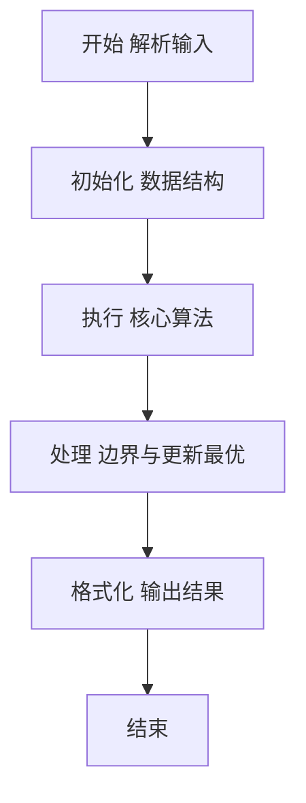
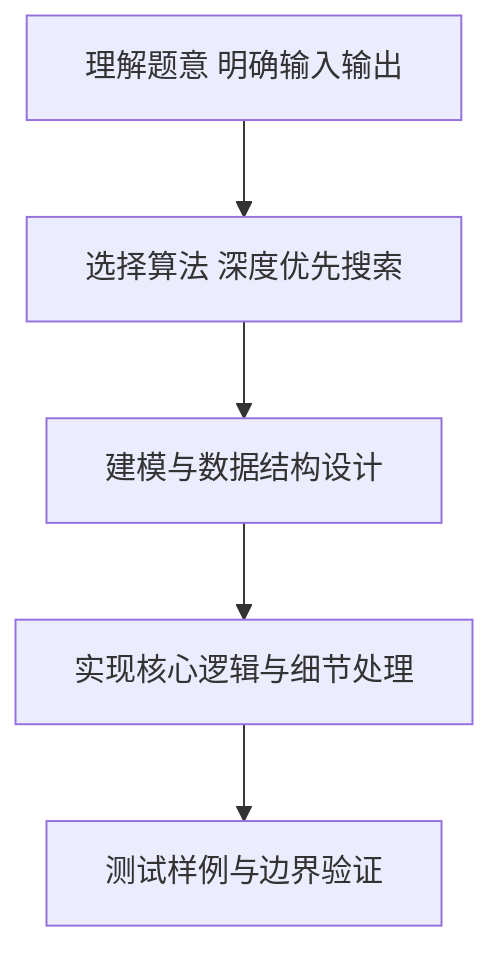

# L2-013 - 红色警报（25 分）

- **时间限制**: 400 ms
- **内存限制**: 65536 KB
- **代码长度限制**: 16 KB

---

## 题目描述


战争中保持各个城市间的连通性非常重要。本题要求你编写一个报警程序，当失去一个城市导致国家被分裂为多个无法连通的区域时，就发出红色警报。注意：若该国本来就不完全连通，是分裂的k个区域，而失去一个城市并不改变其他城市之间的连通性，则不要发出警报。

### 输入格式:

输入在第一行给出两个整数`N`（0 $$<$$ `N` $$\le$$ 500）和`M`（$$\le$$ 5000），分别为城市个数（于是默认城市从0到`N`-1编号）和连接两城市的通路条数。随后`M`行，每行给出一条通路所连接的两个城市的编号，其间以1个空格分隔。在城市信息之后给出被攻占的信息，即一个正整数`K`和随后的`K`个被攻占的城市的编号。

注意：输入保证给出的被攻占的城市编号都是合法的且无重复，但并不保证给出的通路没有重复。

### 输出格式:

对每个被攻占的城市，如果它会改变整个国家的连通性，则输出`Red Alert: City k is lost!`，其中`k`是该城市的编号；否则只输出`City k is lost.`即可。如果该国失去了最后一个城市，则增加一行输出`Game Over.`。

### 输入样例:
```in
5 4
0 1
1 3
3 0
0 4
5
1 2 0 4 3
```

### 输出样例:
```out
City 1 is lost.
City 2 is lost.
Red Alert: City 0 is lost!
City 4 is lost.
City 3 is lost.
Game Over.
```

## 示例

### 示例 1

**输入:**
```
5 4
0 1
1 3
3 0
0 4
5
1 2 0 4 3
```

**输出:**
```
City 1 is lost.
City 2 is lost.
Red Alert: City 0 is lost!
City 4 is lost.
City 3 is lost.
Game Over.
```

### 解题思路

本题要求根据给定的输入数据完成相应的判定或计算任务，以“L2-013_红色警报”为核心，需在约束条件下构造出满足题意的结果。以 Lua 实现为参照，其实现原理概括为：每次城市失守后，用 DFS 统计尚存城市构成的连通块数量。

在算法选型上，针对题目数据规模与结构特征，选择了 深度优先搜索 等关键技术。Lua 代码通过紧凑的表结构与迭代逻辑，将原理转化为可执行流程，既保证了正确性也兼顾了简洁性。例如代码中对输入的逐行解析、数据结构的初始化与核心循环的组织均体现了该思路。

关键在于细节处理与鲁棒性：如对空输入、重复键、边界值的正确处理，以及输出格式的精确控制。整体时间复杂度约为 O(N log N) 或 O(N)，空间复杂度 O(N)，满足题目限制（通常 1e5 级别可通过）。 结合 Lua 的快速 I/O 与表操作，能够在限制时间内完成判定并输出结果。
### 代码流程说明

1. 输入解析与预处理：按题面格式读取全部数据，将数值、字符串或图结构存入 Lua 表，必要时建立映射（如地址→节点、编号→集合）并处理边界空行。
2. 辅助结构初始化：初始化栈/队列等辅助容器，设定容量限制与指针位置，为后续模拟操作准备状态。
3. 搜索与统计：通过 DFS/BFS 遍历图或树结构，统计连通分量、深度或路径信息，并在遍历中更新最优解。
4. 结果输出与格式化：按要求的格式拼接输出（如保留两位小数、按编号排序、输出路径或分类结果），注意末尾空格与换行控制，确保与样例一致。

### 代码实现

```lua
-- L2-013 红色警报
-- 实现原理：每次城市失守后，用 DFS 统计尚存城市构成的连通块数量。
-- 若连通块数增加，说明这座城市是当前图的割点，需要发出红色警报。

local n, m = io.read("*n"), io.read("*n")
local graph = {}
for i = 0, n - 1 do graph[i] = {} end
for _ = 1, m do
    local a, b = io.read("*n"), io.read("*n")
    graph[a][#graph[a] + 1] = b
    graph[b][#graph[b] + 1] = a
end
local k = io.read("*n")
local attacks = {}
for i = 1, k do attacks[i] = io.read("*n") end

local alive = {}
for i = 0, n - 1 do alive[i] = true end

local function components()
    local seen, count = {}, 0
    for start = 0, n - 1 do
        if alive[start] and not seen[start] then
            count = count + 1
            local stack = { start }
            seen[start] = true
            while #stack > 0 do
                local u = table.remove(stack)
                for _, v in ipairs(graph[u]) do
                    if alive[v] and not seen[v] then
                        seen[v] = true
                        stack[#stack + 1] = v
                    end
                end
            end
        end
    end
    return count
end

local remain = n
for _, city in ipairs(attacks) do
    local before = components()
    alive[city] = false
    remain = remain - 1
    local after = components()
    if after > before then
        print("Red Alert: City " . city . " is lost!")
    else
        print("City " . city . " is lost.")
    end
    if remain == 0 then print("Game Over.") end
end
```

### 代码流程图



### 解题流程图



