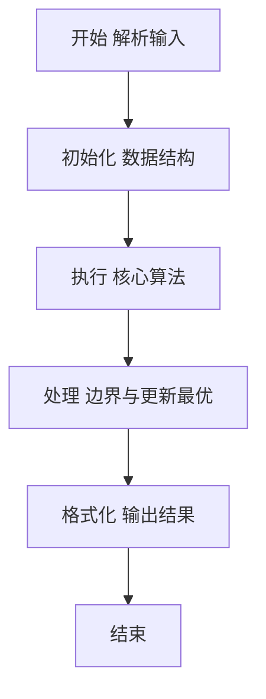
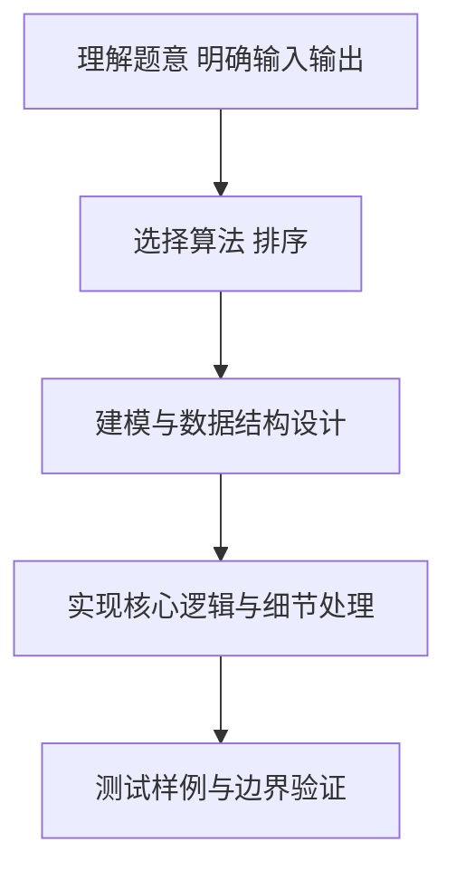

# L2-014 - 列车调度（25 分）

- **时间限制**: 300 ms
- **内存限制**: 65536 KB
- **代码长度限制**: 16 KB

---

## 题目描述


火车站的列车调度铁轨的结构如下图所示。


两端分别是一条入口（Entrance）轨道和一条出口（Exit）轨道，它们之间有`N`条平行的轨道。每趟列车从入口可以选择任意一条轨道进入，最后从出口离开。在图中有9趟列车，在入口处按照{8，4，2，5，3，9，1，6，7}的顺序排队等待进入。如果要求它们必须按序号递减的顺序从出口离开，则至少需要多少条平行铁轨用于调度？

### 输入格式:

输入第一行给出一个整数`N` (2 $\le$ `N` $\le 10^5$)，下一行给出从1到`N`的整数序号的一个重排列。数字间以空格分隔。

### 输出格式:

在一行中输出可以将输入的列车按序号递减的顺序调离所需要的最少的铁轨条数。

### 输入样例:
```in
9
8 4 2 5 3 9 1 6 7
```

### 输出样例:
```out
4
```

## 示例

### 示例 1

**输入:**
```
9
8 4 2 5 3 9 1 6 7
```

**输出:**
```
4
```

### 解题思路

本题要求根据给定的输入数据完成相应的判定或计算任务，以“L2-014_列车调度”为核心，需在约束条件下构造出满足题意的结果。以 Lua 实现为参照，其实现原理概括为：一条调度轨中的到达编号必须递减，因此最少轨道数等于原序列。

在算法选型上，针对题目数据规模与结构特征，选择了 排序 等关键技术。Lua 代码通过紧凑的表结构与迭代逻辑，将原理转化为可执行流程，既保证了正确性也兼顾了简洁性。例如代码中对输入的逐行解析、数据结构的初始化与核心循环的组织均体现了该思路。

关键在于细节处理与鲁棒性：如对空输入、重复键、边界值的正确处理，以及输出格式的精确控制。时间复杂度主要由排序或二分决定，约为 O(N log N)，空间为 O(N)。 结合 Lua 的快速 I/O 与表操作，能够在限制时间内完成判定并输出结果。
### 代码流程说明

1. 输入解析与预处理：按题面格式读取全部数据，将数值、字符串或图结构存入 Lua 表，必要时建立映射（如地址→节点、编号→集合）并处理边界空行。
2. 数据组织与排序：对关键对象按指定关键字排序（如按单价、按得分、按字典序），或构建哈希表/集合以支持 O(1) 判重与统计。
3. 核心逻辑处理：依据“一条调度轨中的到达编号必须递减，因此最少轨道数等于原序列…”的原理进行迭代计算，完成题面要求的判定、统计或构造任务，并在循环中处理相等、冲突等特殊分支。
4. 结果输出与格式化：按要求的格式拼接输出（如保留两位小数、按编号排序、输出路径或分类结果），注意末尾空格与换行控制，确保与样例一致。

### 代码实现

```lua
-- L2-014 列车调度
-- 实现原理：一条调度轨中的到达编号必须递减，因此最少轨道数等于原序列
-- 的最长严格递增子序列长度。用 patience sorting 的 tails 数组在 O(N log N) 求值。

local n = io.read("*n")
local tails = {}
for _ = 1, n do
    local x = io.read("*n")
    local l, r = 1, #tails
    while l <= r do
        local mid = math.floor((l + r) / 2)
        if tails[mid] >= x then r = mid - 1 else l = mid + 1 end
    end
    tails[l] = x
end
print(#tails)
```

### 代码流程图



### 解题流程图



