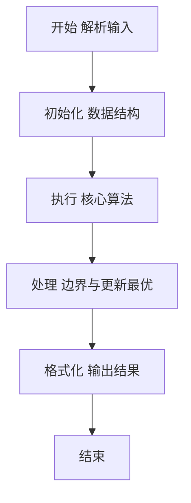
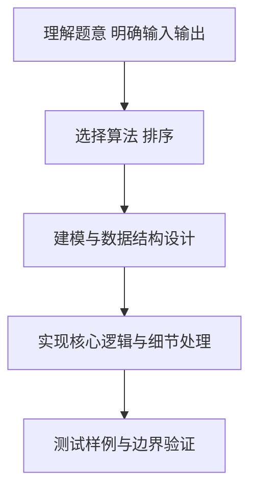

# L2-015 - 互评成绩（25 分）

- **时间限制**: 300 ms
- **内存限制**: 65536 KB
- **代码长度限制**: 16 KB

---

## 题目描述


学生互评作业的简单规则是这样定的：每个人的作业会被`k`个同学评审，得到`k`个成绩。系统需要去掉一个最高分和一个最低分，将剩下的分数取平均，就得到这个学生的最后成绩。本题就要求你编写这个互评系统的算分模块。

### 输入格式:

输入第一行给出3个正整数`N`（3 $$<$$ `N` $$\le 10^4$$，学生总数）、`k`（3 $$\le$$ `k` $$\le$$ 10，每份作业的评审数）、`M`（$$\le$$ 20，需要输出的学生数）。随后`N`行，每行给出一份作业得到的`k`个评审成绩（在区间[0, 100]内），其间以空格分隔。

### 输出格式:

按非递减顺序输出最后得分最高的`M`个成绩，保留小数点后3位。分数间有1个空格，行首尾不得有多余空格。

### 输入样例:
```in
6 5 3
88 90 85 99 60
67 60 80 76 70
90 93 96 99 99
78 65 77 70 72
88 88 88 88 88
55 55 55 55 55
```

### 输出样例:
```out
87.667 88.000 96.000
```

## 示例

### 示例 1

**输入:**
```
6 5 3
88 90 85 99 60
67 60 80 76 70
90 93 96 99 99
78 65 77 70 72
88 88 88 88 88
55 55 55 55 55
```

**输出:**
```
87.667 88.000 96.000
```

### 解题思路

本题要求根据给定的输入数据完成相应的判定或计算任务，以“L2-015_互评成绩”为核心，需在约束条件下构造出满足题意的结果。以 Lua 实现为参照，其实现原理概括为：每位选手的 K 个评分排序后去掉一个最高分和一个最低分，。

在算法选型上，针对题目数据规模与结构特征，选择了 排序 等关键技术。Lua 代码通过紧凑的表结构与迭代逻辑，将原理转化为可执行流程，既保证了正确性也兼顾了简洁性。例如代码中对输入的逐行解析、数据结构的初始化与核心循环的组织均体现了该思路。

关键在于细节处理与鲁棒性：如对空输入、重复键、边界值的正确处理，以及输出格式的精确控制。整体时间复杂度约为 O(N log N) 或 O(N)，空间复杂度 O(N)，满足题目限制（通常 1e5 级别可通过）。 结合 Lua 的快速 I/O 与表操作，能够在限制时间内完成判定并输出结果。
### 代码流程说明

1. 输入解析与预处理：按题面格式读取全部数据，将数值、字符串或图结构存入 Lua 表，必要时建立映射（如地址→节点、编号→集合）并处理边界空行。
2. 数据组织与排序：对关键对象按指定关键字排序（如按单价、按得分、按字典序），或构建哈希表/集合以支持 O(1) 判重与统计。
3. 核心逻辑处理：依据“每位选手的 K 个评分排序后去掉一个最高分和一个最低分，…”的原理进行迭代计算，完成题面要求的判定、统计或构造任务，并在循环中处理相等、冲突等特殊分支。
4. 结果输出与格式化：按要求的格式拼接输出（如保留两位小数、按编号排序、输出路径或分类结果），注意末尾空格与换行控制，确保与样例一致。

### 代码实现

```lua
-- L2-015 互评成绩
-- 实现原理：每位选手的 K 个评分排序后去掉一个最高分和一个最低分，
-- 对中间 K-2 个分数求平均；将所有平均分排序后输出最高的 M 个。

local n, k, m = io.read("*n"), io.read("*n"), io.read("*n")
local scores = {}
for i = 1, n do
    local a, sum = {}, 0
    for j = 1, k do a[j] = io.read("*n") end
    table.sort(a)
    for j = 2, k - 1 do sum = sum + a[j] end
    scores[i] = sum / (k - 2)
end
table.sort(scores)
local out = {}
for i = n - m + 1, n do out[#out + 1] = string.format("%.3f", scores[i]) end
print(table.concat(out, " "))
```

### 代码流程图



### 解题流程图



