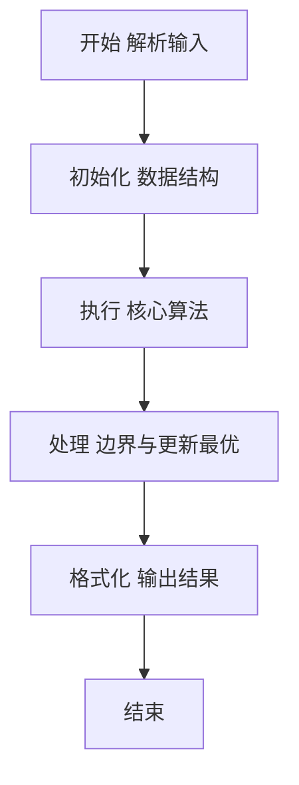
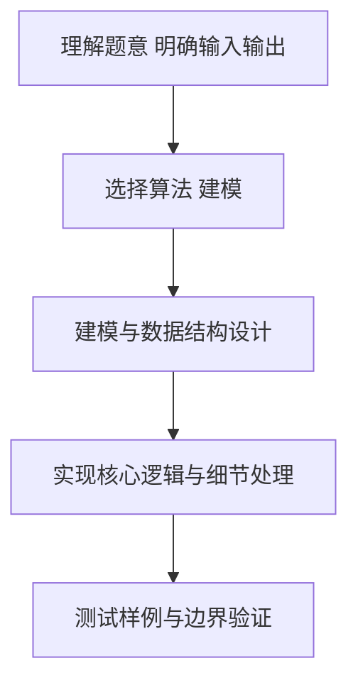

# L2-016 - 愿天下有情人都是失散多年的兄妹（25 分）

- **时间限制**: 200 ms
- **内存限制**: 65536 KB
- **代码长度限制**: 16 KB

---

## 题目描述


呵呵。大家都知道五服以内不得通婚，即两个人最近的共同祖先如果在五代以内（即本人、父母、祖父母、曾祖父母、高祖父母）则不可通婚。本题就请你帮助一对有情人判断一下，他们究竟是否可以成婚？

### 输入格式:

输入第一行给出一个正整数`N`（2 $$\le$$ `N` $$\le 10^4$$），随后`N`行，每行按以下格式给出一个人的信息：

```
本人ID 性别 父亲ID 母亲ID
```

其中`ID`是5位数字，每人不同；性别`M`代表男性、`F`代表女性。如果某人的父亲或母亲已经不可考，则相应的`ID`位置上标记为`-1`。

接下来给出一个正整数`K`，随后`K`行，每行给出一对有情人的`ID`，其间以空格分隔。

注意：题目保证两个人是同辈，每人只有一个性别，并且血缘关系网中没有乱伦或隔辈成婚的情况。

### 输出格式:

对每一对有情人，判断他们的关系是否可以通婚：如果两人是同性，输出`Never Mind`；如果是异性并且关系出了五服，输出`Yes`；如果异性关系未出五服，输出`No`。

### 输入样例:
```in
24
00001 M 01111 -1
00002 F 02222 03333
00003 M 02222 03333
00004 F 04444 03333
00005 M 04444 05555
00006 F 04444 05555
00007 F 06666 07777
00008 M 06666 07777
00009 M 00001 00002
00010 M 00003 00006
00011 F 00005 00007
00012 F 00008 08888
00013 F 00009 00011
00014 M 00010 09999
00015 M 00010 09999
00016 M 10000 00012
00017 F -1 00012
00018 F 11000 00013
00019 F 11100 00018
00020 F 00015 11110
00021 M 11100 00020
00022 M 00016 -1
00023 M 10012 00017
00024 M 00022 10013
9
00021 00024
00019 00024
00011 00012
00022 00018
00001 00004
00013 00016
00017 00015
00019 00021
00010 00011
```

### 输出样例:
```out
Never Mind
Yes
Never Mind
No
Yes
No
Yes
No
No
```

## 示例

### 示例 1

**输入:**
```
24
00001 M 01111 -1
00002 F 02222 03333
00003 M 02222 03333
00004 F 04444 03333
00005 M 04444 05555
00006 F 04444 05555
00007 F 06666 07777
00008 M 06666 07777
00009 M 00001 00002
00010 M 00003 00006
00011 F 00005 00007
00012 F 00008 08888
00013 F 00009 00011
00014 M 00010 09999
00015 M 00010 09999
00016 M 10000 00012
00017 F -1 00012
00018 F 11000 00013
00019 F 11100 00018
00020 F 00015 11110
00021 M 11100 00020
00022 M 00016 -1
00023 M 10012 00017
00024 M 00022 10013
9
00021 00024
00019 00024
00011 00012
00022 00018
00001 00004
00013 00016
00017 00015
00019 00021
00010 00011
```

**输出:**
```
Never Mind
Yes
Never Mind
No
Yes
No
Yes
No
No
```

### 解题思路

本题要求根据给定的输入数据完成相应的判定或计算任务，以“L2-016_愿天下有情人都是失散多年的兄妹”为核心，需在约束条件下构造出满足题意的结果。以 Lua 实现为参照，其实现原理概括为：记录每人的父母关系。对两人分别向上追溯至高祖父母（深度 4），。

在算法选型上，代码遵循“先解析、再建模、后计算”的一般套路，将输入转化为便于处理的内部表示，再通过线性或近线性扫描完成核心判定。实现中注重边界条件与格式细节，以确保在 PTA 判题环境下稳定通过。

关键在于细节处理与鲁棒性：如对空输入、重复键、边界值的正确处理，以及输出格式的精确控制。整体时间复杂度约为 O(N log N) 或 O(N)，空间复杂度 O(N)，满足题目限制（通常 1e5 级别可通过）。 结合 Lua 的快速 I/O 与表操作，能够在限制时间内完成判定并输出结果。
### 代码流程说明

1. 输入解析与预处理：按题面格式读取全部数据，将数值、字符串或图结构存入 Lua 表，必要时建立映射（如地址→节点、编号→集合）并处理边界空行。
2. 数据建模与初始化：将输入转化为内部模型（图、树、链表或数组），初始化距离、访问标记、计数器等辅助数组。
3. 核心逻辑处理：依据“记录每人的父母关系。对两人分别向上追溯至高祖父母（深度 4），…”的原理进行迭代计算，完成题面要求的判定、统计或构造任务，并在循环中处理相等、冲突等特殊分支。
4. 结果输出与格式化：按要求的格式拼接输出（如保留两位小数、按编号排序、输出路径或分类结果），注意末尾空格与换行控制，确保与样例一致。

### 代码实现

```lua
-- L2-016 愿天下有情人都是失散多年的兄妹
-- 实现原理：记录每人的父母关系。对两人分别向上追溯至高祖父母（深度 4），
-- 若祖先集合有交集则为五服以内；同性则无需追溯，直接输出 Never Mind。

local n = io.read("*n")
local sex, father, mother = {}, {}, {}
for _ = 1, n do
    local id, s, f, m = io.read("*n"), io.read("*s"), io.read("*n"), io.read("*n")
    sex[id], father[id], mother[id] = s, f, m
end

local function ancestors(id)
    local result = {}
    local function visit(x, depth)
        if x == -1 or depth > 4 or result[x] then return end
        result[x] = true
        visit(father[x] or -1, depth + 1)
        visit(mother[x] or -1, depth + 1)
    end
    visit(id, 0)
    return result
end

local q = io.read("*n")
for _ = 1, q do
    local a, b = io.read("*n"), io.read("*n")
    if sex[a] == sex[b] then
        print("Never Mind")
    else
        local aa, bb = ancestors(a), ancestors(b)
        local related = false
        for x in pairs(aa) do
            if bb[x] then related = true; break end
        end
        print(related and "No" or "Yes")
    end
end
```

### 代码流程图



### 解题流程图



