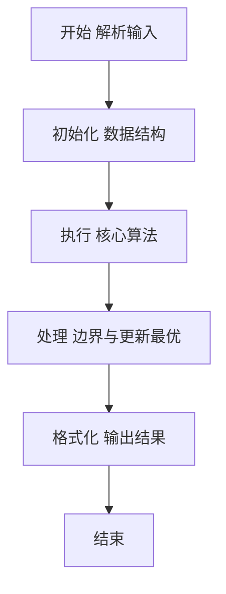
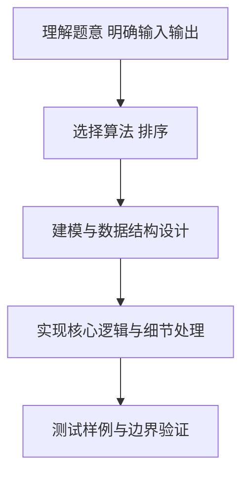

# L2-017 - 人以群分（25 分）

- **时间限制**: 150 ms
- **内存限制**: 65536 KB
- **代码长度限制**: 16 KB

---

## 题目描述


社交网络中我们给每个人定义了一个“活跃度”，现希望根据这个指标把人群分为两大类，即外向型（outgoing，即活跃度高的）和内向型（introverted，即活跃度低的）。要求两类人群的规模尽可能接近，而他们的总活跃度差距尽可能拉开。

### 输入格式:

输入第一行给出一个正整数$$N$$（$$2 \le N \le 10^5$$）。随后一行给出$$N$$个正整数，分别是每个人的活跃度，其间以空格分隔。题目保证这些数字以及它们的和都不会超过$$2^{31}$$。

### 输出格式:

按下列格式输出：

```
Outgoing #: N1
Introverted #: N2
Diff = N3
```

其中`N1`是外向型人的个数；`N2`是内向型人的个数；`N3`是两群人总活跃度之差的绝对值。

### 输入样例 1：
```in
10
23 8 10 99 46 2333 46 1 666 555
```

### 输出样例 1：
```out
Outgoing #: 5
Introverted #: 5
Diff = 3611
```

### 输入样例 2：
```in
13
110 79 218 69 3721 100 29 135 2 6 13 5188 85
```

### 输出样例 2：
```out
Outgoing #: 7
Introverted #: 6
Diff = 9359
```

## 示例

### 示例 1

**输入:**
```
10
23 8 10 99 46 2333 46 1 666 555
```

**输出:**
```
Outgoing #: 5
Introverted #: 5
Diff = 3611
```

### 示例 2

**输入:**
```
13
110 79 218 69 3721 100 29 135 2 6 13 5188 85
```

**输出:**
```
Outgoing #: 7
Introverted #: 6
Diff = 9359
```

### 解题思路

本题要求根据给定的输入数据完成相应的判定或计算任务，以“L2-017_人以群分”为核心，需在约束条件下构造出满足题意的结果。以 Lua 实现为参照，其实现原理概括为：排序后，人数尽量接近时应让较小的一半归入 introverted，。

在算法选型上，针对题目数据规模与结构特征，选择了 排序 等关键技术。Lua 代码通过紧凑的表结构与迭代逻辑，将原理转化为可执行流程，既保证了正确性也兼顾了简洁性。例如代码中对输入的逐行解析、数据结构的初始化与核心循环的组织均体现了该思路。

关键在于细节处理与鲁棒性：如对空输入、重复键、边界值的正确处理，以及输出格式的精确控制。整体时间复杂度约为 O(N log N) 或 O(N)，空间复杂度 O(N)，满足题目限制（通常 1e5 级别可通过）。 结合 Lua 的快速 I/O 与表操作，能够在限制时间内完成判定并输出结果。
### 代码流程说明

1. 输入解析与预处理：按题面格式读取全部数据，将数值、字符串或图结构存入 Lua 表，必要时建立映射（如地址→节点、编号→集合）并处理边界空行。
2. 数据组织与排序：对关键对象按指定关键字排序（如按单价、按得分、按字典序），或构建哈希表/集合以支持 O(1) 判重与统计。
3. 核心逻辑处理：依据“排序后，人数尽量接近时应让较小的一半归入 introverted，…”的原理进行迭代计算，完成题面要求的判定、统计或构造任务，并在循环中处理相等、冲突等特殊分支。
4. 结果输出与格式化：按要求的格式拼接输出（如保留两位小数、按编号排序、输出路径或分类结果），注意末尾空格与换行控制，确保与样例一致。

### 代码实现

```lua
-- L2-017 人以群分
-- 实现原理：排序后，人数尽量接近时应让较小的一半归入 introverted，
-- 较大的一半归入 outgoing。各自求和即可得到人数差和总值差。

local n = io.read("*n")
local a = {}
for i = 1, n do a[i] = io.read("*n") end
table.sort(a)
local intro = math.floor(n / 2)
local left, right = 0, 0
for i = 1, intro do left = left + a[i] end
for i = intro + 1, n do right = right + a[i] end
print("Outgoing #: " . (n - intro))
print("Introverted #: " . intro)
print("Diff = " . (right - left))
```

### 代码流程图



### 解题流程图



