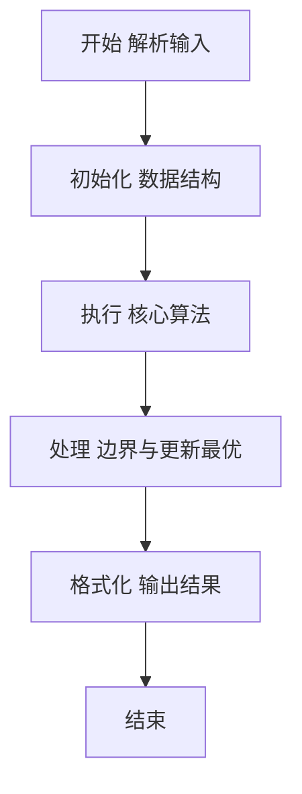
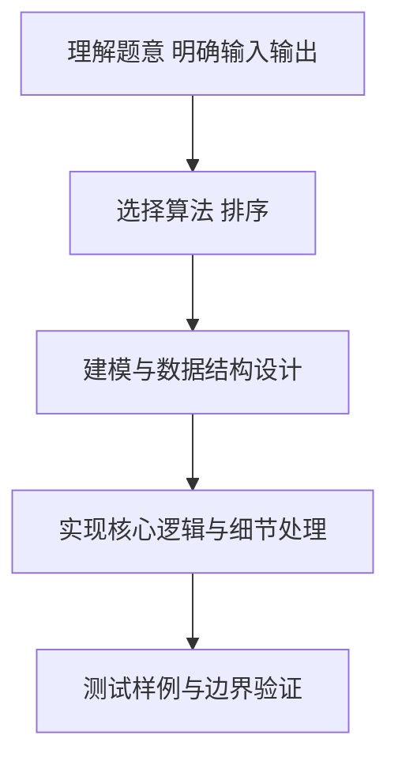

# L2-018 - 多项式A除以B（25 分）

- **时间限制**: 400 ms
- **内存限制**: 65536 KB
- **代码长度限制**: 16 KB

---

## 题目描述


这仍然是一道关于A/B的题，只不过A和B都换成了多项式。你需要计算两个多项式相除的商Q和余R，其中R的阶数必须小于B的阶数。

### 输入格式:

输入分两行，每行给出一个非零多项式，先给出A，再给出B。每行的格式如下：

```
N e[1] c[1] .. e[N] c[N]
```

其中`N`是该多项式非零项的个数，`e[i]`是第`i`个非零项的指数，`c[i]`是第`i`个非零项的系数。各项按照指数递减的顺序给出，保证所有指数是各不相同的非负整数，所有系数是非零整数，所有整数在整型范围内。

### 输出格式:

分两行先后输出商和余，输出格式与输入格式相同，输出的系数保留小数点后1位。同行数字间以1个空格分隔，行首尾不得有多余空格。注意：零多项式是一个特殊多项式，对应输出为`0 0 0.0`。但非零多项式不能输出零系数（包括舍入后为0.0）的项。在样例中，余多项式其实有常数项`-1/27`，但因其舍入后为0.0，故不输出。

### 输入样例:
```in
4 4 1 2 -3 1 -1 0 -1
3 2 3 1 -2 0 1
```

### 输出样例:
```out
3 2 0.3 1 0.2 0 -1.0
1 1 -3.1
```

## 示例

### 示例 1

**输入:**
```
4 4 1 2 -3 1 -1 0 -1
3 2 3 1 -2 0 1
```

**输出:**
```
3 2 0.3 1 0.2 0 -1.0
1 1 -3.1
```

### 解题思路

本题要求根据给定的输入数据完成相应的判定或计算任务，以“L2-018_多项式A除以B”为核心，需在约束条件下构造出满足题意的结果。以 Lua 实现为参照，其实现原理概括为：每次用当前余式最高项除以除式最高项，得到商的一项，。

在算法选型上，针对题目数据规模与结构特征，选择了 排序、动态规划 等关键技术。Lua 代码通过紧凑的表结构与迭代逻辑，将原理转化为可执行流程，既保证了正确性也兼顾了简洁性。例如代码中对输入的逐行解析、数据结构的初始化与核心循环的组织均体现了该思路。

关键在于细节处理与鲁棒性：如对空输入、重复键、边界值的正确处理，以及输出格式的精确控制。整体时间复杂度约为 O(N log N) 或 O(N)，空间复杂度 O(N)，满足题目限制（通常 1e5 级别可通过）。 结合 Lua 的快速 I/O 与表操作，能够在限制时间内完成判定并输出结果。
### 代码流程说明

1. 输入解析与预处理：按题面格式读取全部数据，将数值、字符串或图结构存入 Lua 表，必要时建立映射（如地址→节点、编号→集合）并处理边界空行。
2. 数据组织与排序：对关键对象按指定关键字排序（如按单价、按得分、按字典序），或构建哈希表/集合以支持 O(1) 判重与统计。
3. 核心逻辑处理：依据“每次用当前余式最高项除以除式最高项，得到商的一项，…”的原理进行迭代计算，完成题面要求的判定、统计或构造任务，并在循环中处理相等、冲突等特殊分支。
4. 结果输出与格式化：按要求的格式拼接输出（如保留两位小数、按编号排序、输出路径或分类结果），注意末尾空格与换行控制，确保与样例一致。

### 代码实现

```lua
-- L2-018 多项式A除以B
-- 实现原理：每次用当前余式最高项除以除式最高项，得到商的一项，
-- 再用该项乘除式并从余式中相减。最高次数下降，直至不能再除。

local function readPolynomial()
    local n = io.read("*n")
    local p = {}
    for _ = 1, n do
        local e, c = io.read("*n"), io.read("*n")
        p[e] = (p[e] or 0) + c
    end
    return p
end

local a, b = readPolynomial(), readPolynomial()
local function degree(p)
    local best = nil
    for e, c in pairs(p) do
        if math.abs(c) > 1e-9 and (not best or e > best) then best = e end
    end
    return best
end

local quotient = {}
local db = degree(b)
while degree(a) and degree(a) >= db do
    local da = degree(a)
    local e, c = da - db, a[da] / b[db]
    quotient[e] = (quotient[e] or 0) + c
    for be, bc in pairs(b) do
        local target = be + e
        a[target] = (a[target] or 0) - c * bc
        if math.abs(a[target]) < 1e-9 then a[target] = nil end
    end
end

local function output(p)
    local terms = {}
    for e, c in pairs(p) do
        -- 输出保留一位小数；四舍五入后为 0 的项不应计入多项式。
        if tonumber(string.format("%.1f", c)) ~= 0 then
            terms[#terms + 1] = { e = e, c = c }
        end
    end
    table.sort(terms, function(x, y) return x.e > y.e end)
    local out = { #terms }
    for _, term in ipairs(terms) do
        out[#out + 1] = term.e
        out[#out + 1] = string.format("%.1f", term.c)
    end
    print(table.concat(out, " "))
end

output(quotient)
output(a)
```

### 代码流程图



### 解题流程图



