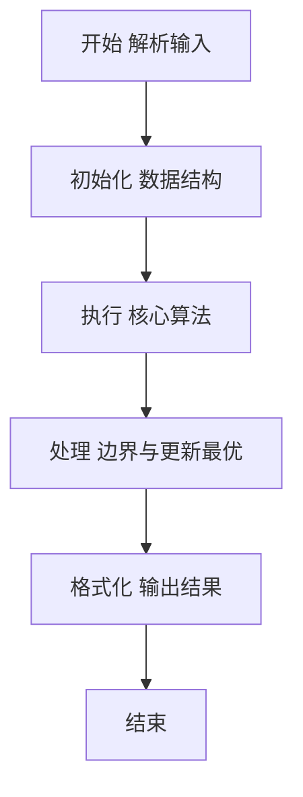
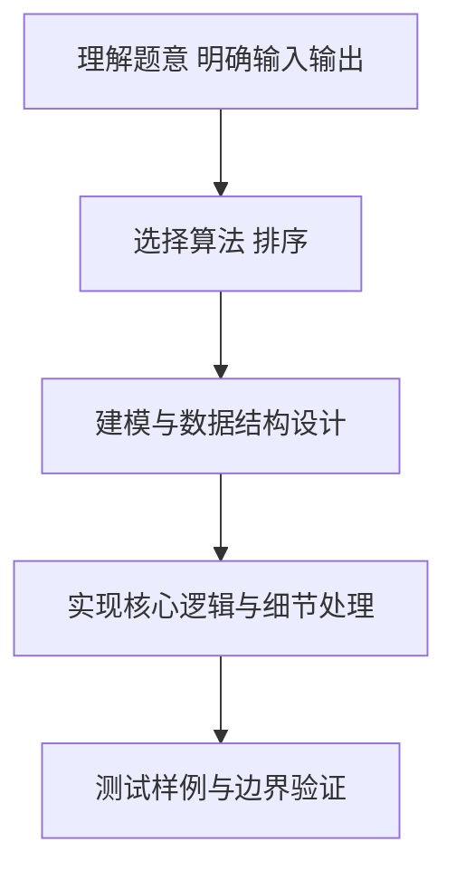

# L2-019 - 悄悄关注（25 分）

- **时间限制**: 150 ms
- **内存限制**: 65536 KB
- **代码长度限制**: 16 KB

---

## 题目描述


新浪微博上有个“悄悄关注”，一个用户悄悄关注的人，不出现在这个用户的关注列表上，但系统会推送其悄悄关注的人发表的微博给该用户。现在我们来做一回网络侦探，根据某人的关注列表和其对其他用户的点赞情况，扒出有可能被其悄悄关注的人。

### 输入格式:

输入首先在第一行给出某用户的关注列表，格式如下：

```
人数N 用户1 用户2 …… 用户N
```

其中`N`是不超过5000的正整数，每个`用户i`（`i`=1, .., `N`）是被其关注的用户的ID，是长度为4位的由数字和英文字母组成的字符串，各项间以空格分隔。

之后给出该用户点赞的信息：首先给出一个不超过10000的正整数`M`，随后`M`行，每行给出一个被其点赞的用户ID和对该用户的点赞次数（不超过1000），以空格分隔。注意：用户ID是一个用户的唯一身份标识。题目保证在关注列表中没有重复用户，在点赞信息中也没有重复用户。

### 输出格式:

我们认为被该用户点赞次数大于其点赞平均数、且不在其关注列表上的人，很可能是其悄悄关注的人。根据这个假设，请你按用户ID字母序的升序输出可能是其悄悄关注的人，每行1个ID。如果其实并没有这样的人，则输出“Bing Mei You”。

### 输入样例 1：
```in
10 GAO3 Magi Zha1 Sen1 Quan FaMK LSum Eins FatM LLao
8
Magi 50
Pota 30
LLao 3
Ammy 48
Dave 15
GAO3 31
Zoro 1
Cath 60
```

### 输出样例 1：
```out
Ammy
Cath
Pota
```

### 输入样例 2：
```in
11 GAO3 Magi Zha1 Sen1 Quan FaMK LSum Eins FatM LLao Pota
7
Magi 50
Pota 30
LLao 48
Ammy 3
Dave 15
GAO3 31
Zoro 29
```

### 输出样例 2：
```out
Bing Mei You
```

## 示例

### 示例 1

**输入:**
```
10 GAO3 Magi Zha1 Sen1 Quan FaMK LSum Eins FatM LLao
8
Magi 50
Pota 30
LLao 3
Ammy 48
Dave 15
GAO3 31
Zoro 1
Cath 60
```

**输出:**
```
Ammy
Cath
Pota
```

### 示例 2

**输入:**
```
11 GAO3 Magi Zha1 Sen1 Quan FaMK LSum Eins FatM LLao Pota
7
Magi 50
Pota 30
LLao 48
Ammy 3
Dave 15
GAO3 31
Zoro 29
```

**输出:**
```
Bing Mei You
```

### 解题思路

本题要求根据给定的输入数据完成相应的判定或计算任务，以“L2-019_悄悄关注”为核心，需在约束条件下构造出满足题意的结果。以 Lua 实现为参照，其实现原理概括为：先用集合记录已关注用户，再统计每个出现用户的点赞总数和次数。

在算法选型上，针对题目数据规模与结构特征，选择了 排序 等关键技术。Lua 代码通过紧凑的表结构与迭代逻辑，将原理转化为可执行流程，既保证了正确性也兼顾了简洁性。例如代码中对输入的逐行解析、数据结构的初始化与核心循环的组织均体现了该思路。

关键在于细节处理与鲁棒性：如对空输入、重复键、边界值的正确处理，以及输出格式的精确控制。整体时间复杂度约为 O(N log N) 或 O(N)，空间复杂度 O(N)，满足题目限制（通常 1e5 级别可通过）。 结合 Lua 的快速 I/O 与表操作，能够在限制时间内完成判定并输出结果。
### 代码流程说明

1. 输入解析与预处理：按题面格式读取全部数据，将数值、字符串或图结构存入 Lua 表，必要时建立映射（如地址→节点、编号→集合）并处理边界空行。
2. 数据组织与排序：对关键对象按指定关键字排序（如按单价、按得分、按字典序），或构建哈希表/集合以支持 O(1) 判重与统计。
3. 核心逻辑处理：依据“先用集合记录已关注用户，再统计每个出现用户的点赞总数和次数。…”的原理进行迭代计算，完成题面要求的判定、统计或构造任务，并在循环中处理相等、冲突等特殊分支。
4. 结果输出与格式化：按要求的格式拼接输出（如保留两位小数、按编号排序、输出路径或分类结果），注意末尾空格与换行控制，确保与样例一致。

### 代码实现

```lua
-- L2-019 悄悄关注
-- 实现原理：先用集合记录已关注用户，再统计每个出现用户的点赞总数和次数。
-- 平均点赞数之上的未关注用户为候选，按昵称字典序输出。

local line = io.read("*l")
local followed = {}
for id in line:gmatch("%S+") do
    if id ~= line:match("^%S+") then followed[id] = true end
end
-- 首个字段是关注数；重新按字段处理可避免把它作为用户 ID。
followed = {}
local first = true
for id in line:gmatch("%S+") do
    if first then first = false else followed[id] = true end
end

local m = io.read("*n")
local total, sum, count = 0, {}, {}
for _ = 1, m do
    local id, likes = io.read("*s"), io.read("*n")
    total = total + likes
    sum[id] = (sum[id] or 0) + likes
    count[id] = (count[id] or 0) + 1
end

local answer = {}
for id, value in pairs(sum) do
    if not followed[id] and value / count[id] > total / m then answer[#answer + 1] = id end
end
table.sort(answer)
if #answer == 0 then print("Bing Meiyou") else print(table.concat(answer, "\n")) end
```

### 代码流程图



### 解题流程图



