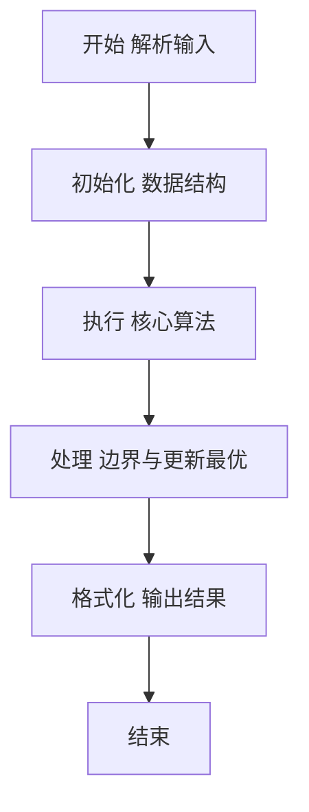
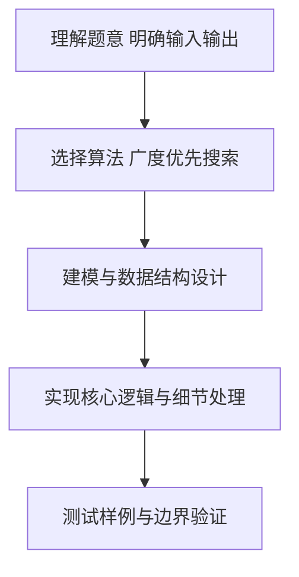

# L2-020 - 功夫传人（25 分）

- **时间限制**: 400 ms
- **内存限制**: 65536 KB
- **代码长度限制**: 16 KB

---

## 题目描述


一门武功能否传承久远并被发扬光大，是要看缘分的。一般来说，师傅传授给徒弟的武功总要打个折扣，于是越往后传，弟子们的功夫就越弱…… 直到某一支的某一代突然出现一个天分特别高的弟子（或者是吃到了灵丹、挖到了特别的秘笈），会将功夫的威力一下子放大N倍 —— 我们称这种弟子为“得道者”。

这里我们来考察某一位祖师爷门下的徒子徒孙家谱：假设家谱中的每个人只有1位师傅（除了祖师爷没有师傅）；每位师傅可以带很多徒弟；并且假设辈分严格有序，即祖师爷这门武功的每个第`i`代传人只能在第`i-1`代传人中拜1个师傅。我们假设已知祖师爷的功力值为`Z`，每向下传承一代，就会减弱`r%`，除非某一代弟子得道。现给出师门谱系关系，要求你算出所有得道者的功力总值。

### 输入格式:

输入在第一行给出3个正整数，分别是：$$N$$（$$\le 10^5$$）——整个师门的总人数（于是每个人从0到$$N-1$$编号，祖师爷的编号为0）；$$Z$$——祖师爷的功力值（不一定是整数，但起码是正数）；$$r$$ ——每传一代功夫所打的折扣百分比值（不超过100的正数）。接下来有$$N$$行，第$$i$$行（$$i=0, \cdots , N-1$$）描述编号为$$i$$的人所传的徒弟，格式为：

$$K_i$$ ID[1] ID[2] $$\cdots$$ ID[$$K_i$$]

其中$$K_i$$是徒弟的个数，后面跟的是各位徒弟的编号，数字间以空格间隔。$$K_i$$为零表示这是一位得道者，这时后面跟的一个数字表示其武功被放大的倍数。

### 输出格式:

在一行中输出所有得道者的功力总值，只保留其整数部分。题目保证输入和正确的输出都不超过$$10^{10}$$。

### 输入样例:
```in
10 18.0 1.00
3 2 3 5
1 9
1 4
1 7
0 7
2 6 1
1 8
0 9
0 4
0 3
```

### 输出样例:
```out
404
```

## 示例

### 示例 1

**输入:**
```
10 18.0 1.00
3 2 3 5
1 9
1 4
1 7
0 7
2 6 1
1 8
0 9
0 4
0 3
```

**输出:**
```
404
```

### 解题思路

本题要求根据给定的输入数据完成相应的判定或计算任务，以“L2-020_功夫传人”为核心，需在约束条件下构造出满足题意的结果。以 Lua 实现为参照，其实现原理概括为：从祖师爷开始广度优先遍历，队列同时保存传承层数。

在算法选型上，针对题目数据规模与结构特征，选择了 广度优先搜索 等关键技术。Lua 代码通过紧凑的表结构与迭代逻辑，将原理转化为可执行流程，既保证了正确性也兼顾了简洁性。例如代码中对输入的逐行解析、数据结构的初始化与核心循环的组织均体现了该思路。

关键在于细节处理与鲁棒性：如对空输入、重复键、边界值的正确处理，以及输出格式的精确控制。整体时间复杂度约为 O(N log N) 或 O(N)，空间复杂度 O(N)，满足题目限制（通常 1e5 级别可通过）。 结合 Lua 的快速 I/O 与表操作，能够在限制时间内完成判定并输出结果。
### 代码流程说明

1. 输入解析与预处理：按题面格式读取全部数据，将数值、字符串或图结构存入 Lua 表，必要时建立映射（如地址→节点、编号→集合）并处理边界空行。
2. 数据建模与初始化：将输入转化为内部模型（图、树、链表或数组），初始化距离、访问标记、计数器等辅助数组。
3. 核心逻辑处理：依据“从祖师爷开始广度优先遍历，队列同时保存传承层数。…”的原理进行迭代计算，完成题面要求的判定、统计或构造任务，并在循环中处理相等、冲突等特殊分支。
4. 结果输出与格式化：按要求的格式拼接输出（如保留两位小数、按编号排序、输出路径或分类结果），注意末尾空格与换行控制，确保与样例一致。

### 代码实现

```lua
-- L2-020 功夫传人
-- 实现原理：从祖师爷开始广度优先遍历，队列同时保存传承层数。
-- 到达叶子节点时，将该层功力乘叶子的弟子人数并累加，最后取整数部分。

local n, z, r = io.read("*n"), io.read("*n"), io.read("*n")
local children, leaves = {}, {}
for i = 0, n - 1 do
    local k = io.read("*n")
    if k == 0 then
        leaves[i] = io.read("*n")
    else
        children[i] = {}
        for j = 1, k do children[i][j] = io.read("*n") end
    end
end

local decay = 1 - r / 100
local queue, head, answer = { { 0, 0 } }, 1, 0
while head <= #queue do
    local node, depth = queue[head][1], queue[head][2]
    head = head + 1
    if leaves[node] then
        answer = answer + z * (decay ^ depth) * leaves[node]
    else
        for _, child in ipairs(children[node]) do
            queue[#queue + 1] = { child, depth + 1 }
        end
    end
end
print(math.floor(answer))
```

### 代码流程图



### 解题流程图



