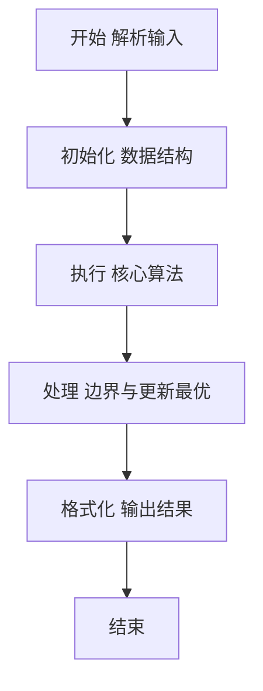
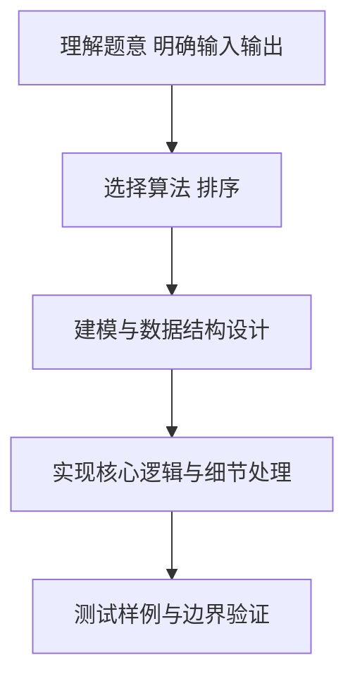

# L2-021 - 点赞狂魔（25 分）

- **时间限制**: 200 ms
- **内存限制**: 65536 KB
- **代码长度限制**: 16 KB

---

## 题目描述


微博上有个“点赞”功能，你可以为你喜欢的博文点个赞表示支持。每篇博文都有一些刻画其特性的标签，而你点赞的博文的类型，也间接刻画了你的特性。然而有这么一种人，他们会通过给自己看到的一切内容点赞来狂刷存在感，这种人就被称为“点赞狂魔”。他们点赞的标签非常分散，无法体现出明显的特性。本题就要求你写个程序，通过统计每个人点赞的不同标签的数量，找出前3名点赞狂魔。

### 输入格式:

输入在第一行给出一个正整数$$N$$（$$\le 100$$），是待统计的用户数。随后$$N$$行，每行列出一位用户的点赞标签。格式为“`Name` $$K$$ $$F_1 \cdots F_K$$”，其中`Name`是不超过8个英文小写字母的非空用户名，$$1\le K\le 1000$$，$$F_i$$（$$i=1, \cdots , K$$）是特性标签的编号，我们将所有特性标签从 1 到 $$10^7$$ 编号。数字间以空格分隔。

### 输出格式:

统计每个人点赞的不同标签的数量，找出数量最大的前3名，在一行中顺序输出他们的用户名,其间以1个空格分隔,且行末不得有多余空格。如果有并列，则输出标签出现次数平均值最小的那个，题目保证这样的用户没有并列。若不足3人，则用`-`补齐缺失，例如`mike jenny -`就表示只有2人。

### 输入样例:
```in
5
bob 11 101 102 103 104 105 106 107 108 108 107 107
peter 8 1 2 3 4 3 2 5 1
chris 12 1 2 3 4 5 6 7 8 9 1 2 3
john 10 8 7 6 5 4 3 2 1 7 5
jack 9 6 7 8 9 10 11 12 13 14
```

### 输出样例:
```out
jack chris john
```

## 示例

### 示例 1

**输入:**
```
5
bob 11 101 102 103 104 105 106 107 108 108 107 107
peter 8 1 2 3 4 3 2 5 1
chris 12 1 2 3 4 5 6 7 8 9 1 2 3
john 10 8 7 6 5 4 3 2 1 7 5
jack 9 6 7 8 9 10 11 12 13 14
```

**输出:**
```
jack chris john
```

### 解题思路

本题要求根据给定的输入数据完成相应的判定或计算任务，以“L2-021_点赞狂魔”为核心，需在约束条件下构造出满足题意的结果。以 Lua 实现为参照，其实现原理概括为：对每位用户用集合去重以得到不同标签数，同时记录标签总次数。

在算法选型上，针对题目数据规模与结构特征，选择了 排序 等关键技术。Lua 代码通过紧凑的表结构与迭代逻辑，将原理转化为可执行流程，既保证了正确性也兼顾了简洁性。例如代码中对输入的逐行解析、数据结构的初始化与核心循环的组织均体现了该思路。

关键在于细节处理与鲁棒性：如对空输入、重复键、边界值的正确处理，以及输出格式的精确控制。整体时间复杂度约为 O(N log N) 或 O(N)，空间复杂度 O(N)，满足题目限制（通常 1e5 级别可通过）。 结合 Lua 的快速 I/O 与表操作，能够在限制时间内完成判定并输出结果。
### 代码流程说明

1. 输入解析与预处理：按题面格式读取全部数据，将数值、字符串或图结构存入 Lua 表，必要时建立映射（如地址→节点、编号→集合）并处理边界空行。
2. 数据组织与排序：对关键对象按指定关键字排序（如按单价、按得分、按字典序），或构建哈希表/集合以支持 O(1) 判重与统计。
3. 核心逻辑处理：依据“对每位用户用集合去重以得到不同标签数，同时记录标签总次数。…”的原理进行迭代计算，完成题面要求的判定、统计或构造任务，并在循环中处理相等、冲突等特殊分支。
4. 结果输出与格式化：按要求的格式拼接输出（如保留两位小数、按编号排序、输出路径或分类结果），注意末尾空格与换行控制，确保与样例一致。

### 代码实现

```lua
-- L2-021 点赞狂魔
-- 实现原理：对每位用户用集合去重以得到不同标签数，同时记录标签总次数。
-- 排名关键字依次为不同标签数降序、平均出现次数升序，取前三名即可。

local n = io.read("*n")
local users = {}
for i = 1, n do
    local name, k = io.read("*s"), io.read("*n")
    local distinct = {}
    for _ = 1, k do distinct[io.read("*n")] = true end
    local kinds = 0
    for _ in pairs(distinct) do kinds = kinds + 1 end
    users[i] = { name = name, kinds = kinds, average = k / kinds }
end
table.sort(users, function(a, b)
    if a.kinds ~= b.kinds then return a.kinds > b.kinds end
    return a.average < b.average
end)
local out = {}
for i = 1, 3 do out[i] = users[i] and users[i].name or "-" end
print(table.concat(out, " "))
```

### 代码流程图



### 解题流程图



