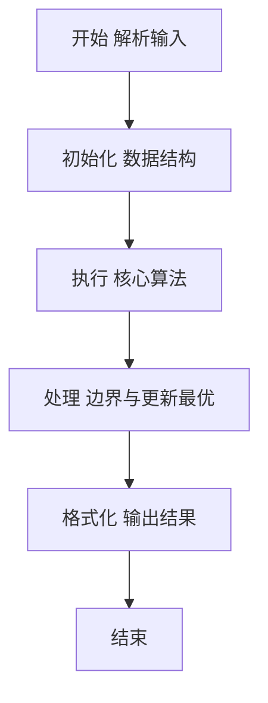
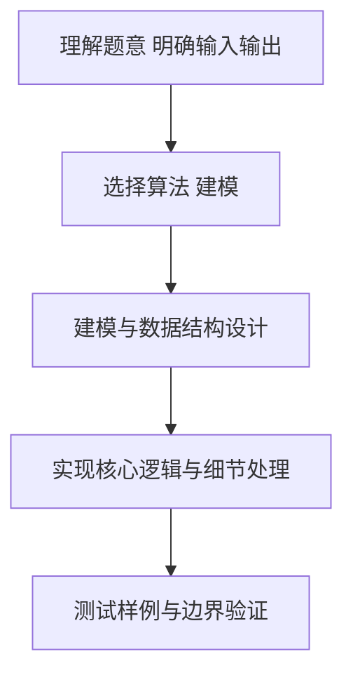

# L2-022 - 重排链表（25 分）

- **时间限制**: 500 ms
- **内存限制**: 65536 KB
- **代码长度限制**: 16 KB

---

## 题目描述


给定一个单链表 $L_1$→$L_2$→$\cdots$→$L_{n-1}$→$L_n$，请编写程序将链表重新排列为 $L_n$→$L_1$→$L_{n-1}$→$L_2$→$\cdots$。例如：给定$L$为1→2→3→4→5→6，则输出应该为6→1→5→2→4→3。

### 输入格式:

每个输入包含1个测试用例。每个测试用例第1行给出第1个结点的地址和结点总个数，即正整数$N$ ($\le 10^5$)。结点的地址是5位非负整数，NULL地址用$-1$表示。

接下来有$N$行，每行格式为：

```
Address Data Next
```

其中`Address`是结点地址；`Data`是该结点保存的数据，为不超过$10^5$的正整数；`Next`是下一结点的地址。题目保证给出的链表上至少有两个结点。

### 输出格式:

对每个测试用例，顺序输出重排后的结果链表，其上每个结点占一行，格式与输入相同。

### 输入样例:
```in
00100 6
00000 4 99999
00100 1 12309
68237 6 -1
33218 3 00000
99999 5 68237
12309 2 33218
```

### 输出样例:
```out
68237 6 00100
00100 1 99999
99999 5 12309
12309 2 00000
00000 4 33218
33218 3 -1
```

## 示例

### 示例 1

**输入:**
```
00100 6
00000 4 99999
00100 1 12309
68237 6 -1
33218 3 00000
99999 5 68237
12309 2 33218
```

**输出:**
```
68237 6 00100
00100 1 99999
99999 5 12309
12309 2 00000
00000 4 33218
33218 3 -1
```

### 解题思路

本题要求根据给定的输入数据完成相应的判定或计算任务，以“L2-022_重排链表”为核心，需在约束条件下构造出满足题意的结果。以 Lua 实现为参照，其实现原理概括为：先沿首地址遍历出真实链表节点，再从末端、首端交替取节点，。

在算法选型上，代码遵循“先解析、再建模、后计算”的一般套路，将输入转化为便于处理的内部表示，再通过线性或近线性扫描完成核心判定。实现中注重边界条件与格式细节，以确保在 PTA 判题环境下稳定通过。

关键在于细节处理与鲁棒性：如对空输入、重复键、边界值的正确处理，以及输出格式的精确控制。整体时间复杂度约为 O(N log N) 或 O(N)，空间复杂度 O(N)，满足题目限制（通常 1e5 级别可通过）。 结合 Lua 的快速 I/O 与表操作，能够在限制时间内完成判定并输出结果。
### 代码流程说明

1. 输入解析与预处理：按题面格式读取全部数据，将数值、字符串或图结构存入 Lua 表，必要时建立映射（如地址→节点、编号→集合）并处理边界空行。
2. 数据建模与初始化：将输入转化为内部模型（图、树、链表或数组），初始化距离、访问标记、计数器等辅助数组。
3. 核心逻辑处理：依据“先沿首地址遍历出真实链表节点，再从末端、首端交替取节点，…”的原理进行迭代计算，完成题面要求的判定、统计或构造任务，并在循环中处理相等、冲突等特殊分支。
4. 结果输出与格式化：按要求的格式拼接输出（如保留两位小数、按编号排序、输出路径或分类结果），注意末尾空格与换行控制，确保与样例一致。

### 代码实现

```lua
-- L2-022 重排链表
-- 实现原理：先沿首地址遍历出真实链表节点，再从末端、首端交替取节点，
-- 得到 Ln,L1,Ln-1,L2.. 的新顺序；输出时由相邻元素确定 Next 地址。

local head, n = io.read("*s"), io.read("*n")
local nodes = {}
for _ = 1, n do
    local addr, data, nextAddr = io.read("*s"), io.read("*n"), io.read("*s")
    nodes[addr] = { addr = addr, data = data, nextAddr = nextAddr }
end

local list, p = {}, head
while p ~= "-1" do
    list[#list + 1] = nodes[p]
    p = nodes[p].nextAddr
end
local order, l, r = {}, 1, #list
while l <= r do
    order[#order + 1] = list[r]
    r = r - 1
    if l <= r then order[#order + 1] = list[l]; l = l + 1 end
end
for i, node in ipairs(order) do
    local nextAddr = order[i + 1] and order[i + 1].addr or "-1"
    print(node.addr . " " . node.data . " " . nextAddr)
end
```

### 代码流程图



### 解题流程图



