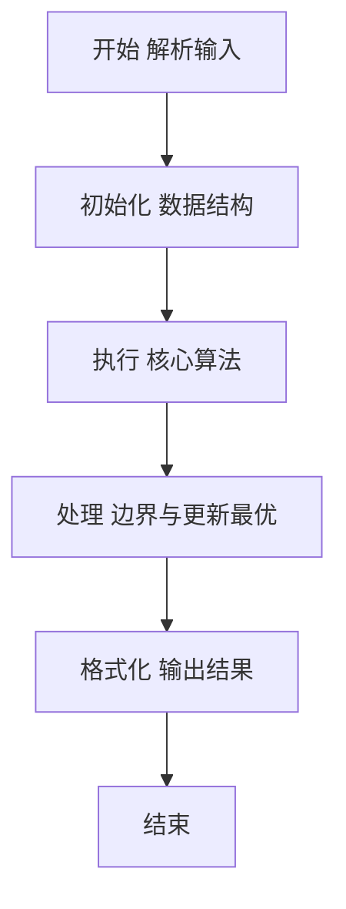
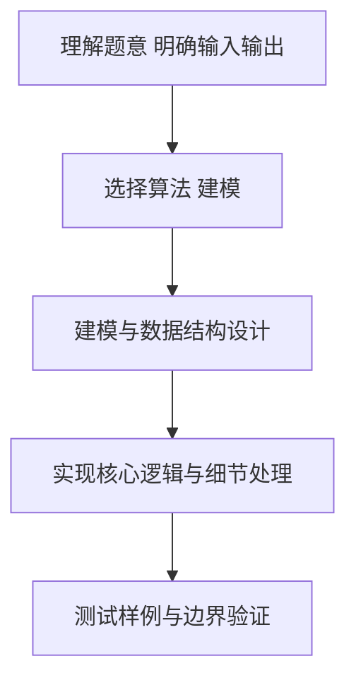

# L2-023 - 图着色问题（25 分）

- **时间限制**: 300 ms
- **内存限制**: 65536 KB
- **代码长度限制**: 16 KB

---

## 题目描述


图着色问题是一个著名的NP完全问题。给定无向图$G = (V, E)$，问可否用$K$种颜色为$V$中的每一个顶点分配一种颜色，使得不会有两个相邻顶点具有同一种颜色？

但本题并不是要你解决这个着色问题，而是对给定的一种颜色分配，请你判断这是否是图着色问题的一个解。

### 输入格式:

输入在第一行给出3个整数$V$（$0 < V \le 500$）、$E$（$\ge 0$）和$K$（$0 < K \le V$），分别是无向图的顶点数、边数、以及颜色数。顶点和颜色都从1到$V$编号。随后$E$行，每行给出一条边的两个端点的编号。在图的信息给出之后，给出了一个正整数$N$（$\le 20$），是待检查的颜色分配方案的个数。随后$N$行，每行顺次给出$V$个顶点的颜色（第$i$个数字表示第$i$个顶点的颜色），数字间以空格分隔。题目保证给定的无向图是合法的（即不存在自回路和重边）。

### 输出格式:

对每种颜色分配方案，如果是图着色问题的一个解则输出`Yes`，否则输出`No`，每句占一行。

### 输入样例:
```in
6 8 3
2 1
1 3
4 6
2 5
2 4
5 4
5 6
3 6
4
1 2 3 3 1 2
4 5 6 6 4 5
1 2 3 4 5 6
2 3 4 2 3 4
```

### 输出样例:
```out
Yes
Yes
No
No
```

## 示例

### 示例 1

**输入:**
```
6 8 3
2 1
1 3
4 6
2 5
2 4
5 4
5 6
3 6
4
1 2 3 3 1 2
4 5 6 6 4 5
1 2 3 4 5 6
2 3 4 2 3 4
```

**输出:**
```
Yes
Yes
No
No
```

### 解题思路

本题要求根据给定的输入数据完成相应的判定或计算任务，以“L2-023_图着色问题”为核心，需在约束条件下构造出满足题意的结果。以 Lua 实现为参照，其实现原理概括为：颜色必须在 1.K 中，且每条边两端颜色不同。

在算法选型上，代码遵循“先解析、再建模、后计算”的一般套路，将输入转化为便于处理的内部表示，再通过线性或近线性扫描完成核心判定。实现中注重边界条件与格式细节，以确保在 PTA 判题环境下稳定通过。

关键在于细节处理与鲁棒性：如对空输入、重复键、边界值的正确处理，以及输出格式的精确控制。整体时间复杂度约为 O(N log N) 或 O(N)，空间复杂度 O(N)，满足题目限制（通常 1e5 级别可通过）。 结合 Lua 的快速 I/O 与表操作，能够在限制时间内完成判定并输出结果。
### 代码流程说明

1. 输入解析与预处理：按题面格式读取全部数据，将数值、字符串或图结构存入 Lua 表，必要时建立映射（如地址→节点、编号→集合）并处理边界空行。
2. 数据建模与初始化：将输入转化为内部模型（图、树、链表或数组），初始化距离、访问标记、计数器等辅助数组。
3. 核心逻辑处理：依据“颜色必须在 1.K 中，且每条边两端颜色不同。…”的原理进行迭代计算，完成题面要求的判定、统计或构造任务，并在循环中处理相等、冲突等特殊分支。
4. 结果输出与格式化：按要求的格式拼接输出（如保留两位小数、按编号排序、输出路径或分类结果），注意末尾空格与换行控制，确保与样例一致。

### 代码实现

```lua
-- L2-023 图着色问题
-- 实现原理：颜色必须在 1.K 中，且每条边两端颜色不同。
-- 对每个候选方案读入 V 个颜色后线性扫描全部边即可完成验证。

local v, e, k = io.read("*n"), io.read("*n"), io.read("*n")
local edges = {}
for i = 1, e do edges[i] = { io.read("*n"), io.read("*n") } end
local q = io.read("*n")
for _ = 1, q do
    local color, ok = {}, true
    for i = 1, v do
        color[i] = io.read("*n")
        if color[i] < 1 or color[i] > k then ok = false end
    end
    for _, edge in ipairs(edges) do
        if color[edge[1]] == color[edge[2]] then ok = false; break end
    end
    print(ok and "Yes" or "No")
end
```

### 代码流程图



### 解题流程图



