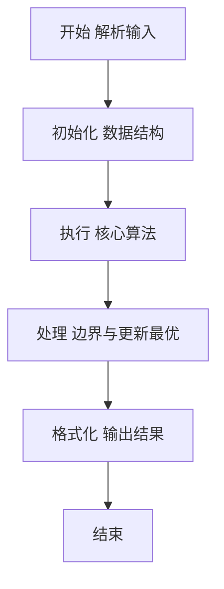
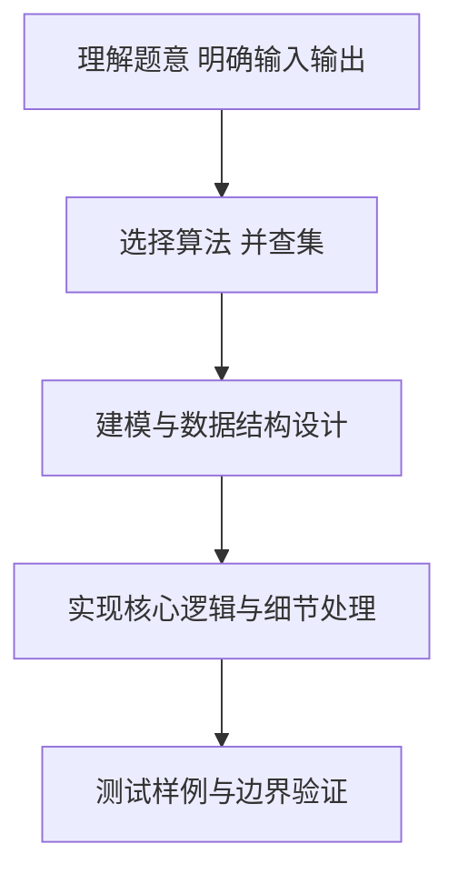

# L2-024 - 部落（25 分）

- **时间限制**: 150 ms
- **内存限制**: 65536 KB
- **代码长度限制**: 16 KB

---

## 题目描述


在一个社区里，每个人都有自己的小圈子，还可能同时属于很多不同的朋友圈。我们认为朋友的朋友都算在一个部落里，于是要请你统计一下，在一个给定社区中，到底有多少个互不相交的部落？并且检查任意两个人是否属于同一个部落。

### 输入格式:

输入在第一行给出一个正整数$N$（$\le 10^4$），是已知小圈子的个数。随后$N$行，每行按下列格式给出一个小圈子里的人：

$K$ $P[1]$ $P[2]$ $\cdots$ $P[K]$

其中$K$是小圈子里的人数，$P[i]$（$i=1, \cdots , K$）是小圈子里每个人的编号。这里所有人的编号从1开始连续编号，最大编号不会超过$10^4$。

之后一行给出一个非负整数$Q$（$\le 10^4$），是查询次数。随后$Q$行，每行给出一对被查询的人的编号。

### 输出格式:

首先在一行中输出这个社区的总人数、以及互不相交的部落的个数。随后对每一次查询，如果他们属于同一个部落，则在一行中输出`Y`，否则输出`N`。

### 输入样例:
```in
4
3 10 1 2
2 3 4
4 1 5 7 8
3 9 6 4
2
10 5
3 7
```

### 输出样例:
```out
10 2
Y
N
```

## 示例

### 示例 1

**输入:**
```
4
3 10 1 2
2 3 4
4 1 5 7 8
3 9 6 4
2
10 5
3 7
```

**输出:**
```
10 2
Y
N
```

### 解题思路

本题要求根据给定的输入数据完成相应的判定或计算任务，以“L2-024_部落”为核心，需在约束条件下构造出满足题意的结果。以 Lua 实现为参照，其实现原理概括为：同一朋友圈的所有人并入同一并查集。出现过的人数为社区人数，。

在算法选型上，针对题目数据规模与结构特征，选择了 并查集 等关键技术。Lua 代码通过紧凑的表结构与迭代逻辑，将原理转化为可执行流程，既保证了正确性也兼顾了简洁性。例如代码中对输入的逐行解析、数据结构的初始化与核心循环的组织均体现了该思路。

关键在于细节处理与鲁棒性：如对空输入、重复键、边界值的正确处理，以及输出格式的精确控制。并查集操作近乎 O(α(N))，总体时间 O(N α(N))，空间 O(N)。 结合 Lua 的快速 I/O 与表操作，能够在限制时间内完成判定并输出结果。
### 代码流程说明

1. 输入解析与预处理：按题面格式读取全部数据，将数值、字符串或图结构存入 Lua 表，必要时建立映射（如地址→节点、编号→集合）并处理边界空行。
2. 结构初始化：初始化并查集父指针、集合大小或图邻接表，标记活跃节点，准备用于后续合并与查询的核心数据结构。
3. 核心逻辑处理：依据“同一朋友圈的所有人并入同一并查集。出现过的人数为社区人数，…”的原理进行迭代计算，完成题面要求的判定、统计或构造任务，并在循环中处理相等、冲突等特殊分支。
4. 结果输出与格式化：按要求的格式拼接输出（如保留两位小数、按编号排序、输出路径或分类结果），注意末尾空格与换行控制，确保与样例一致。

### 代码实现

```lua
-- L2-024 部落
-- 实现原理：同一朋友圈的所有人并入同一并查集。出现过的人数为社区人数，
-- 这些人的不同根节点数为部落数；查询时比较两个根节点即可。

local parent, present = {}, {}
local function find(x)
    if parent[x] ~= x then parent[x] = find(parent[x]) end
    return parent[x]
end
local function add(x)
    if not parent[x] then parent[x] = x end
    present[x] = true
end
local function union(a, b)
    a, b = find(a), find(b)
    if a ~= b then parent[a] = b end
end

local n = io.read("*n")
for _ = 1, n do
    local k = io.read("*n")
    local first = io.read("*n")
    add(first)
    for _ = 2, k do
        local x = io.read("*n")
        add(x)
        union(first, x)
    end
end
local people, roots = 0, {}
for x in pairs(present) do people = people + 1; roots[find(x)] = true end
local tribes = 0
for _ in pairs(roots) do tribes = tribes + 1 end
print(people . " " . tribes)
local q = io.read("*n")
for _ = 1, q do
    local a, b = io.read("*n"), io.read("*n")
    print(find(a) == find(b) and "Y" or "N")
end
```

### 代码流程图



### 解题流程图



