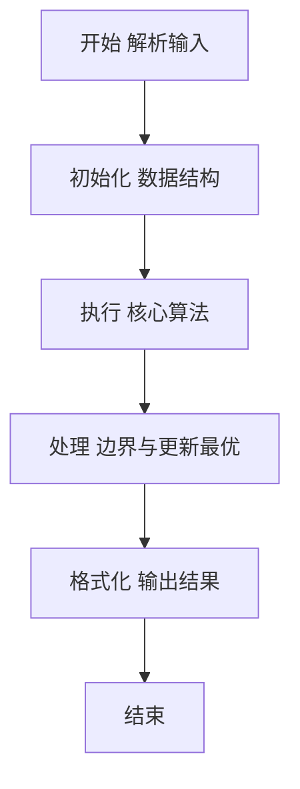
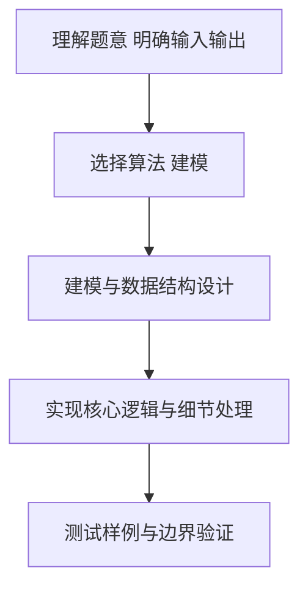

# L2-025 - 分而治之（25 分）

- **时间限制**: 600 ms
- **内存限制**: 65536 KB
- **代码长度限制**: 16 KB

---

## 题目描述


分而治之，各个击破是兵家常用的策略之一。在战争中，我们希望首先攻下敌方的部分城市，使其剩余的城市变成孤立无援，然后再分头各个击破。为此参谋部提供了若干打击方案。本题就请你编写程序，判断每个方案的可行性。

### 输入格式:

输入在第一行给出两个正整数 N 和 M（均不超过10 000），分别为敌方城市个数（于是默认城市从 1 到 N 编号）和连接两城市的通路条数。随后 M 行，每行给出一条通路所连接的两个城市的编号，其间以一个空格分隔。在城市信息之后给出参谋部的系列方案，即一个正整数 K （$$\le$$ 100）和随后的 K 行方案，每行按以下格式给出：

```
Np v[1] v[2] .. v[Np]
```

其中 `Np` 是该方案中计划攻下的城市数量，后面的系列 `v[i]` 是计划攻下的城市编号。

### 输出格式:

对每一套方案，如果可行就输出`YES`，否则输出`NO`。

### 输入样例:
```in
10 11
8 7
6 8
4 5
8 4
8 1
1 2
1 4
9 8
9 1
1 10
2 4
5
4 10 3 8 4
6 6 1 7 5 4 9
3 1 8 4
2 2 8
7 9 8 7 6 5 4 2
```

### 输出样例:
```out
NO
YES
YES
NO
NO
```

## 示例

### 示例 1

**输入:**
```
10 11
8 7
6 8
4 5
8 4
8 1
1 2
1 4
9 8
9 1
1 10
2 4
5
4 10 3 8 4
6 6 1 7 5 4 9
3 1 8 4
2 2 8
7 9 8 7 6 5 4 2
```

**输出:**
```
NO
YES
YES
NO
NO
```

### 解题思路

本题要求根据给定的输入数据完成相应的判定或计算任务，以“L2-025_分而治之”为核心，需在约束条件下构造出满足题意的结果。以 Lua 实现为参照，其实现原理概括为：攻下部分城市后，若任意道路两端仍都未失守，剩余城市就没有。

在算法选型上，代码遵循“先解析、再建模、后计算”的一般套路，将输入转化为便于处理的内部表示，再通过线性或近线性扫描完成核心判定。实现中注重边界条件与格式细节，以确保在 PTA 判题环境下稳定通过。

关键在于细节处理与鲁棒性：如对空输入、重复键、边界值的正确处理，以及输出格式的精确控制。整体时间复杂度约为 O(N log N) 或 O(N)，空间复杂度 O(N)，满足题目限制（通常 1e5 级别可通过）。 结合 Lua 的快速 I/O 与表操作，能够在限制时间内完成判定并输出结果。
### 代码流程说明

1. 输入解析与预处理：按题面格式读取全部数据，将数值、字符串或图结构存入 Lua 表，必要时建立映射（如地址→节点、编号→集合）并处理边界空行。
2. 数据建模与初始化：将输入转化为内部模型（图、树、链表或数组），初始化距离、访问标记、计数器等辅助数组。
3. 核心逻辑处理：依据“攻下部分城市后，若任意道路两端仍都未失守，剩余城市就没有…”的原理进行迭代计算，完成题面要求的判定、统计或构造任务，并在循环中处理相等、冲突等特殊分支。
4. 结果输出与格式化：按要求的格式拼接输出（如保留两位小数、按编号排序、输出路径或分类结果），注意末尾空格与换行控制，确保与样例一致。

### 代码实现

```lua
-- L2-025 分而治之
-- 实现原理：攻下部分城市后，若任意道路两端仍都未失守，剩余城市就没有
-- 被完全分割。因此每个方案只需检查是否每条道路至少覆盖了一个被攻下端点。

local n, m = io.read("*n"), io.read("*n")
local edges = {}
for i = 1, m do edges[i] = { io.read("*n"), io.read("*n") } end
local k = io.read("*n")
for _ = 1, k do
    local count, taken = io.read("*n"), {}
    for _ = 1, count do taken[io.read("*n")] = true end
    local ok = true
    for _, edge in ipairs(edges) do
        if not taken[edge[1]] and not taken[edge[2]] then ok = false; break end
    end
    print(ok and "YES" or "NO")
end
```

### 代码流程图



### 解题流程图



