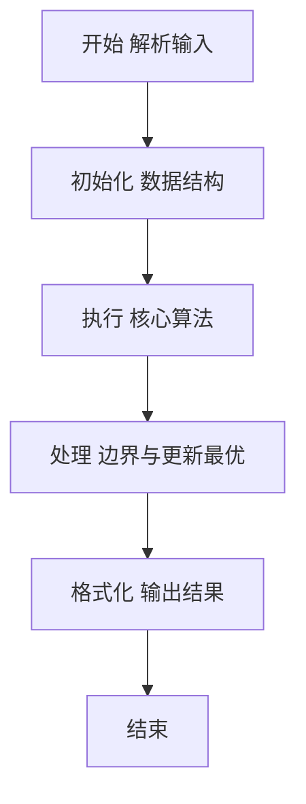
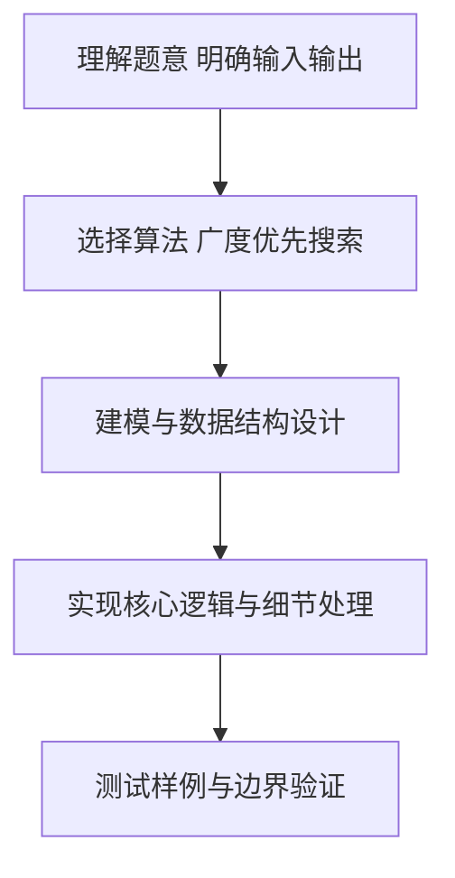

# L2-026 - 小字辈（25 分）

- **时间限制**: 400 ms
- **内存限制**: 65536 KB
- **代码长度限制**: 16 KB

---

## 题目描述


本题给定一个庞大家族的家谱，要请你给出最小一辈的名单。

### 输入格式:

输入在第一行给出家族人口总数 N（不超过 100 000 的正整数） —— 简单起见，我们把家族成员从 1 到 N 编号。随后第二行给出 N 个编号，其中第 i 个编号对应第 i 位成员的父/母。家谱中辈分最高的老祖宗对应的父/母编号为 -1。一行中的数字间以空格分隔。

### 输出格式:

首先输出最小的辈分（老祖宗的辈分为 1，以下逐级递增）。然后在第二行按递增顺序输出辈分最小的成员的编号。编号间以一个空格分隔，行首尾不得有多余空格。

### 输入样例:
```in
9
2 6 5 5 -1 5 6 4 7
```

### 输出样例:
```out
4
1 9
```

## 示例

### 示例 1

**输入:**
```
9
2 6 5 5 -1 5 6 4 7
```

**输出:**
```
4
1 9
```

### 解题思路

本题要求根据给定的输入数据完成相应的判定或计算任务，以“L2-026_小字辈”为核心，需在约束条件下构造出满足题意的结果。以 Lua 实现为参照，其实现原理概括为：由父/母编号反建孩子邻接表，从祖先进行层序遍历。

在算法选型上，针对题目数据规模与结构特征，选择了 广度优先搜索、排序 等关键技术。Lua 代码通过紧凑的表结构与迭代逻辑，将原理转化为可执行流程，既保证了正确性也兼顾了简洁性。例如代码中对输入的逐行解析、数据结构的初始化与核心循环的组织均体现了该思路。

关键在于细节处理与鲁棒性：如对空输入、重复键、边界值的正确处理，以及输出格式的精确控制。整体时间复杂度约为 O(N log N) 或 O(N)，空间复杂度 O(N)，满足题目限制（通常 1e5 级别可通过）。 结合 Lua 的快速 I/O 与表操作，能够在限制时间内完成判定并输出结果。
### 代码流程说明

1. 输入解析与预处理：按题面格式读取全部数据，将数值、字符串或图结构存入 Lua 表，必要时建立映射（如地址→节点、编号→集合）并处理边界空行。
2. 数据组织与排序：对关键对象按指定关键字排序（如按单价、按得分、按字典序），或构建哈希表/集合以支持 O(1) 判重与统计。
3. 核心逻辑处理：依据“由父/母编号反建孩子邻接表，从祖先进行层序遍历。…”的原理进行迭代计算，完成题面要求的判定、统计或构造任务，并在循环中处理相等、冲突等特殊分支。
4. 结果输出与格式化：按要求的格式拼接输出（如保留两位小数、按编号排序、输出路径或分类结果），注意末尾空格与换行控制，确保与样例一致。

### 代码实现

```lua
-- L2-026 小字辈
-- 实现原理：由父/母编号反建孩子邻接表，从祖先进行层序遍历。
-- 队列中的深度就是辈分，遍历结束时深度最大的所有节点即为小字辈。

local n = io.read("*n")
local children, root = {}, nil
for i = 1, n do
    local p = io.read("*n")
    if p == -1 then root = i else
        children[p] = children[p] or {}
        children[p][#children[p] + 1] = i
    end
end
local queue, head, maxDepth, youngest = { { root, 1 } }, 1, 0, {}
while head <= #queue do
    local x, depth = queue[head][1], queue[head][2]
    head = head + 1
    if depth > maxDepth then maxDepth, youngest = depth, { x }
    elseif depth == maxDepth then youngest[#youngest + 1] = x end
    for _, child in ipairs(children[x] or {}) do queue[#queue + 1] = { child, depth + 1 } end
end
table.sort(youngest)
print(maxDepth)
print(table.concat(youngest, " "))
```

### 代码流程图



### 解题流程图



