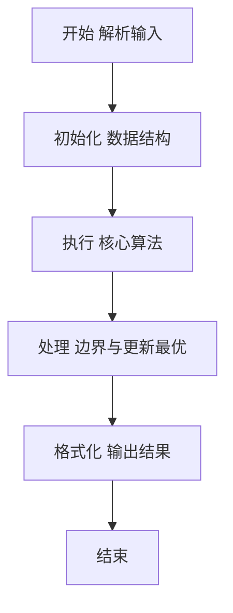
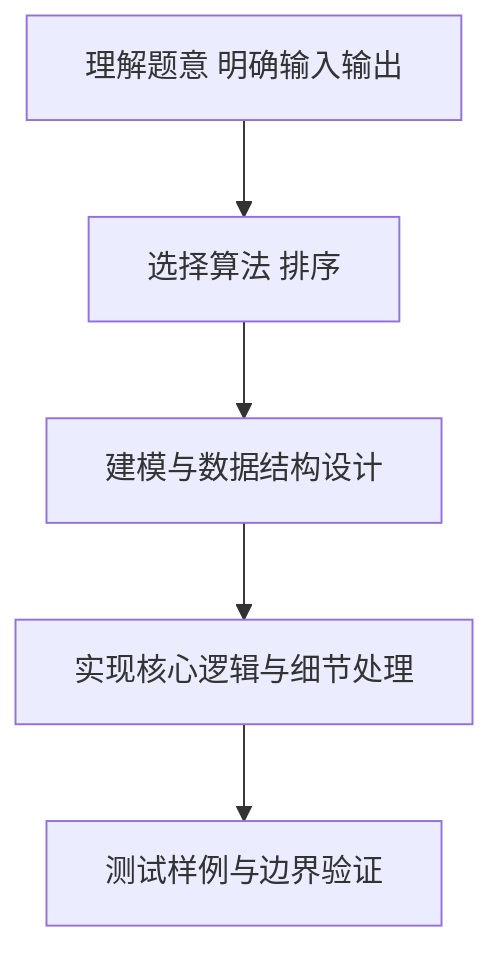

# L2-027 - 名人堂与代金券（25 分）

- **时间限制**: 150 ms
- **内存限制**: 65536 KB
- **代码长度限制**: 16 KB

---

## 题目描述


对于在中国大学MOOC（http://www.icourse163.org/ ）学习“数据结构”课程的学生，想要获得一张合格证书，总评成绩必须达到 60 分及以上，并且有另加福利：总评分在 [G, 100] 区间内者，可以得到 50 元 PAT 代金券；在 [60, G) 区间内者，可以得到 20 元PAT代金券。全国考点通用，一年有效。同时任课老师还会把总评成绩前 K 名的学生列入课程“名人堂”。本题就请你编写程序，帮助老师列出名人堂的学生，并统计一共发出了面值多少元的 PAT 代金券。

### 输入格式:

输入在第一行给出 3 个整数，分别是 N（不超过 10 000 的正整数，为学生总数）、G（在 (60,100) 区间内的整数，为题面中描述的代金券等级分界线）、K（不超过 100 且不超过 N 的正整数，为进入名人堂的最低名次）。接下来 N 行，每行给出一位学生的账号（长度不超过15位、不带空格的字符串）和总评成绩（区间 [0, 100] 内的整数），其间以空格分隔。题目保证没有重复的账号。

### 输出格式:

首先在一行中输出发出的 PAT 代金券的总面值。然后按总评成绩非升序输出进入名人堂的学生的名次、账号和成绩，其间以 1 个空格分隔。需要注意的是：成绩相同的学生享有并列的排名，排名并列时，按账号的字母序升序输出。

### 输入样例:
```in
10 80 5
cy@zju.edu.cn 78
cy@pat-edu.com 87
1001@qq.com 65
uh-oh@163.com 96
test@126.com 39
anyone@qq.com 87
zoe@mit.edu 80
jack@ucla.edu 88
bob@cmu.edu 80
ken@163.com 70
```

### 输出样例:
```out
360
1 uh-oh@163.com 96
2 jack@ucla.edu 88
3 anyone@qq.com 87
3 cy@pat-edu.com 87
5 bob@cmu.edu 80
5 zoe@mit.edu 80
```

## 示例

### 示例 1

**输入:**
```
10 80 5
cy@zju.edu.cn 78
cy@pat-edu.com 87
1001@qq.com 65
uh-oh@163.com 96
test@126.com 39
anyone@qq.com 87
zoe@mit.edu 80
jack@ucla.edu 88
bob@cmu.edu 80
ken@163.com 70
```

**输出:**
```
360
1 uh-oh@163.com 96
2 jack@ucla.edu 88
3 anyone@qq.com 87
3 cy@pat-edu.com 87
5 bob@cmu.edu 80
5 zoe@mit.edu 80
```

### 解题思路

本题要求根据给定的输入数据完成相应的判定或计算任务，以“L2-027_名人堂与代金券”为核心，需在约束条件下构造出满足题意的结果。以 Lua 实现为参照，其实现原理概括为：成绩排序时按分数降序、账号升序处理；排序后下标就是竞赛排名。

在算法选型上，针对题目数据规模与结构特征，选择了 排序 等关键技术。Lua 代码通过紧凑的表结构与迭代逻辑，将原理转化为可执行流程，既保证了正确性也兼顾了简洁性。例如代码中对输入的逐行解析、数据结构的初始化与核心循环的组织均体现了该思路。

关键在于细节处理与鲁棒性：如对空输入、重复键、边界值的正确处理，以及输出格式的精确控制。整体时间复杂度约为 O(N log N) 或 O(N)，空间复杂度 O(N)，满足题目限制（通常 1e5 级别可通过）。 结合 Lua 的快速 I/O 与表操作，能够在限制时间内完成判定并输出结果。
### 代码流程说明

1. 输入解析与预处理：按题面格式读取全部数据，将数值、字符串或图结构存入 Lua 表，必要时建立映射（如地址→节点、编号→集合）并处理边界空行。
2. 数据组织与排序：对关键对象按指定关键字排序（如按单价、按得分、按字典序），或构建哈希表/集合以支持 O(1) 判重与统计。
3. 核心逻辑处理：依据“成绩排序时按分数降序、账号升序处理；排序后下标就是竞赛排名…”的原理进行迭代计算，完成题面要求的判定、统计或构造任务，并在循环中处理相等、冲突等特殊分支。
4. 结果输出与格式化：按要求的格式拼接输出（如保留两位小数、按编号排序、输出路径或分类结果），注意末尾空格与换行控制，确保与样例一致。

### 代码实现

```lua
-- L2-027 名人堂与代金券
-- 实现原理：成绩排序时按分数降序、账号升序处理；排序后下标就是竞赛排名
-- （同分沿用前一名的排名）。代金券则按原始成绩区间直接累计。

local n, g, k = io.read("*n"), io.read("*n"), io.read("*n")
local students, coupon = {}, 0
for i = 1, n do
    local id, score = io.read("*s"), io.read("*n")
    students[i] = { id = id, score = score }
    if score >= g then coupon = coupon + 50 elseif score >= 60 then coupon = coupon + 20 end
end
table.sort(students, function(a, b)
    return a.score ~= b.score and a.score > b.score or a.id < b.id
end)
print(coupon)
local rank = 0
for i = 1, math.min(k, n) do
    if i == 1 or students[i].score ~= students[i - 1].score then rank = i end
    print(rank . " " . students[i].id . " " . students[i].score)
end
```

### 代码流程图



### 解题流程图



