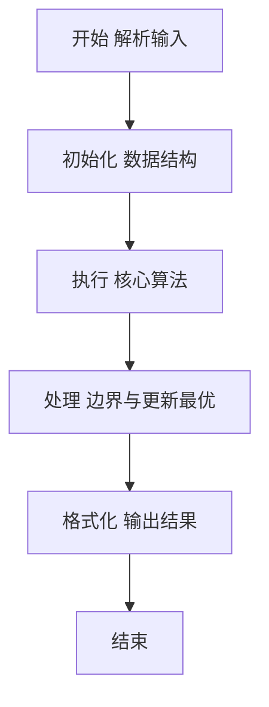
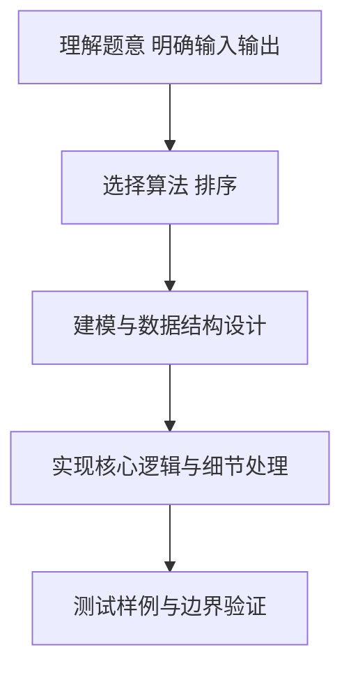

# L2-028 - 秀恩爱分得快（25 分）

- **时间限制**: 500 ms
- **内存限制**: 65536 KB
- **代码长度限制**: 16 KB

---

## 题目描述


古人云：秀恩爱，分得快。

互联网上每天都有大量人发布大量照片，我们通过分析这些照片，可以分析人与人之间的亲密度。如果一张照片上出现了 K 个人，这些人两两间的亲密度就被定义为 1/K。任意两个人如果同时出现在若干张照片里，他们之间的亲密度就是所有这些同框照片对应的亲密度之和。下面给定一批照片，请你分析一对给定的情侣，看看他们分别有没有亲密度更高的异性朋友？

### 输入格式:

输入在第一行给出 2 个正整数：N（不超过1000，为总人数——简单起见，我们把所有人从 0 到 N-1 编号。为了区分性别，我们用编号前的负号表示女性）和 M（不超过1000，为照片总数）。随后 M 行，每行给出一张照片的信息，格式如下：

```
K P[1] .. P[K]
```

其中 K（$$\le$$ 500）是该照片中出现的人数，P[1] ~ P[K] 就是这些人的编号。最后一行给出一对异性情侣的编号 A 和 B。同行数字以空格分隔。题目保证每个人只有一个性别，并且不会在同一张照片里出现多次。

### 输出格式:

首先输出 `A PA`，其中 `PA` 是与 `A` 最亲密的异性。如果 `PA` 不唯一，则按他们编号的绝对值递增输出；然后类似地输出 `B PB`。但如果 `A` 和 `B` 正是彼此亲密度最高的一对，则只输出他们的编号，无论是否还有其他人并列。

### 输入样例 1：
```in
10 4
4 -1 2 -3 4
4 2 -3 -5 -6
3 2 4 -5
3 -6 0 2
-3 2
```

### 输出样例 1：
```out
-3 2
2 -5
2 -6
```

### 输入样例 2：
```in
4 4
4 -1 2 -3 0
2 0 -3
2 2 -3
2 -1 2 
-3 2
```

### 输出样例 2：
```out
-3 2
```

## 示例

### 示例 1

**输入:**
```
10 4
4 -1 2 -3 4
4 2 -3 -5 -6
3 2 4 -5
3 -6 0 2
-3 2
```

**输出:**
```
-3 2
2 -5
2 -6
```

### 示例 2

**输入:**
```
4 4
4 -1 2 -3 0
2 0 -3
2 2 -3
2 -1 2 
-3 2
```

**输出:**
```
-3 2
```

### 解题思路

本题要求根据给定的输入数据完成相应的判定或计算任务，以“L2-028_秀恩爱分得快”为核心，需在约束条件下构造出满足题意的结果。以 Lua 实现为参照，其实现原理概括为：一张含 $K$ 人的照片，对其中每对异性累计 $1/K$ 的亲密度。

在算法选型上，针对题目数据规模与结构特征，选择了 排序 等关键技术。Lua 代码通过紧凑的表结构与迭代逻辑，将原理转化为可执行流程，既保证了正确性也兼顾了简洁性。例如代码中对输入的逐行解析、数据结构的初始化与核心循环的组织均体现了该思路。

关键在于细节处理与鲁棒性：如对空输入、重复键、边界值的正确处理，以及输出格式的精确控制。整体时间复杂度约为 O(N log N) 或 O(N)，空间复杂度 O(N)，满足题目限制（通常 1e5 级别可通过）。 结合 Lua 的快速 I/O 与表操作，能够在限制时间内完成判定并输出结果。
### 代码流程说明

1. 输入解析与预处理：按题面格式读取全部数据，将数值、字符串或图结构存入 Lua 表，必要时建立映射（如地址→节点、编号→集合）并处理边界空行。
2. 数据组织与排序：对关键对象按指定关键字排序（如按单价、按得分、按字典序），或构建哈希表/集合以支持 O(1) 判重与统计。
3. 核心逻辑处理：依据“一张含 $K$ 人的照片，对其中每对异性累计 $1/K$ 的亲密度。…”的原理进行迭代计算，完成题面要求的判定、统计或构造任务，并在循环中处理相等、冲突等特殊分支。
4. 结果输出与格式化：按要求的格式拼接输出（如保留两位小数、按编号排序、输出路径或分类结果），注意末尾空格与换行控制，确保与样例一致。

### 代码实现

```lua
-- L2-028 秀恩爱分得快
-- 实现原理：一张含 K 人的照片，对其中每对异性累计 1/K 的亲密度。
-- 分别找出 A、B 的最大异性亲密度对象；若两人互为最大对象则只输出这一对。

local n, m = io.read("*n"), io.read("*n")
local intimacy = {}
local function add(a, b, value)
    intimacy[a] = intimacy[a] or {}
    intimacy[a][b] = (intimacy[a][b] or 0) + value
end
for _ = 1, m do
    local k, people = io.read("*n"), {}
    for i = 1, k do people[i] = io.read("*n") end
    for i = 1, k do
        for j = i + 1, k do
            if (people[i] < 0) ~= (people[j] < 0) then
                add(people[i], people[j], 1 / k)
                add(people[j], people[i], 1 / k)
            end
        end
    end
end
local a, b = io.read("*n"), io.read("*n")
local function best(x)
    local maxValue, result = -1, {}
    for y, value in pairs(intimacy[x] or {}) do
        if value > maxValue + 1e-10 then maxValue, result = value, { y }
        elseif math.abs(value - maxValue) < 1e-10 then result[#result + 1] = y end
    end
    table.sort(result, function(u, v) return math.abs(u) < math.abs(v) end)
    return result
end
local pa, pb = best(a), best(b)
local aLikesB, bLikesA = false, false
for _, x in ipairs(pa) do if x == b then aLikesB = true end end
for _, x in ipairs(pb) do if x == a then bLikesA = true end end
if aLikesB and bLikesA then
    print(a . " " . b)
else
    for _, x in ipairs(pa) do print(a . " " . x) end
    for _, x in ipairs(pb) do print(b . " " . x) end
end
```

### 代码流程图



### 解题流程图


