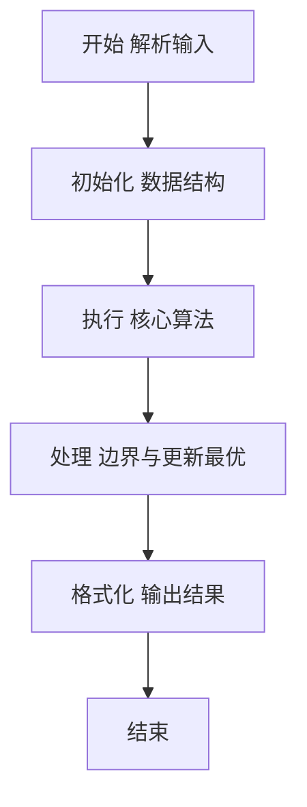
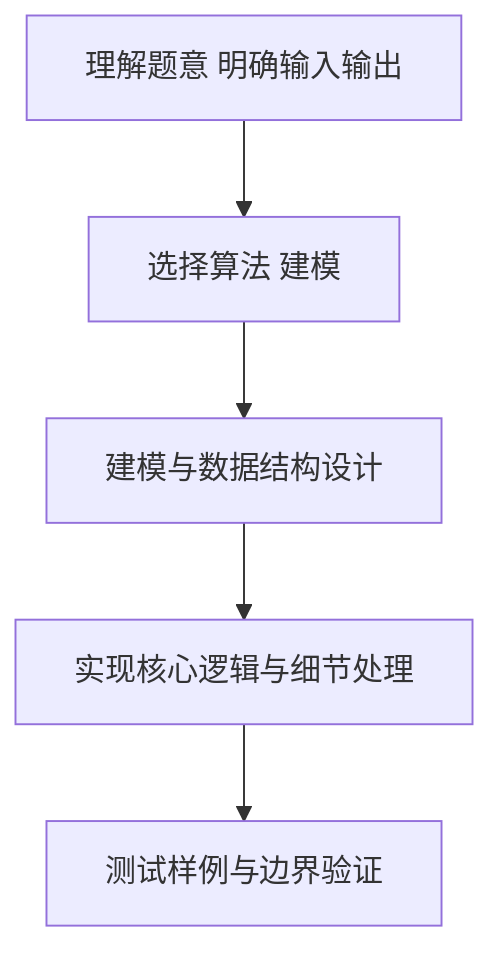

# L2-029 - 特立独行的幸福（25 分）

- **时间限制**: 400 ms
- **内存限制**: 65536 KB
- **代码长度限制**: 16 KB

---

## 题目描述


对一个十进制数的各位数字做一次平方和，称作一次迭代。如果一个十进制数能通过若干次迭代得到 1，就称该数为幸福数。1 是一个幸福数。此外，例如 19 经过 1 次迭代得到 82，2 次迭代后得到 68，3 次迭代后得到 100，最后得到 1。则 19 就是幸福数。显然，在一个幸福数迭代到 1 的过程中经过的数字都是幸福数，它们的幸福是依附于初始数字的。例如 82、68、100 的幸福是依附于 19 的。而一个**特立独行**的幸福数，是在一个有限的区间内不依附于任何其它数字的；其**独立性**就是依附于它的的幸福数的个数。如果这个数还是个素数，则其独立性加倍。例如 19 在区间[1, 100] 内就是一个特立独行的幸福数，其独立性为 $$2\times 4 = 8$$。

另一方面，如果一个大于1的数字经过数次迭代后进入了死循环，那这个数就不幸福。例如 29 迭代得到 85、89、145、42、20、4、16、37、58、89、…… 可见 89 到 58 形成了死循环，所以 29 就不幸福。

本题就要求你编写程序，列出给定区间内的所有特立独行的幸福数和它的独立性。

### 输入格式:

输入在第一行给出闭区间的两个端点：$$1<A<B\le 10^4$$。

### 输出格式:

按递增顺序列出给定闭区间 $$[A,B]$$ 内的所有特立独行的幸福数和它的独立性。每对数字占一行，数字间以 1 个空格分隔。

如果区间内没有幸福数，则在一行中输出 `SAD`。

### 输入样例 1：
```in
10 40
```

### 输出样例 1：
```out
19 8
23 6
28 3
31 4
32 3
```

### 输入样例 2：
```in
110 120
```

### 输出样例 2：
```out
SAD
```

## 示例

### 示例 1

**输入:**
```
10 40
```

**输出:**
```
19 8
23 6
28 3
31 4
32 3
```

### 示例 2

**输入:**
```
110 120
```

**输出:**
```
SAD
```

### 解题思路

本题要求根据给定的输入数据完成相应的判定或计算任务，以“L2-029_特立独行的幸福”为核心，需在约束条件下构造出满足题意的结果。以 Lua 实现为参照，其实现原理概括为：对区间内每个数模拟各位平方和，检测到 1 即为幸福数并记录步数。

在算法选型上，代码遵循“先解析、再建模、后计算”的一般套路，将输入转化为便于处理的内部表示，再通过线性或近线性扫描完成核心判定。实现中注重边界条件与格式细节，以确保在 PTA 判题环境下稳定通过。

关键在于细节处理与鲁棒性：如对空输入、重复键、边界值的正确处理，以及输出格式的精确控制。整体时间复杂度约为 O(N log N) 或 O(N)，空间复杂度 O(N)，满足题目限制（通常 1e5 级别可通过）。 结合 Lua 的快速 I/O 与表操作，能够在限制时间内完成判定并输出结果。
### 代码流程说明

1. 输入解析与预处理：按题面格式读取全部数据，将数值、字符串或图结构存入 Lua 表，必要时建立映射（如地址→节点、编号→集合）并处理边界空行。
2. 数据建模与初始化：将输入转化为内部模型（图、树、链表或数组），初始化距离、访问标记、计数器等辅助数组。
3. 核心逻辑处理：依据“对区间内每个数模拟各位平方和，检测到 1 即为幸福数并记录步数。…”的原理进行迭代计算，完成题面要求的判定、统计或构造任务，并在循环中处理相等、冲突等特殊分支。
4. 结果输出与格式化：按要求的格式拼接输出（如保留两位小数、按编号排序、输出路径或分类结果），注意末尾空格与换行控制，确保与样例一致。

### 代码实现

```lua
-- L2-029 特立独行的幸福
-- 实现原理：对区间内每个数模拟各位平方和，检测到 1 即为幸福数并记录步数。
-- 若某幸福数出现在另一幸福数的迭代链中，它就依附于后者；未被依附者才输出。

local a, b = io.read("*n"), io.read("*n")
local function nextValue(x)
    local sum = 0
    while x > 0 do local d = x % 10; sum = sum + d * d; x = math.floor(x / 10) end
    return sum
end
local function happinessSteps(x)
    local seen, steps = {}, 0
    while x ~= 1 and not seen[x] do
        seen[x] = true
        x = nextValue(x)
        steps = steps + 1
    end
    return x == 1 and steps or nil
end
local function isPrime(x)
    if x < 2 then return false end
    for d = 2, math.floor(math.sqrt(x)) do if x % d == 0 then return false end end
    return true
end

local steps, attached = {}, {}
for x = a, b do steps[x] = happinessSteps(x) end
for x = a, b do
    if steps[x] then
        local y = nextValue(x)
        while y ~= 1 do
            if y >= a and y <= b then attached[y] = true end
            y = nextValue(y)
        end
    end
end
local found = false
for x = a, b do
    if steps[x] and not attached[x] then
        local value = steps[x]
        if isPrime(x) then value = value * 2 end
        print(x . " " . value)
        found = true
    end
end
if not found then print("SAD") end
```

### 代码流程图



### 解题流程图



