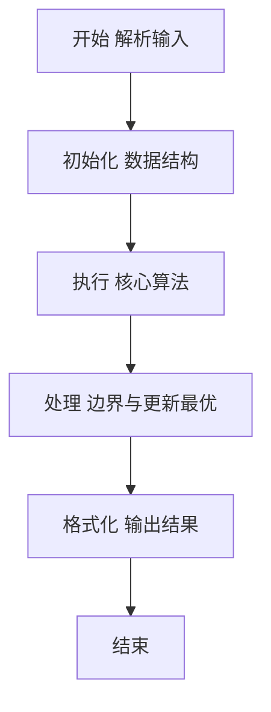
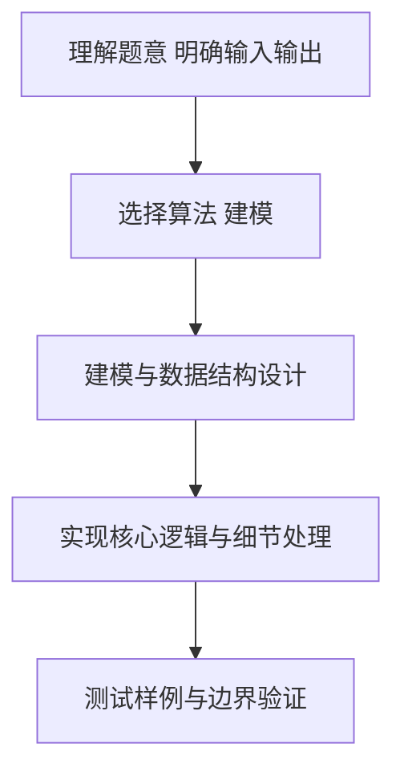

# L2-030 - 冰岛人（25 分）

- **时间限制**: 400 ms
- **内存限制**: 65536 KB
- **代码长度限制**: 16 KB

---

## 题目描述


2018年世界杯，冰岛队因1:1平了强大的阿根廷队而一战成名。好事者发现冰岛人的名字后面似乎都有个“松”（son），于是有网友科普如下：


冰岛人沿用的是维京人古老的父系姓制，孩子的姓等于父亲的名加后缀，如果是儿子就加 sson，女儿则加 sdottir。因为冰岛人口较少，为避免近亲繁衍，本地人交往前先用个 App 查一下两人祖宗若干代有无联系。本题就请你实现这个 App 的功能。

### 输入格式:

输入首先在第一行给出一个正整数 $$N$$（$$1 < N \le 10^5$$），为当地人口数。随后 $$N$$ 行，每行给出一个人名，格式为：`名 姓（带性别后缀）`，两个字符串均由不超过 20 个小写的英文字母组成。维京人后裔是可以通过姓的后缀判断其性别的，其他人则是在姓的后面加 `m` 表示男性、`f` 表示女性。题目保证给出的每个维京家族的起源人都是男性。

随后一行给出正整数 $$M$$，为查询数量。随后 $$M$$ 行，每行给出一对人名，格式为：`名1 姓1 名2 姓2`。注意：这里的`姓`是不带后缀的。四个字符串均由不超过 20 个小写的英文字母组成。

题目保证不存在两个人是同名的。

### 输出格式:

对每一个查询，根据结果在一行内显示以下信息：

- 若两人为异性，且五代以内无公共祖先，则输出 `Yes`；
- 若两人为异性，但五代以内（不包括第五代）有公共祖先，则输出 `No`；
- 若两人为同性，则输出 `Whatever`；
- 若有一人不在名单内，则输出 `NA`。

所谓“五代以内无公共祖先”是指两人的公共祖先（如果存在的话）必须比任何一方的曾祖父辈分高。

### 输入样例:
```in
15
chris smithm
adam smithm
bob adamsson
jack chrissson
bill chrissson
mike jacksson
steve billsson
tim mikesson
april mikesdottir
eric stevesson
tracy timsdottir
james ericsson
patrick jacksson
robin patricksson
will robinsson
6
tracy tim james eric
will robin tracy tim
april mike steve bill
bob adam eric steve
tracy tim tracy tim
x man april mikes
```

### 输出样例:
```out
Yes
No
No
Whatever
Whatever
NA
```

## 示例

### 示例 1

**输入:**
```
15
chris smithm
adam smithm
bob adamsson
jack chrissson
bill chrissson
mike jacksson
steve billsson
tim mikesson
april mikesdottir
eric stevesson
tracy timsdottir
james ericsson
patrick jacksson
robin patricksson
will robinsson
6
tracy tim james eric
will robin tracy tim
april mike steve bill
bob adam eric steve
tracy tim tracy tim
x man april mikes
```

**输出:**
```
Yes
No
No
Whatever
Whatever
NA
```

### 解题思路

本题要求根据给定的输入数据完成相应的判定或计算任务，以“L2-030_冰岛人”为核心，需在约束条件下构造出满足题意的结果。以 Lua 实现为参照，其实现原理概括为：从带性别后缀的姓中提取性别和父亲名字，建立父系家谱。

在算法选型上，代码遵循“先解析、再建模、后计算”的一般套路，将输入转化为便于处理的内部表示，再通过线性或近线性扫描完成核心判定。实现中注重边界条件与格式细节，以确保在 PTA 判题环境下稳定通过。

关键在于细节处理与鲁棒性：如对空输入、重复键、边界值的正确处理，以及输出格式的精确控制。整体时间复杂度约为 O(N log N) 或 O(N)，空间复杂度 O(N)，满足题目限制（通常 1e5 级别可通过）。 结合 Lua 的快速 I/O 与表操作，能够在限制时间内完成判定并输出结果。
### 代码流程说明

1. 输入解析与预处理：按题面格式读取全部数据，将数值、字符串或图结构存入 Lua 表，必要时建立映射（如地址→节点、编号→集合）并处理边界空行。
2. 数据建模与初始化：将输入转化为内部模型（图、树、链表或数组），初始化距离、访问标记、计数器等辅助数组。
3. 核心逻辑处理：依据“从带性别后缀的姓中提取性别和父亲名字，建立父系家谱。…”的原理进行迭代计算，完成题面要求的判定、统计或构造任务，并在循环中处理相等、冲突等特殊分支。
4. 结果输出与格式化：按要求的格式拼接输出（如保留两位小数、按编号排序、输出路径或分类结果），注意末尾空格与换行控制，确保与样例一致。

### 代码实现

```lua
-- L2-030 冰岛人
-- 实现原理：从带性别后缀的姓中提取性别和父亲名字，建立父系家谱。
-- 查询时分别向上收集四代祖先；异性双方祖先集合无交集则可以交往。

local n = io.read("*n")
local people, byKey, byFirst = {}, {}, {}
for i = 1, n do
    local first, surname = io.read("*s"), io.read("*s")
    local sex, base, fatherName
    if surname:sub(-4) == "sson" then
        sex, base, fatherName = "M", surname:sub(1, -5), surname:sub(1, -5)
    elseif surname:sub(-7) == "sdottir" then
        sex, base, fatherName = "F", surname:sub(1, -7), surname:sub(1, -7)
    else
        sex, base = surname:sub(-1) == "m" and "M" or "F", surname:sub(1, -2)
    end
    people[i] = { first = first, base = base, sex = sex, fatherName = fatherName }
    byKey[first . " " . base], byFirst[first] = i, i
end
for _, person in ipairs(people) do person.father = person.fatherName and byFirst[person.fatherName] or nil end

local function ancestorSet(id)
    local set, depth = {}, 0
    while id and depth < 4 do
        id = people[id].father
        depth = depth + 1
        if id then set[id] = true end
    end
    return set
end

local q = io.read("*n")
for _ = 1, q do
    local f1, s1, f2, s2 = io.read("*s"), io.read("*s"), io.read("*s"), io.read("*s")
    local x, y = byKey[f1 . " " . s1], byKey[f2 . " " . s2]
    if not x or not y then
        print("NA")
    elseif people[x].sex == people[y].sex then
        print("Whatever")
    else
        local ax, ay, related = ancestorSet(x), ancestorSet(y), false
        for id in pairs(ax) do if ay[id] then related = true; break end end
        print(related and "No" or "Yes")
    end
end
```

### 代码流程图



### 解题流程图



