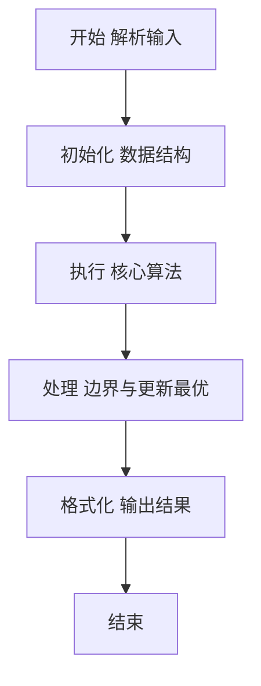
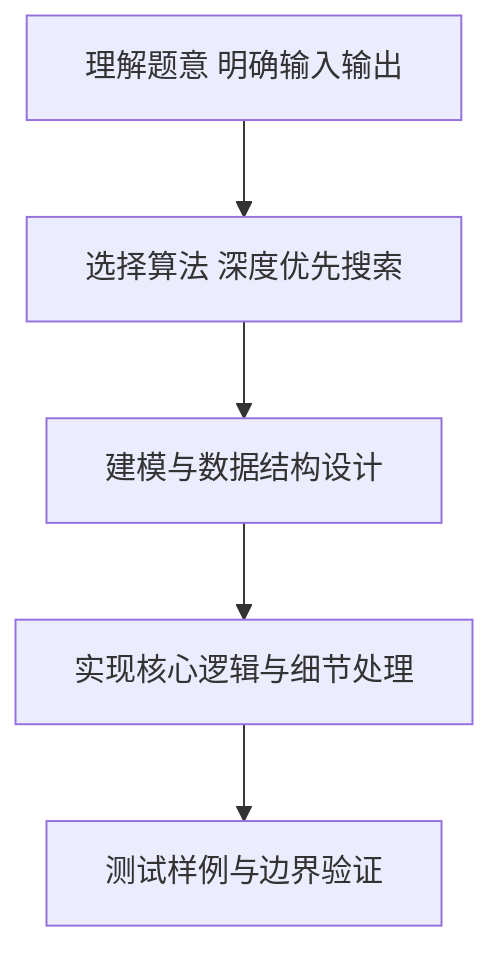

# L2-031 - 深入虎穴（25 分）

- **时间限制**: 400 ms
- **内存限制**: 65536 KB
- **代码长度限制**: 16 KB

---

## 题目描述


著名的王牌间谍 007 需要执行一次任务，获取敌方的机密情报。已知情报藏在一个地下迷宫里，迷宫只有一个入口，里面有很多条通路，每条路通向一扇门。每一扇门背后或者是一个房间，或者又有很多条路，同样是每条路通向一扇门…… 他的手里有一张表格，是其他间谍帮他收集到的情报，他们记下了每扇门的编号，以及这扇门背后的每一条通路所到达的门的编号。007 发现不存在两条路通向同一扇门。

内线告诉他，情报就藏在迷宫的最深处。但是这个迷宫太大了，他需要你的帮助 —— 请编程帮他找出距离入口最远的那扇门。

### 输入格式:

输入首先在一行中给出正整数 $$N$$（$$< 10^5$$），是门的数量。最后 $$N$$ 行，第 $$i$$ 行（$$1\le i \le N$$）按以下格式描述编号为 $$i$$ 的那扇门背后能通向的门：

```
K D[1] D[2] .. D[K]
```
其中 `K` 是通道的数量，其后是每扇门的编号。

### 输出格式:

在一行中输出距离入口最远的那扇门的编号。题目保证这样的结果是唯一的。

### 输入样例:
```in
13
3 2 3 4
2 5 6
1 7
1 8
1 9
0
2 11 10
1 13
0
0
1 12
0
0
```

### 输出样例:
```out
12
```

## 示例

### 示例 1

**输入:**
```
13
3 2 3 4
2 5 6
1 7
1 8
1 9
0
2 11 10
1 13
0
0
1 12
0
0
```

**输出:**
```
12
```

### 解题思路

本题要求根据给定的输入数据完成相应的判定或计算任务，以“L2-031_深入虎穴”为核心，需在约束条件下构造出满足题意的结果。以 Lua 实现为参照，其实现原理概括为：门和通路构成一棵以唯一入门为根的树。先由入度找到根，。

在算法选型上，针对题目数据规模与结构特征，选择了 深度优先搜索 等关键技术。Lua 代码通过紧凑的表结构与迭代逻辑，将原理转化为可执行流程，既保证了正确性也兼顾了简洁性。例如代码中对输入的逐行解析、数据结构的初始化与核心循环的组织均体现了该思路。

关键在于细节处理与鲁棒性：如对空输入、重复键、边界值的正确处理，以及输出格式的精确控制。整体时间复杂度约为 O(N log N) 或 O(N)，空间复杂度 O(N)，满足题目限制（通常 1e5 级别可通过）。 结合 Lua 的快速 I/O 与表操作，能够在限制时间内完成判定并输出结果。
### 代码流程说明

1. 输入解析与预处理：按题面格式读取全部数据，将数值、字符串或图结构存入 Lua 表，必要时建立映射（如地址→节点、编号→集合）并处理边界空行。
2. 辅助结构初始化：初始化栈/队列等辅助容器，设定容量限制与指针位置，为后续模拟操作准备状态。
3. 核心逻辑处理：依据“门和通路构成一棵以唯一入门为根的树。先由入度找到根，…”的原理进行迭代计算，完成题面要求的判定、统计或构造任务，并在循环中处理相等、冲突等特殊分支。
4. 结果输出与格式化：按要求的格式拼接输出（如保留两位小数、按编号排序、输出路径或分类结果），注意末尾空格与换行控制，确保与样例一致。

### 代码实现

```lua
-- L2-031 深入虎穴
-- 实现原理：门和通路构成一棵以唯一入门为根的树。先由入度找到根，
-- 再以迭代 DFS 记录深度，深度最大的门即为目标。

local n = io.read("*n")
local children, indegree = {}, {}
for i = 1, n do
    local k = io.read("*n")
    children[i] = {}
    for j = 1, k do
        local x = io.read("*n")
        children[i][j] = x
        indegree[x] = (indegree[x] or 0) + 1
    end
end
local root
for i = 1, n do if not indegree[i] then root = i; break end end
local stack, farDoor, farDepth = { { root, 0 } }, root, -1
while #stack > 0 do
    local x, depth = stack[#stack][1], stack[#stack][2]
    stack[#stack] = nil
    if depth > farDepth then farDoor, farDepth = x, depth end
    for _, child in ipairs(children[x]) do stack[#stack + 1] = { child, depth + 1 } end
end
print(farDoor)
```

### 代码流程图



### 解题流程图



