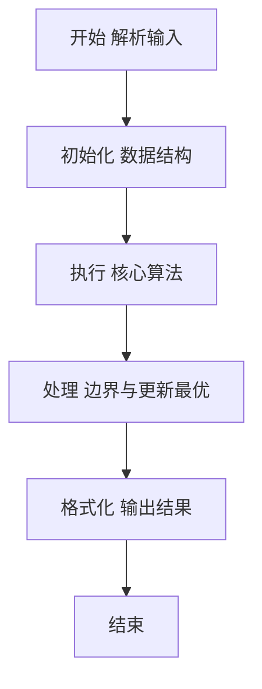
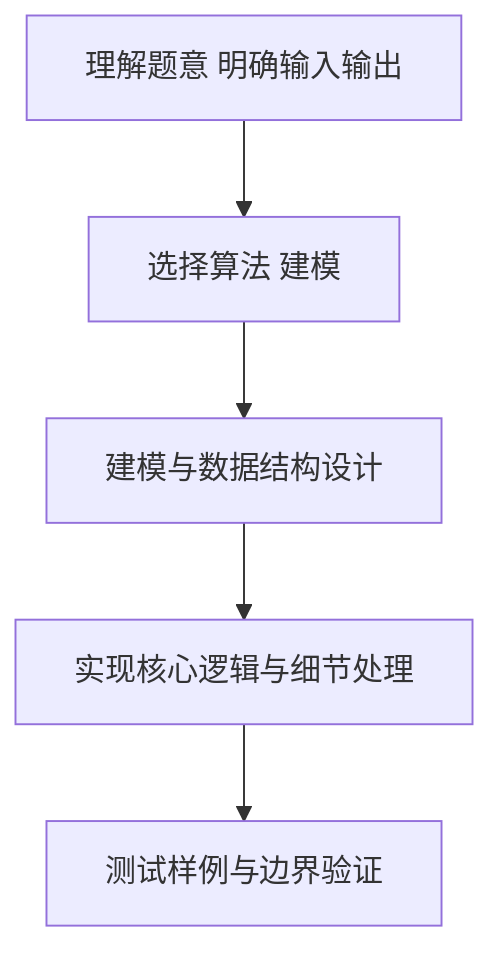

# L2-032 - 彩虹瓶（25 分）

- **时间限制**: 400 ms
- **内存限制**: 65536 KB
- **代码长度限制**: 16 KB

---

## 题目描述


彩虹瓶的制作过程（并不）是这样的：先把一大批空瓶铺放在装填场地上，然后按照一定的顺序将每种颜色的小球均匀撒到这批瓶子里。

假设彩虹瓶里要按顺序装 N 种颜色的小球（不妨将顺序就编号为 1 到 N）。现在工厂里有每种颜色的小球各一箱，工人需要一箱一箱地将小球从工厂里搬到装填场地。如果搬来的这箱小球正好是可以装填的颜色，就直接拆箱装填；如果不是，就把箱子先码放在一个临时货架上，码放的方法就是一箱一箱堆上去。当一种颜色装填完以后，先看看货架顶端的一箱是不是下一个要装填的颜色，如果是就取下来装填，否则去工厂里再搬一箱过来。

如果工厂里发货的顺序比较好，工人就可以顺利地完成装填。例如要按顺序装填 7 种颜色，工厂按照 7、6、1、3、2、5、4 这个顺序发货，则工人先拿到 7、6 两种不能装填的颜色，将其按照 7 在下、6 在上的顺序堆在货架上；拿到 1 时可以直接装填；拿到 3 时又得临时码放在 6 号颜色箱上；拿到 2 时可以直接装填；随后从货架顶取下 3 进行装填；然后拿到 5，临时码放到 6 上面；最后取了 4 号颜色直接装填；剩下的工作就是顺序从货架上取下 5、6、7 依次装填。

但如果工厂按照 3、1、5、4、2、6、7 这个顺序发货，工人就必须要愤怒地折腾货架了，因为装填完 2 号颜色以后，不把货架上的多个箱子搬下来就拿不到 3 号箱，就不可能顺利完成任务。

另外，货架的容量有限，如果要堆积的货物超过容量，工人也没办法顺利完成任务。例如工厂按照 7、6、5、4、3、2、1 这个顺序发货，如果货架够高，能码放 6 只箱子，那还是可以顺利完工的；但如果货架只能码放 5 只箱子，工人就又要愤怒了……

本题就请你判断一下，工厂的发货顺序能否让工人顺利完成任务。

### 输入格式:

输入首先在第一行给出 3 个正整数，分别是彩虹瓶的颜色数量 $$N$$（$$1 < N \le 10^3$$）、临时货架的容量 $$M$$（$$< N$$）、以及需要判断的发货顺序的数量 $$K$$。

随后 $$K$$ 行，每行给出 $$N$$ 个数字，是 1 到$$N$$ 的一个排列，对应工厂的发货顺序。

一行中的数字都以空格分隔。

### 输出格式:

对每个发货顺序，如果工人可以愉快完工，就在一行中输出 `YES`；否则输出 `NO`。

### 输入样例:
```in
7 5 3
7 6 1 3 2 5 4
3 1 5 4 2 6 7
7 6 5 4 3 2 1
```

### 输出样例:
```out
YES
NO
NO
```

## 示例

### 示例 1

**输入:**
```
7 5 3
7 6 1 3 2 5 4
3 1 5 4 2 6 7
7 6 5 4 3 2 1
```

**输出:**
```
YES
NO
NO
```

### 解题思路

本题要求根据给定的输入数据完成相应的判定或计算任务，以“L2-032_彩虹瓶”为核心，需在约束条件下构造出满足题意的结果。以 Lua 实现为参照，其实现原理概括为：临时货架满足后进先出，直接模拟栈顶是否正好是下一待装颜色。

在算法选型上，代码遵循“先解析、再建模、后计算”的一般套路，将输入转化为便于处理的内部表示，再通过线性或近线性扫描完成核心判定。实现中注重边界条件与格式细节，以确保在 PTA 判题环境下稳定通过。

关键在于细节处理与鲁棒性：如对空输入、重复键、边界值的正确处理，以及输出格式的精确控制。整体时间复杂度约为 O(N log N) 或 O(N)，空间复杂度 O(N)，满足题目限制（通常 1e5 级别可通过）。 结合 Lua 的快速 I/O 与表操作，能够在限制时间内完成判定并输出结果。
### 代码流程说明

1. 输入解析与预处理：按题面格式读取全部数据，将数值、字符串或图结构存入 Lua 表，必要时建立映射（如地址→节点、编号→集合）并处理边界空行。
2. 辅助结构初始化：初始化栈/队列等辅助容器，设定容量限制与指针位置，为后续模拟操作准备状态。
3. 核心逻辑处理：依据“临时货架满足后进先出，直接模拟栈顶是否正好是下一待装颜色。…”的原理进行迭代计算，完成题面要求的判定、统计或构造任务，并在循环中处理相等、冲突等特殊分支。
4. 结果输出与格式化：按要求的格式拼接输出（如保留两位小数、按编号排序、输出路径或分类结果），注意末尾空格与换行控制，确保与样例一致。

### 代码实现

```lua
-- L2-032 彩虹瓶
-- 实现原理：临时货架满足后进先出，直接模拟栈顶是否正好是下一待装颜色。
-- 货架超过容量或最终不能按 1.N 取完时，该发货序列不可行。

local n, limit, k = io.read("*n"), io.read("*n"), io.read("*n")
for _ = 1, k do
    local order = {}
    for i = 1, n do order[i] = io.read("*n") end
    local stack, need, ok = {}, 1, true
    for _, color in ipairs(order) do
        if color == need then
            need = need + 1
            while #stack > 0 and stack[#stack] == need do stack[#stack] = nil; need = need + 1 end
        elseif #stack >= limit then
            ok = false
        else
            stack[#stack + 1] = color
        end
    end
    while #stack > 0 and stack[#stack] == need do stack[#stack] = nil; need = need + 1 end
    print(ok and need == n + 1 and "YES" or "NO")
end
```

### 代码流程图



### 解题流程图



