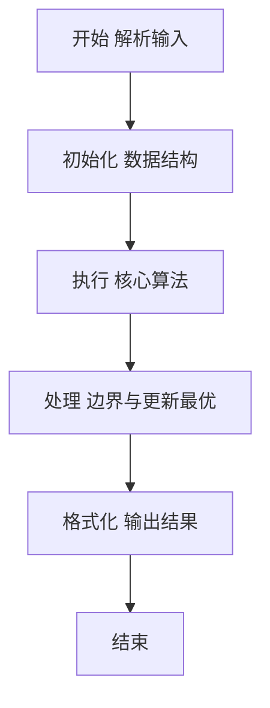
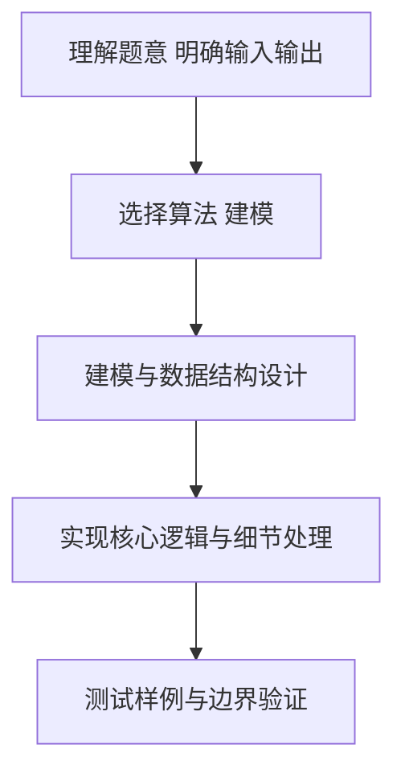

# L2-033 - 简单计算器（25 分）

- **时间限制**: 400 ms
- **内存限制**: 65536 KB
- **代码长度限制**: 16 KB

---

## 题目描述


本题要求你为初学数据结构的小伙伴设计一款简单的利用堆栈执行的计算器。如上图所示，计算器由两个堆栈组成，一个堆栈 $$S_1$$ 存放数字，另一个堆栈 $$S_2$$ 存放运算符。计算器的最下方有一个等号键，每次按下这个键，计算器就执行以下操作：

1. 从 $$S_1$$ 中弹出两个数字，顺序为 $$n_1$$ 和 $$n_2$$；
1. 从 $$S_2$$ 中弹出一个运算符 op；
1. 执行计算 $$n_2$$ op $$n_1$$；
1. 将得到的结果压回 $$S_1$$。

直到两个堆栈都为空时，计算结束，最后的结果将显示在屏幕上。

### 输入格式:

输入首先在第一行给出正整数 $$N$$（$$1 < N \le 10^3$$），为 $$S_1$$ 中数字的个数。

第二行给出 $$N$$ 个绝对值不超过 100 的整数；第三行给出 $$N-1$$ 个运算符 —— 这里仅考虑 `+`、`-`、`*`、`/` 这四种运算。一行中的数字和符号都以空格分隔。

### 输出格式:

将输入的数字和运算符按给定顺序分别压入堆栈 $$S_1$$ 和 $$S_2$$，将执行计算的最后结果输出。注意所有的计算都只取结果的整数部分。题目保证计算的中间和最后结果的绝对值都不超过 $$10^9$$。

如果执行除法时出现分母为零的非法操作，则在一行中输出：`ERROR: X/0`，其中 `X` 是当时的分子。然后结束程序。

### 输入样例 1：
```in
5
40 5 8 3 2
/ * - +
```

### 输出样例 1：
```out
2
```

### 输入样例 2：
```in
5
2 5 8 4 4
* / - +
```

### 输出样例 2：
```out
ERROR: 5/0
```

## 示例

### 示例 1

**输入:**
```
5
40 5 8 3 2
/ * - +
```

**输出:**
```
2
```

### 示例 2

**输入:**
```
5
2 5 8 4 4
* / - +
```

**输出:**
```
ERROR: 5/0
```

### 解题思路

本题要求根据给定的输入数据完成相应的判定或计算任务，以“L2-033_简单计算器”为核心，需在约束条件下构造出满足题意的结果。以 Lua 实现为参照，其实现原理概括为：数字和运算符按给定顺序压入两个栈，随后按题意依次弹出。

在算法选型上，代码遵循“先解析、再建模、后计算”的一般套路，将输入转化为便于处理的内部表示，再通过线性或近线性扫描完成核心判定。实现中注重边界条件与格式细节，以确保在 PTA 判题环境下稳定通过。

关键在于细节处理与鲁棒性：如对空输入、重复键、边界值的正确处理，以及输出格式的精确控制。整体时间复杂度约为 O(N log N) 或 O(N)，空间复杂度 O(N)，满足题目限制（通常 1e5 级别可通过）。 结合 Lua 的快速 I/O 与表操作，能够在限制时间内完成判定并输出结果。
### 代码流程说明

1. 输入解析与预处理：按题面格式读取全部数据，将数值、字符串或图结构存入 Lua 表，必要时建立映射（如地址→节点、编号→集合）并处理边界空行。
2. 辅助结构初始化：初始化栈/队列等辅助容器，设定容量限制与指针位置，为后续模拟操作准备状态。
3. 核心逻辑处理：依据“数字和运算符按给定顺序压入两个栈，随后按题意依次弹出。…”的原理进行迭代计算，完成题面要求的判定、统计或构造任务，并在循环中处理相等、冲突等特殊分支。
4. 结果输出与格式化：按要求的格式拼接输出（如保留两位小数、按编号排序、输出路径或分类结果），注意末尾空格与换行控制，确保与样例一致。

### 代码实现

```lua
-- L2-033 简单计算器
-- 实现原理：数字和运算符按给定顺序压入两个栈，随后按题意依次弹出。
-- 因此每次计算的是“后弹出的数 op 先弹出的数”，除法用 modf 截去小数部分。

local n = io.read("*n")
local nums, ops = {}, {}
for i = 1, n do nums[i] = io.read("*n") end
for i = 1, n - 1 do ops[i] = io.read("*s") end
while #ops > 0 do
    local n1, n2 = nums[#nums], nums[#nums - 1]
    nums[#nums], nums[#nums - 1] = nil, nil
    local op = ops[#ops]
    ops[#ops] = nil
    local value
    if op == "+" then value = n2 + n1
    elseif op == "-" then value = n2 - n1
    elseif op == "*" then value = n2 * n1
    else
        if n1 == 0 then print("ERROR: " . n2 . "/0"); os.exit() end
        value = math.modf(n2 / n1)
    end
    nums[#nums + 1] = value
end
print(nums[1])
```

### 代码流程图



### 解题流程图



