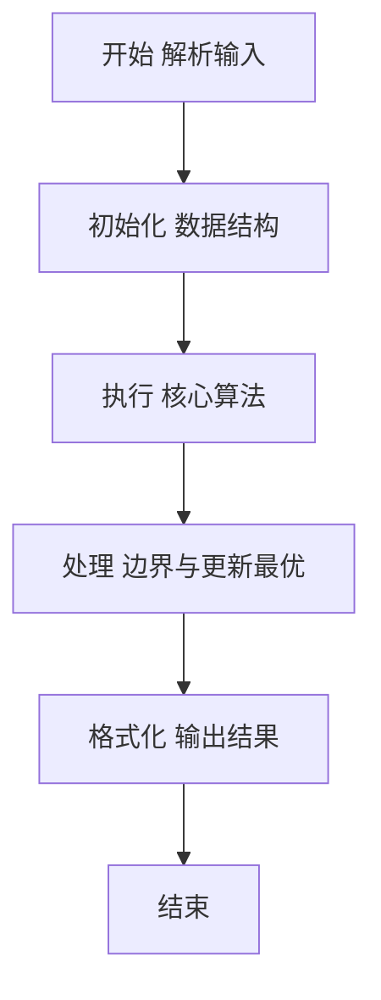
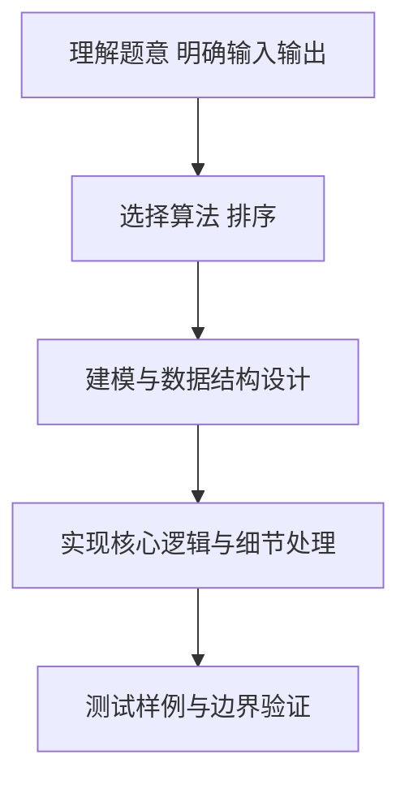

# L2-034 - 口罩发放（25 分）

- **时间限制**: 400 ms
- **内存限制**: 65536 KB
- **代码长度限制**: 16 KB

---

## 题目描述


为了抗击来势汹汹的  COVID19 新型冠状病毒，全国各地均启动了各项措施控制疫情发展，其中一个重要的环节是口罩的发放。

某市出于给市民发放口罩的需要，推出了一款小程序让市民填写信息，方便工作的开展。小程序收集了各种信息，包括市民的姓名、身份证、身体情况、提交时间等，但因为数据量太大，需要根据一定规则进行筛选和处理，请你编写程序，按照给定规则输出口罩的寄送名单。

### 输入格式:

输入第一行是两个正整数 $D$ 和 $P$（$1 \le D, P \le 30$），表示有 $D$ 天的数据，市民两次获得口罩的时间至少需要间隔 $P$ 天。

接下来 $D$ 块数据，每块给出一天的申请信息。第 $i$ 块数据（$i=1, \cdots , D$）的第一行是两个整数 $T_i$ 和 $S_i$（$1 \le T_i \le 1000, 0 \le S_i \le 1000$），表示在第 $i$ 天有 $T_i$ 条申请，总共有 $S_i$ 个口罩发放名额。随后 $T_i$ 行，每行给出一条申请信息，格式如下：
```
姓名 身份证号 身体情况 提交时间
```
给定数据约束如下：
* `姓名` 是一个长度不超过 10 的不包含空格的非空字符串；
* `身份证号` 是一个长度不超过 20 的非空字符串；
* `身体情况` 是 0 或者 1，0 表示自觉良好，1 表示有相关症状；
* `提交时间` 是 hh:mm，为24小时时间（由 ``00:00`` 到 ``23:59``。例如 09:08。）。注意，给定的记录的提交时间不一定有序；
* `身份证号` 各不相同，同一个身份证号被认为是同一个人，数据保证同一个身份证号姓名是相同的。

能发放口罩的记录要求如下：
* `身份证号` 必须是 18 位的**数字**（可以包含前导0）；
* 同一个身份证号若在第 $i$ 天申请成功，则接下来的 $P$ 天不能再次申请。也就是说，若第 $i$ 天申请成功，则等到第 $i + P + 1$ 天才能再次申请；
* 在上面两条都符合的情况下，按照提交时间的先后顺序发放，直至全部记录处理完毕或 $S_i$ 个名额用完。如果提交时间相同，则按照在列表中出现的先后顺序决定。

### 输出格式:

对于每一天的申请记录，每行输出一位得到口罩的人的姓名及身份证号，用一个空格隔开。顺序按照发放顺序确定。

在输出完发放记录后，你还需要输出有合法记录的、身体状况为 1 的申请人的姓名及身份证号，用空格隔开。顺序按照申请记录中出现的顺序确定，同一个人只需要输出一次。

### 输入样例:
```in
4 2
5 3
A 123456789012345670 1 13:58
B 123456789012345671 0 13:58
C 12345678901234567 0 13:22
D 123456789012345672 0 03:24
C 123456789012345673 0 13:59
4 3
A 123456789012345670 1 13:58
E 123456789012345674 0 13:59
C 123456789012345673 0 13:59
F F 0 14:00
1 3
E 123456789012345674 1 13:58
1 1
A 123456789012345670 0 14:11
```

### 输出样例:
```out
D 123456789012345672
A 123456789012345670
B 123456789012345671
E 123456789012345674
C 123456789012345673
A 123456789012345670
A 123456789012345670
E 123456789012345674
```

## 示例

### 示例 1

**输入:**
```
4 2
5 3
A 123456789012345670 1 13:58
B 123456789012345671 0 13:58
C 12345678901234567 0 13:22
D 123456789012345672 0 03:24
C 123456789012345673 0 13:59
4 3
A 123456789012345670 1 13:58
E 123456789012345674 0 13:59
C 123456789012345673 0 13:59
F F 0 14:00
1 3
E 123456789012345674 1 13:58
1 1
A 123456789012345670 0 14:11
```

**输出:**
```
D 123456789012345672
A 123456789012345670
B 123456789012345671
E 123456789012345674
C 123456789012345673
A 123456789012345670
A 123456789012345670
E 123456789012345674
```

### 解题思路

本题要求根据给定的输入数据完成相应的判定或计算任务，以“L2-034_口罩发放”为核心，需在约束条件下构造出满足题意的结果。以 Lua 实现为参照，其实现原理概括为：每天先筛出合法身份证记录，按提交时间和原出现顺序排序后发放。

在算法选型上，针对题目数据规模与结构特征，选择了 排序 等关键技术。Lua 代码通过紧凑的表结构与迭代逻辑，将原理转化为可执行流程，既保证了正确性也兼顾了简洁性。例如代码中对输入的逐行解析、数据结构的初始化与核心循环的组织均体现了该思路。

关键在于细节处理与鲁棒性：如对空输入、重复键、边界值的正确处理，以及输出格式的精确控制。整体时间复杂度约为 O(N log N) 或 O(N)，空间复杂度 O(N)，满足题目限制（通常 1e5 级别可通过）。 结合 Lua 的快速 I/O 与表操作，能够在限制时间内完成判定并输出结果。
### 代码流程说明

1. 输入解析与预处理：按题面格式读取全部数据，将数值、字符串或图结构存入 Lua 表，必要时建立映射（如地址→节点、编号→集合）并处理边界空行。
2. 数据组织与排序：对关键对象按指定关键字排序（如按单价、按得分、按字典序），或构建哈希表/集合以支持 O(1) 判重与统计。
3. 核心逻辑处理：依据“每天先筛出合法身份证记录，按提交时间和原出现顺序排序后发放。…”的原理进行迭代计算，完成题面要求的判定、统计或构造任务，并在循环中处理相等、冲突等特殊分支。
4. 结果输出与格式化：按要求的格式拼接输出（如保留两位小数、按编号排序、输出路径或分类结果），注意末尾空格与换行控制，确保与样例一致。

### 代码实现

```lua
-- L2-034 口罩发放
-- 实现原理：每天先筛出合法身份证记录，按提交时间和原出现顺序排序后发放。
-- last[id] 保存上次成功日期以检查间隔；症状名单则在所有合法记录中首次出现时收集。

local days, gap = io.read("*n"), io.read("*n")
local last, suspicious, seenSuspicious = {}, {}, {}
local function valid(id) return #id == 18 and id:match("^%d+$") end
for day = 1, days do
    local t, quota = io.read("*n"), io.read("*n")
    local candidates = {}
    for order = 1, t do
        local name, id, status, time = io.read("*s"), io.read("*s"), io.read("*n"), io.read("*s")
        if valid(id) then
            if status == 1 and not seenSuspicious[id] then
                seenSuspicious[id] = true
                suspicious[#suspicious + 1] = { name, id }
            end
            candidates[#candidates + 1] = { name = name, id = id, time = time, order = order }
        end
    end
    table.sort(candidates, function(a, b) return a.time ~= b.time and a.time < b.time or a.order < b.order end)
    local sent = 0
    for _, person in ipairs(candidates) do
        if sent < quota and (not last[person.id] or day - last[person.id] > gap) then
            print(person.name . " " . person.id)
            last[person.id] = day
            sent = sent + 1
        end
    end
end
for _, person in ipairs(suspicious) do print(person[1] . " " . person[2]) end
```

### 代码流程图



### 解题流程图



