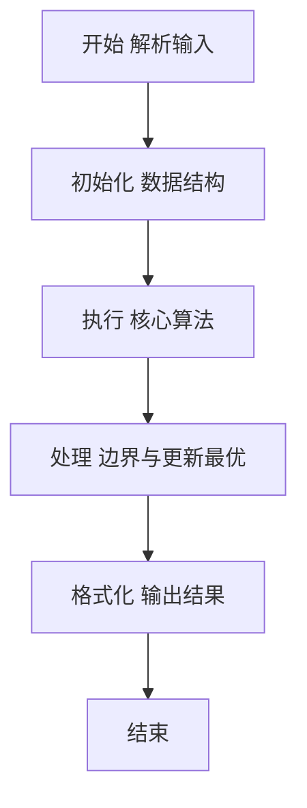
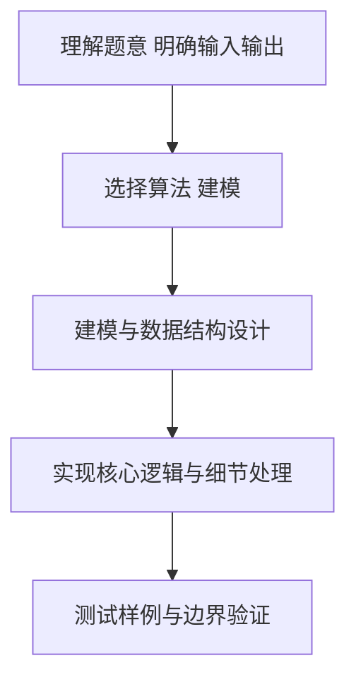

# L2-035 - 完全二叉树的层序遍历（25 分）

- **时间限制**: 400 ms
- **内存限制**: 65536 KB
- **代码长度限制**: 16 KB

---

## 题目描述


一个二叉树，如果每一个层的结点数都达到最大值，则这个二叉树就是**完美二叉树**。对于深度为 $D$ 的，有 $N$ 个结点的二叉树，若其结点对应于相同深度完美二叉树的层序遍历的前 $N$ 个结点，这样的树就是**完全二叉树**。

给定一棵完全二叉树的后序遍历，请你给出这棵树的层序遍历结果。

### 输入格式:

输入在第一行中给出正整数 $N$（$\le 30$），即树中结点个数。第二行给出后序遍历序列，为 $N$ 个不超过 100 的正整数。同一行中所有数字都以空格分隔。

### 输出格式:

在一行中输出该树的层序遍历序列。所有数字都以 1 个空格分隔，行首尾不得有多余空格。

### 输入样例:
```in
8
91 71 2 34 10 15 55 18
```

### 输出样例:
```out
18 34 55 71 2 10 15 91
```

## 示例

### 示例 1

**输入:**
```
8
91 71 2 34 10 15 55 18
```

**输出:**
```
18 34 55 71 2 10 15 91
```

### 解题思路

本题要求根据给定的输入数据完成相应的判定或计算任务，以“L2-035_完全二叉树的层序遍历”为核心，需在约束条件下构造出满足题意的结果。以 Lua 实现为参照，其实现原理概括为：完全二叉树可用层序数组表示，结点 $i$ 的左右孩子为 $2i$、$2i+1$。

在算法选型上，代码遵循“先解析、再建模、后计算”的一般套路，将输入转化为便于处理的内部表示，再通过线性或近线性扫描完成核心判定。实现中注重边界条件与格式细节，以确保在 PTA 判题环境下稳定通过。

关键在于细节处理与鲁棒性：如对空输入、重复键、边界值的正确处理，以及输出格式的精确控制。整体时间复杂度约为 O(N log N) 或 O(N)，空间复杂度 O(N)，满足题目限制（通常 1e5 级别可通过）。 结合 Lua 的快速 I/O 与表操作，能够在限制时间内完成判定并输出结果。
### 代码流程说明

1. 输入解析与预处理：按题面格式读取全部数据，将数值、字符串或图结构存入 Lua 表，必要时建立映射（如地址→节点、编号→集合）并处理边界空行。
2. 数据建模与初始化：将输入转化为内部模型（图、树、链表或数组），初始化距离、访问标记、计数器等辅助数组。
3. 核心逻辑处理：依据“完全二叉树可用层序数组表示，结点 $i$ 的左右孩子为 $2i$、$2i+1$。…”的原理进行迭代计算，完成题面要求的判定、统计或构造任务，并在循环中处理相等、冲突等特殊分支。
4. 结果输出与格式化：按要求的格式拼接输出（如保留两位小数、按编号排序、输出路径或分类结果），注意末尾空格与换行控制，确保与样例一致。

### 代码实现

```lua
-- L2-035 完全二叉树的层序遍历
-- 实现原理：完全二叉树可用层序数组表示，i 的左右孩子为 2i、2i+1。
-- 后序序列逆向为“根、右、左”，递归填入数组即可直接得到层序结果。

local n = io.read("*n")
local post, tree = {}, {}
for i = 1, n do post[i] = io.read("*n") end
local pos = n
local function fill(i)
    if i > n then return end
    tree[i] = post[pos]
    pos = pos - 1
    fill(i * 2 + 1)
    fill(i * 2)
end
fill(1)
print(table.concat(tree, " "))
```

### 代码流程图



### 解题流程图


