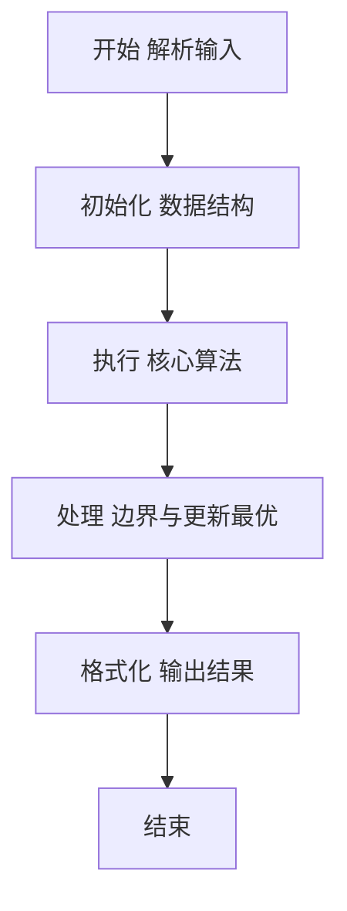
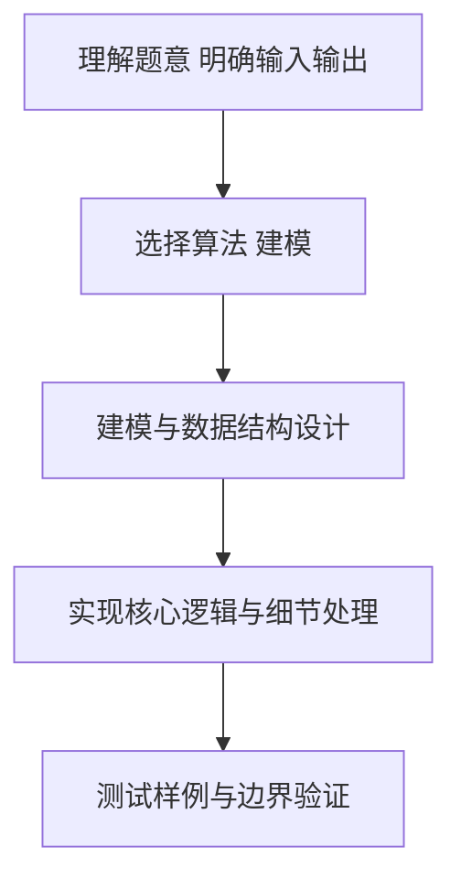

# L2-036 - 网红点打卡攻略（25 分）

- **时间限制**: 400 ms
- **内存限制**: 65536 KB
- **代码长度限制**: 16 KB

---

## 题目描述


一个旅游景点，如果被带火了的话，就被称为“网红点”。大家来网红点游玩，俗称“打卡”。在各个网红点打卡的快（省）乐（钱）方法称为“攻略”。你的任务就是从一大堆攻略中，找出那个能在每个网红点打卡仅一次、并且路上花费最少的攻略。

### 输入格式:

首先第一行给出两个正整数：网红点的个数 $$N$$（$$1 < N\le 200$$）和网红点之间通路的条数 $$M$$。随后 $$M$$ 行，每行给出有通路的两个网红点、以及这条路上的旅行花费（为正整数），格式为“网红点1 网红点2 费用”，其中网红点从 1 到 $$N$$ 编号；同时也给出你家到某些网红点的花费，格式相同，其中你家的编号固定为 `0`。

再下一行给出一个正整数 $$K$$，是待检验的攻略的数量。随后 $$K$$ 行，每行给出一条待检攻略，格式为：

$$n$$ $$V_1$$ $$V_2$$ $$\cdots$$ $$V_n$$

其中 $$n (\le 200)$$ 是攻略中的网红点数，$$V_i$$ 是路径上的网红点编号。这里假设你从家里出发，从 $$V_1$$ 开始打卡，最后从 $$V_n$$ 回家。

### 输出格式:

在第一行输出满足要求的攻略的个数。

在第二行中，首先输出那个能在每个网红点打卡仅一次、并且路上花费最少的攻略的序号（从 1 开始），然后输出这个攻略的总路费，其间以一个空格分隔。如果这样的攻略不唯一，则输出序号最小的那个。

题目保证至少存在一个有效攻略，并且总路费不超过 $$10^9$$。

### 输入样例:
```in
6 13
0 5 2
6 2 2
6 0 1
3 4 2
1 5 2
2 5 1
3 1 1
4 1 2
1 6 1
6 3 2
1 2 1
4 5 3
2 0 2
7
6 5 1 4 3 6 2
6 5 2 1 6 3 4
8 6 2 1 6 3 4 5 2
3 2 1 5
6 6 1 3 4 5 2
7 6 2 1 3 4 5 2
6 5 2 1 4 3 6
```

### 输出样例:
```out
3
5 11
```

## 示例

### 示例 1

**输入:**
```
6 13
0 5 2
6 2 2
6 0 1
3 4 2
1 5 2
2 5 1
3 1 1
4 1 2
1 6 1
6 3 2
1 2 1
4 5 3
2 0 2
7
6 5 1 4 3 6 2
6 5 2 1 6 3 4
8 6 2 1 6 3 4 5 2
3 2 1 5
6 6 1 3 4 5 2
7 6 2 1 3 4 5 2
6 5 2 1 4 3 6
```

**输出:**
```
3
5 11
```

### 解题思路

本题要求根据给定的输入数据完成相应的判定或计算任务，以“L2-036_网红点打卡攻略”为核心，需在约束条件下构造出满足题意的结果。以 Lua 实现为参照，其实现原理概括为：用邻接矩阵保存道路费用。一个攻略有效当且仅当恰含 N 个不同景点，。

在算法选型上，代码遵循“先解析、再建模、后计算”的一般套路，将输入转化为便于处理的内部表示，再通过线性或近线性扫描完成核心判定。实现中注重边界条件与格式细节，以确保在 PTA 判题环境下稳定通过。

关键在于细节处理与鲁棒性：如对空输入、重复键、边界值的正确处理，以及输出格式的精确控制。时间复杂度为 Dijkstra 的 O(N²)朴素实现（N≤500）或堆优化 O(M log N)，空间为 O(N+M)。 结合 Lua 的快速 I/O 与表操作，能够在限制时间内完成判定并输出结果。
### 代码流程说明

1. 输入解析与预处理：按题面格式读取全部数据，将数值、字符串或图结构存入 Lua 表，必要时建立映射（如地址→节点、编号→集合）并处理边界空行。
2. 数据建模与初始化：将输入转化为内部模型（图、树、链表或数组），初始化距离、访问标记、计数器等辅助数组。
3. 核心逻辑处理：依据“用邻接矩阵保存道路费用。一个攻略有效当且仅当恰含 N 个不同景点，…”的原理进行迭代计算，完成题面要求的判定、统计或构造任务，并在循环中处理相等、冲突等特殊分支。
4. 结果输出与格式化：按要求的格式拼接输出（如保留两位小数、按编号排序、输出路径或分类结果），注意末尾空格与换行控制，确保与样例一致。

### 代码实现

```lua
-- L2-036 网红点打卡攻略
-- 实现原理：用邻接矩阵保存道路费用。一个攻略有效当且仅当恰含 N 个不同景点，
-- 每条相邻路段（含家 0 的出发、返回）都存在；同时累计其总费用。

local n, m = io.read("*n"), io.read("*n")
local cost = {}
for _ = 1, m do
    local a, b, c = io.read("*n"), io.read("*n"), io.read("*n")
    cost[a] = cost[a] or {}; cost[b] = cost[b] or {}
    cost[a][b], cost[b][a] = c, c
end
local k, valid, bestIndex, bestCost = io.read("*n"), 0, nil, math.huge
for index = 1, k do
    local len, route = io.read("*n"), {}
    for i = 1, len do route[i] = io.read("*n") end
    local seen, ok, sum = {}, len == n, 0
    for _, x in ipairs(route) do
        if x < 1 or x > n or seen[x] then ok = false end
        seen[x] = true
    end
    local prev = 0
    for i = 1, len + 1 do
        local cur = route[i] or 0
        if not cost[prev] or not cost[prev][cur] then ok = false else sum = sum + cost[prev][cur] end
        prev = cur
    end
    if ok then
        valid = valid + 1
        if sum < bestCost then bestCost, bestIndex = sum, index end
    end
end
print(valid)
print(bestIndex . " " . bestCost)
```

### 代码流程图



### 解题流程图



