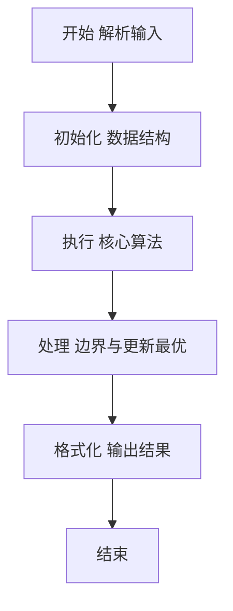
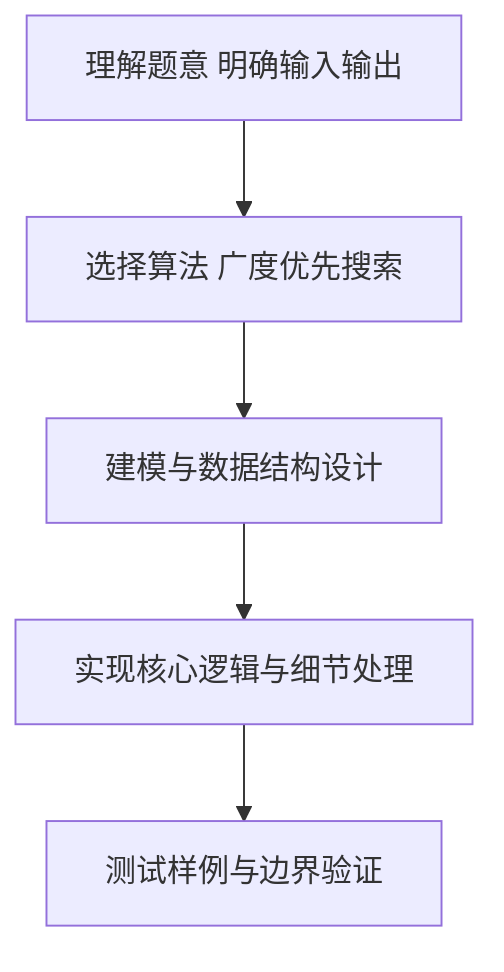

# L2-037 - 包装机（25 分）

- **时间限制**: 400 ms
- **内存限制**: 65536 KB
- **代码长度限制**: 16 KB

---

## 题目描述


一种自动包装机的结构如图 1 所示。首先机器中有 $$N$$ 条轨道，放置了一些物品。轨道下面有一个筐。当某条轨道的按钮被按下时，活塞向左推动，将轨道尽头的一件物品推落筐中。当 0 号按钮被按下时，机械手将抓取筐顶部的一件物品，放到流水线上。图 2 显示了顺序按下按钮 3、2、3、0、1、2、0 后包装机的状态。


图1 自动包装机的结构


图 2 顺序按下按钮 3、2、3、0、1、2、0 后包装机的状态

一种特殊情况是，因为筐的容量是有限的，当筐已经满了，但仍然有某条轨道的按钮被按下时，系统应强制启动 0 号键，先从筐里抓出一件物品，再将对应轨道的物品推落。此外，如果轨道已经空了，再按对应的按钮不会发生任何事；同样的，如果筐是空的，按 0 号按钮也不会发生任何事。

现给定一系列按钮操作，请你依次列出流水线上的物品。

### 输入格式:

输入第一行给出 3 个正整数 $$N$$（$$\le 100$$）、$$M$$（$$\le 1000$$）和 $$S_{max}$$（$$\le 100$$），分别为轨道的条数（于是轨道从 1 到 $$N$$ 编号）、每条轨道初始放置的物品数量、以及筐的最大容量。随后 $$N$$ 行，每行给出 $$M$$ 个英文大写字母，表示每条轨道的初始物品摆放。

最后一行给出一系列数字，顺序对应被按下的按钮编号，直到 $$-1$$ 标志输入结束，这个数字不要处理。数字间以空格分隔。题目保证至少会取出一件物品放在流水线上。

### 输出格式:

在一行中顺序输出流水线上的物品，不得有任何空格。

### 输入样例:
```in
3 4 4
GPLT
PATA
OMSA
3 2 3 0 1 2 0 2 2 0 -1
```

### 输出样例:
```out
MATA
```

## 示例

### 示例 1

**输入:**
```
3 4 4
GPLT
PATA
OMSA
3 2 3 0 1 2 0 2 2 0 -1
```

**输出:**
```
MATA
```

### 解题思路

本题要求根据给定的输入数据完成相应的判定或计算任务，以“L2-037_包装机”为核心，需在约束条件下构造出满足题意的结果。以 Lua 实现为参照，其实现原理概括为：每条轨道用下标模拟队列，筐用数组模拟栈。

在算法选型上，针对题目数据规模与结构特征，选择了 广度优先搜索 等关键技术。Lua 代码通过紧凑的表结构与迭代逻辑，将原理转化为可执行流程，既保证了正确性也兼顾了简洁性。例如代码中对输入的逐行解析、数据结构的初始化与核心循环的组织均体现了该思路。

关键在于细节处理与鲁棒性：如对空输入、重复键、边界值的正确处理，以及输出格式的精确控制。整体时间复杂度约为 O(N log N) 或 O(N)，空间复杂度 O(N)，满足题目限制（通常 1e5 级别可通过）。 结合 Lua 的快速 I/O 与表操作，能够在限制时间内完成判定并输出结果。
### 代码流程说明

1. 输入解析与预处理：按题面格式读取全部数据，将数值、字符串或图结构存入 Lua 表，必要时建立映射（如地址→节点、编号→集合）并处理边界空行。
2. 辅助结构初始化：初始化栈/队列等辅助容器，设定容量限制与指针位置，为后续模拟操作准备状态。
3. 核心逻辑处理：依据“每条轨道用下标模拟队列，筐用数组模拟栈。…”的原理进行迭代计算，完成题面要求的判定、统计或构造任务，并在循环中处理相等、冲突等特殊分支。
4. 结果输出与格式化：按要求的格式拼接输出（如保留两位小数、按编号排序、输出路径或分类结果），注意末尾空格与换行控制，确保与样例一致。

### 代码实现

```lua
-- L2-037 包装机
-- 实现原理：每条轨道用下标模拟队列，筐用数组模拟栈。
-- 按轨道键时若筐已满，先强制弹出栈顶；按 0 键则仅弹出栈顶到流水线。

local n, m, limit = io.read("*n"), io.read("*n"), io.read("*n")
local tracks, nextPos = {}, {}
for i = 1, n do tracks[i] = io.read("*s"); nextPos[i] = 1 end
local basket, output = {}, {}
while true do
    local button = io.read("*n")
    if button == -1 then break end
    if button == 0 then
        if #basket > 0 then output[#output + 1] = basket[#basket]; basket[#basket] = nil end
    elseif nextPos[button] <= m then
        if #basket == limit then output[#output + 1] = basket[#basket]; basket[#basket] = nil end
        basket[#basket + 1] = tracks[button]:sub(nextPos[button], nextPos[button])
        nextPos[button] = nextPos[button] + 1
    end
end
print(table.concat(output))
```

### 代码流程图



### 解题流程图



