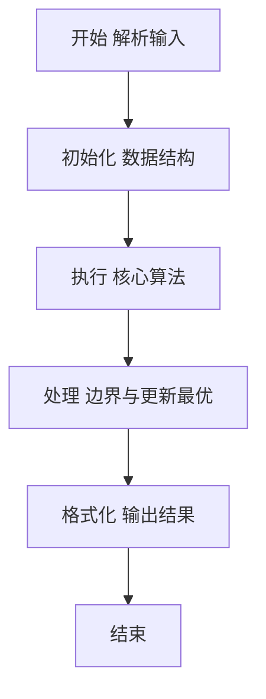
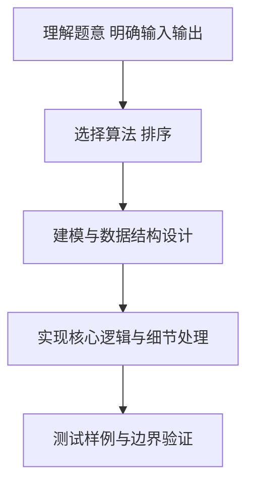

# L2-038 - 病毒溯源（25 分）

- **时间限制**: 400 ms
- **内存限制**: 65536 KB
- **代码长度限制**: 16 KB

---

## 题目描述


病毒容易发生变异。某种病毒可以通过突变产生若干变异的毒株，而这些变异的病毒又可能被诱发突变产生第二代变异，如此继续不断变化。

现给定一些病毒之间的变异关系，要求你找出其中最长的一条变异链。

在此假设给出的变异都是由突变引起的，不考虑复杂的基因重组变异问题 —— 即每一种病毒都是由唯一的一种病毒突变而来，并且不存在循环变异的情况。

### 输入格式:

输入在第一行中给出一个正整数 $N$（$\le 10^4$），即病毒种类的总数。于是我们将所有病毒从 0 到 $N-1$ 进行编号。

随后 $N$ 行，每行按以下格式描述一种病毒的变异情况：

```
k 变异株1 …… 变异株k
```

其中 `k` 是该病毒产生的变异毒株的种类数，后面跟着每种变异株的编号。第 $i$ 行对应编号为 $i$ 的病毒（$0\le i <N$）。题目保证病毒源头有且仅有一个。

### 输出格式:

首先输出从源头开始最长变异链的长度。

在第二行中输出从源头开始最长的一条变异链，编号间以 1 个空格分隔，行首尾不得有多余空格。如果最长链不唯一，则输出最小序列。

注：我们称序列 { $a_1, \cdots , a_n$ } 比序列 { $b_1, \cdots , b_n$ } “小”，如果存在 $1\le k \le n$ 满足 $a_i = b_i$ 对所有 $i<k$ 成立，且 $a_k < b_k$。

### 输入样例:
```in
10
3 6 4 8
0
0
0
2 5 9
0
1 7
1 2
0
2 3 1
```

### 输出样例:
```out
4
0 4 9 1
```

## 示例

### 示例 1

**输入:**
```
10
3 6 4 8
0
0
0
2 5 9
0
1 7
1 2
0
2 3 1
```

**输出:**
```
4
0 4 9 1
```

### 解题思路

本题要求根据给定的输入数据完成相应的判定或计算任务，以“L2-038_病毒溯源”为核心，需在约束条件下构造出满足题意的结果。以 Lua 实现为参照，其实现原理概括为：这是一棵有根树。递归求每个节点到叶子的最长链长度，。

在算法选型上，针对题目数据规模与结构特征，选择了 排序 等关键技术。Lua 代码通过紧凑的表结构与迭代逻辑，将原理转化为可执行流程，既保证了正确性也兼顾了简洁性。例如代码中对输入的逐行解析、数据结构的初始化与核心循环的组织均体现了该思路。

关键在于细节处理与鲁棒性：如对空输入、重复键、边界值的正确处理，以及输出格式的精确控制。整体时间复杂度约为 O(N log N) 或 O(N)，空间复杂度 O(N)，满足题目限制（通常 1e5 级别可通过）。 结合 Lua 的快速 I/O 与表操作，能够在限制时间内完成判定并输出结果。
### 代码流程说明

1. 输入解析与预处理：按题面格式读取全部数据，将数值、字符串或图结构存入 Lua 表，必要时建立映射（如地址→节点、编号→集合）并处理边界空行。
2. 数据组织与排序：对关键对象按指定关键字排序（如按单价、按得分、按字典序），或构建哈希表/集合以支持 O(1) 判重与统计。
3. 核心逻辑处理：依据“这是一棵有根树。递归求每个节点到叶子的最长链长度，…”的原理进行迭代计算，完成题面要求的判定、统计或构造任务，并在循环中处理相等、冲突等特殊分支。
4. 结果输出与格式化：按要求的格式拼接输出（如保留两位小数、按编号排序、输出路径或分类结果），注意末尾空格与换行控制，确保与样例一致。

### 代码实现

```lua
-- L2-038 病毒溯源
-- 实现原理：这是一棵有根树。递归求每个节点到叶子的最长链长度，
-- 并在长度并列时优先选择编号更小的孩子，即得到字典序最小的最长链。

local n = io.read("*n")
local children, indegree = {}, {}
for i = 0, n - 1 do
    local k = io.read("*n")
    children[i] = {}
    for j = 1, k do
        local x = io.read("*n")
        children[i][j] = x
        indegree[x] = true
    end
    table.sort(children[i])
end
local root
for i = 0, n - 1 do if not indegree[i] then root = i; break end end
local function longest(x)
    local bestLength, bestPath = 1, { x }
    for _, child in ipairs(children[x]) do
        local length, path = longest(child)
        if length + 1 > bestLength then
            bestLength, bestPath = length + 1, { x }
            for _, v in ipairs(path) do bestPath[#bestPath + 1] = v end
        end
    end
    return bestLength, bestPath
end
local length, path = longest(root)
print(length)
print(table.concat(path, " "))
```

### 代码流程图



### 解题流程图



