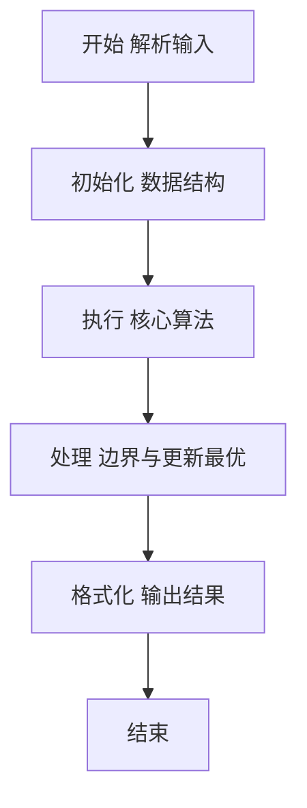
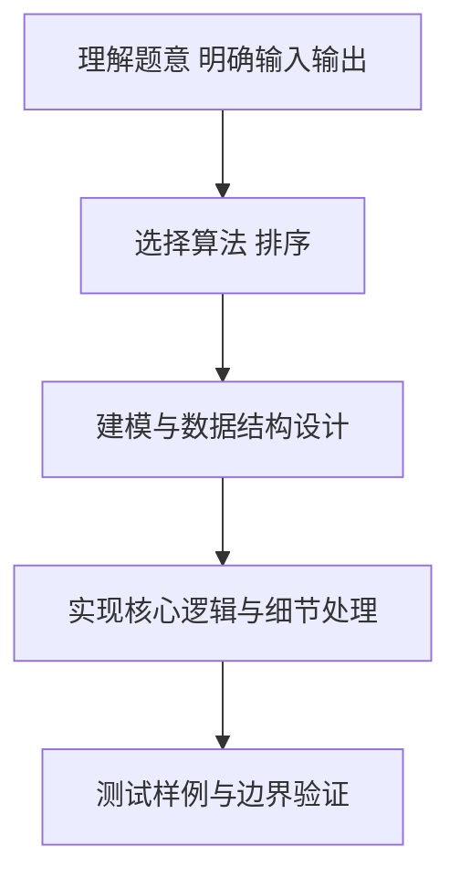

# L2-039 - 清点代码库（25 分）

- **时间限制**: 500 ms
- **内存限制**: 65536 KB
- **代码长度限制**: 16 KB

---

## 题目描述


上图转自新浪微博：“阿里代码库有几亿行代码，但其中有很多功能重复的代码，比如单单快排就被重写了几百遍。请设计一个程序，能够将代码库中所有功能重复的代码找出。各位大佬有啥想法，我当时就懵了，然后就挂了。。”

这里我们把问题简化一下：首先假设两个功能模块如果接受同样的输入，总是给出同样的输出，则它们就是功能重复的；其次我们把每个模块的输出都简化为一个整数（在 **int** 范围内）。于是我们可以设计一系列输入，检查所有功能模块的对应输出，从而查出功能重复的代码。你的任务就是设计并实现这个简化问题的解决方案。

### 输入格式:

输入在第一行中给出 2 个正整数，依次为 $N$（$\le 10^4$）和 $M$（$\le 10^2$），对应功能模块的个数和系列测试输入的个数。

随后 $N$ 行，每行给出一个功能模块的 $M$ 个对应输出，数字间以空格分隔。

### 输出格式:

首先在第一行输出不同功能的个数 $K$。随后 $K$ 行，每行给出具有这个功能的模块的个数，以及这个功能的对应输出。数字间以 1 个空格分隔，行首尾不得有多余空格。输出首先按模块个数非递增顺序，如果有并列，则按输出序列的递增序给出。

注：所谓数列 { $A_1$, .., $A_M$ } 比 { $B_1$, .., $B_M$ } 大，是指存在 $1\le i <M$，使得 $A_1=B_1$，..，$A_i=B_i$ 成立，且 $A_{i+1} > B_{i+1}$。

### 输入样例:
```in
7 3
35 28 74
-1 -1 22
28 74 35
-1 -1 22
11 66 0
35 28 74
35 28 74
```

### 输出样例:
```out
4
3 35 28 74
2 -1 -1 22
1 11 66 0
1 28 74 35
```

## 示例

### 示例 1

**输入:**
```
7 3
35 28 74
-1 -1 22
28 74 35
-1 -1 22
11 66 0
35 28 74
35 28 74
```

**输出:**
```
4
3 35 28 74
2 -1 -1 22
1 11 66 0
1 28 74 35
```

### 解题思路

本题要求根据给定的输入数据完成相应的判定或计算任务，以“L2-039_清点代码库”为核心，需在约束条件下构造出满足题意的结果。以 Lua 实现为参照，其实现原理概括为：将同一组 M 个输出编码为一个字符串键并计数，等价键即功能相同。

在算法选型上，针对题目数据规模与结构特征，选择了 排序 等关键技术。Lua 代码通过紧凑的表结构与迭代逻辑，将原理转化为可执行流程，既保证了正确性也兼顾了简洁性。例如代码中对输入的逐行解析、数据结构的初始化与核心循环的组织均体现了该思路。

关键在于细节处理与鲁棒性：如对空输入、重复键、边界值的正确处理，以及输出格式的精确控制。整体时间复杂度约为 O(N log N) 或 O(N)，空间复杂度 O(N)，满足题目限制（通常 1e5 级别可通过）。 结合 Lua 的快速 I/O 与表操作，能够在限制时间内完成判定并输出结果。
### 代码流程说明

1. 输入解析与预处理：按题面格式读取全部数据，将数值、字符串或图结构存入 Lua 表，必要时建立映射（如地址→节点、编号→集合）并处理边界空行。
2. 数据组织与排序：对关键对象按指定关键字排序（如按单价、按得分、按字典序），或构建哈希表/集合以支持 O(1) 判重与统计。
3. 核心逻辑处理：依据“将同一组 M 个输出编码为一个字符串键并计数，等价键即功能相同。…”的原理进行迭代计算，完成题面要求的判定、统计或构造任务，并在循环中处理相等、冲突等特殊分支。
4. 结果输出与格式化：按要求的格式拼接输出（如保留两位小数、按编号排序、输出路径或分类结果），注意末尾空格与换行控制，确保与样例一致。

### 代码实现

```lua
-- L2-039 清点代码库
-- 实现原理：将同一组 M 个输出编码为一个字符串键并计数，等价键即功能相同。
-- 输出时按出现次数降序、数值序列字典序升序排序。

local n, m = io.read("*n"), io.read("*n")
local groups = {}
for _ = 1, n do
    local values, key = {}, {}
    for i = 1, m do values[i] = io.read("*n"); key[i] = values[i] end
    key = table.concat(key, ",")
    if not groups[key] then groups[key] = { count = 0, values = values } end
    groups[key].count = groups[key].count + 1
end
local result = {}
for _, group in pairs(groups) do result[#result + 1] = group end
table.sort(result, function(a, b)
    if a.count ~= b.count then return a.count > b.count end
    for i = 1, m do
        if a.values[i] ~= b.values[i] then return a.values[i] < b.values[i] end
    end
    return false
end)
print(#result)
for _, group in ipairs(result) do
    local out = { group.count }
    for _, value in ipairs(group.values) do out[#out + 1] = value end
    print(table.concat(out, " "))
end
```

### 代码流程图



### 解题流程图



