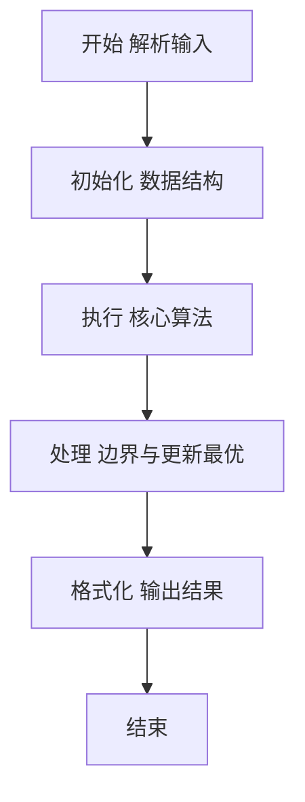
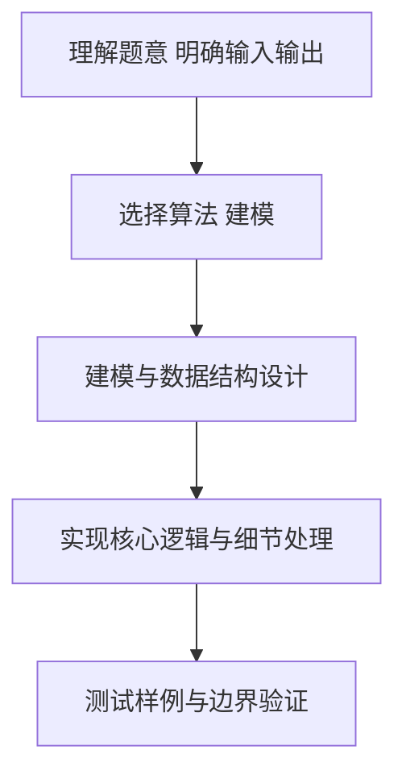

# L2-040 - 哲哲打游戏（25 分）

- **时间限制**: 400 ms
- **内存限制**: 65536 KB
- **代码长度限制**: 16 KB

---

## 题目描述


哲哲是一位硬核游戏玩家。最近一款名叫《达诺达诺》的新游戏刚刚上市，哲哲自然要快速攻略游戏，守护硬核游戏玩家的一切！

为简化模型，我们不妨假设游戏有 $N$ 个剧情点，通过游戏里不同的操作或选择可以从某个剧情点去往另外一个剧情点。此外，游戏还设置了一些**存档**，在某个剧情点可以将玩家的游戏进度保存在一个档位上，读取存档后可以回到剧情点，重新进行操作或者选择，到达不同的剧情点。

为了追踪硬核游戏玩家哲哲的攻略进度，你打算写一个程序来完成这个工作。假设你已经知道了游戏的全部剧情点和流程，以及哲哲的游戏操作，请你输出哲哲的游戏进度。

### 输入格式:

输入第一行是两个正整数 $N$ 和 $M$ ($1\le N , M \le 10^5$)，表示总共有 $N$ 个剧情点，哲哲有 $M$ 个游戏操作。

接下来的 $N$ 行，每行对应一个剧情点的发展设定。第 $i$ 行的第一个数字是 $K_i$，表示剧情点 $i$ 通过一些操作或选择能去往下面 $K_i$ 个剧情点；接下来有 $K_i$ 个数字，第 $k$ 个数字表示做第 $k$ 个操作或选择可以去往的剧情点编号。

最后有 $M$ 行，每行第一个数字是 0、1 或 2，分别表示：

* 0 表示哲哲做出了某个操作或选择，后面紧接着一个数字 $j$，表示哲哲在当前剧情点做出了第 $j$ 个选择。我们保证哲哲的选择永远是合法的。
* 1 表示哲哲进行了一次存档，后面紧接着是一个数字 $j$，表示存档放在了第 $j$ 个档位上。
* 2 表示哲哲进行了一次读取存档的操作，后面紧接着是一个数字 $j$，表示读取了放在第 $j$ 个位置的存档。

约定：所有操作或选择以及剧情点编号都从 1 号开始。存档的档位不超过 100 个，编号也从 1 开始。游戏默认从 1 号剧情点开始。总的选项数（即 $\sum K_i$）不超过 $10^6$。

### 输出格式:

对于每个 1（即存档）操作，在一行中输出存档的剧情点编号。

最后一行输出哲哲最后到达的剧情点编号。

### 输入样例:
```in
10 11
3 2 3 4
1 6
3 4 7 5
1 3
1 9
2 3 5
3 1 8 5
1 9
2 8 10
0
1 1
0 3
0 1
1 2
0 2
0 2
2 2
0 3
0 1
1 1
0 2
```

### 输出样例:
```out
1
3
9
10
```

## 示例

### 示例 1

**输入:**
```
10 11
3 2 3 4
1 6
3 4 7 5
1 3
1 9
2 3 5
3 1 8 5
1 9
2 8 10
0
1 1
0 3
0 1
1 2
0 2
0 2
2 2
0 3
0 1
1 1
0 2
```

**输出:**
```
1
3
9
10
```

### 解题思路

本题要求根据给定的输入数据完成相应的判定或计算任务，以“L2-040_哲哲打游戏”为核心，需在约束条件下构造出满足题意的结果。以 Lua 实现为参照，其实现原理概括为：每个剧情点保存按选择编号排列的下一节点；current 表示当前进度，。

在算法选型上，代码遵循“先解析、再建模、后计算”的一般套路，将输入转化为便于处理的内部表示，再通过线性或近线性扫描完成核心判定。实现中注重边界条件与格式细节，以确保在 PTA 判题环境下稳定通过。

关键在于细节处理与鲁棒性：如对空输入、重复键、边界值的正确处理，以及输出格式的精确控制。整体时间复杂度约为 O(N log N) 或 O(N)，空间复杂度 O(N)，满足题目限制（通常 1e5 级别可通过）。 结合 Lua 的快速 I/O 与表操作，能够在限制时间内完成判定并输出结果。
### 代码流程说明

1. 输入解析与预处理：按题面格式读取全部数据，将数值、字符串或图结构存入 Lua 表，必要时建立映射（如地址→节点、编号→集合）并处理边界空行。
2. 数据建模与初始化：将输入转化为内部模型（图、树、链表或数组），初始化距离、访问标记、计数器等辅助数组。
3. 核心逻辑处理：依据“每个剧情点保存按选择编号排列的下一节点；current 表示当前进度，…”的原理进行迭代计算，完成题面要求的判定、统计或构造任务，并在循环中处理相等、冲突等特殊分支。
4. 结果输出与格式化：按要求的格式拼接输出（如保留两位小数、按编号排序、输出路径或分类结果），注意末尾空格与换行控制，确保与样例一致。

### 代码实现

```lua
-- L2-040 哲哲打游戏
-- 实现原理：每个剧情点保存按选择编号排列的下一节点；current 表示当前进度，
-- save[j] 表示第 j 个存档位。三种操作分别更新 current 或 save 即可。

local n, m = io.read("*n"), io.read("*n")
local nextPoint = {}
for i = 1, n do
    local k = io.read("*n")
    nextPoint[i] = {}
    for j = 1, k do nextPoint[i][j] = io.read("*n") end
end
local current, save = 1, {}
for _ = 1, m do
    local op, x = io.read("*n"), io.read("*n")
    if op == 0 then current = nextPoint[current][x]
    elseif op == 1 then save[x] = current; print(current)
    else current = save[x] end
end
print(current)
```

### 代码流程图



### 解题流程图



