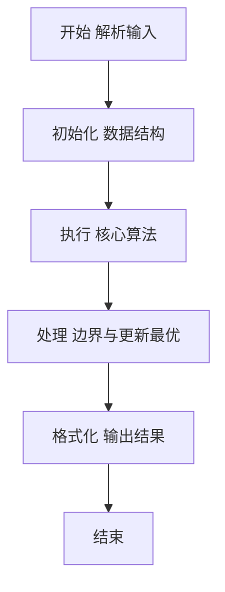
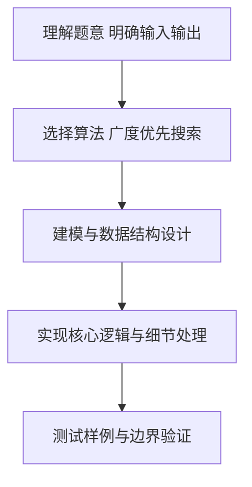

# L2-041 - 插松枝（25 分）

- **时间限制**: 400 ms
- **内存限制**: 65536 KB
- **代码长度限制**: 16 KB

---

## 题目描述


人造松枝加工场的工人需要将各种尺寸的塑料松针插到松枝干上，做成大大小小的松枝。他们的工作流程（并不）是这样的：

- 每人手边有一只小盒子，初始状态为空。
- 每人面前有用不完的松枝干和一个推送器，每次推送一片随机型号的松针片。
- 工人首先捡起一根空的松枝干，从小盒子里摸出最上面的一片松针 —— 如果小盒子是空的，就从推送器上取一片松针。将这片松针插到枝干的最下面。
- 工人在插后面的松针时，需要保证，每一步插到一根非空松枝干上的松针片，不能比前一步插上的松针片大。如果小盒子中最上面的松针满足要求，就取之插好；否则去推送器上取一片。如果推送器上拿到的仍然不满足要求，就把拿到的这片堆放到小盒子里，继续去推送器上取下一片。注意这里假设小盒子里的松针片是按放入的顺序堆叠起来的，工人每次只能取出最上面（即最后放入）的一片。
- 当下列三种情况之一发生时，工人会结束手里的松枝制作，开始做下一个：

（1）小盒子已经满了，但推送器上取到的松针仍然不满足要求。此时将手中的松枝放到成品篮里，推送器上取到的松针压回推送器，开始下一根松枝的制作。

（2）小盒子中最上面的松针不满足要求，但推送器上已经没有松针了。此时将手中的松枝放到成品篮里，开始下一根松枝的制作。

（3）手中的松枝干上已经插满了松针，将之放到成品篮里，开始下一根松枝的制作。

现在给定推送器上顺序传过来的 $N$ 片松针的大小，以及小盒子和松枝的容量，请你编写程序自动列出每根成品松枝的信息。

### 输入格式:

输入在第一行中给出 3 个正整数：$N$（$\le 10^3$），为推送器上松针片的数量；$M$（$\le 20$）为小盒子能存放的松针片的最大数量；$K$（$\le 5$）为一根松枝干上能插的松针片的最大数量。

随后一行给出 $N$ 个不超过 $100$ 的正整数，为推送器上顺序推出的松针片的大小。

### 输出格式:

每支松枝成品的信息占一行，顺序给出自底向上每片松针的大小。数字间以 1 个空格分隔，行首尾不得有多余空格。

### 输入样例:
```in
8 3 4
20 25 15 18 20 18 8 5
```

### 输出样例:
```out
20 15
20 18 18 8
25 5
```

## 示例

### 示例 1

**输入:**
```
8 3 4
20 25 15 18 20 18 8 5
```

**输出:**
```
20 15
20 18 18 8
25 5
```

### 解题思路

本题要求根据给定的输入数据完成相应的判定或计算任务，以“L2-041_插松枝”为核心，需在约束条件下构造出满足题意的结果。以 Lua 实现为参照，其实现原理概括为：小盒子是栈、推送器是按给定顺序取物的队列。

在算法选型上，针对题目数据规模与结构特征，选择了 广度优先搜索 等关键技术。Lua 代码通过紧凑的表结构与迭代逻辑，将原理转化为可执行流程，既保证了正确性也兼顾了简洁性。例如代码中对输入的逐行解析、数据结构的初始化与核心循环的组织均体现了该思路。

关键在于细节处理与鲁棒性：如对空输入、重复键、边界值的正确处理，以及输出格式的精确控制。整体时间复杂度约为 O(N log N) 或 O(N)，空间复杂度 O(N)，满足题目限制（通常 1e5 级别可通过）。 结合 Lua 的快速 I/O 与表操作，能够在限制时间内完成判定并输出结果。
### 代码流程说明

1. 输入解析与预处理：按题面格式读取全部数据，将数值、字符串或图结构存入 Lua 表，必要时建立映射（如地址→节点、编号→集合）并处理边界空行。
2. 辅助结构初始化：初始化栈/队列等辅助容器，设定容量限制与指针位置，为后续模拟操作准备状态。
3. 核心逻辑处理：依据“小盒子是栈、推送器是按给定顺序取物的队列。…”的原理进行迭代计算，完成题面要求的判定、统计或构造任务，并在循环中处理相等、冲突等特殊分支。
4. 结果输出与格式化：按要求的格式拼接输出（如保留两位小数、按编号排序、输出路径或分类结果），注意末尾空格与换行控制，确保与样例一致。

### 代码实现

```lua
-- L2-041 插松枝
-- 实现原理：小盒子是栈、推送器是按给定顺序取物的队列。
-- 每根松枝依次插入不大于前一片的松针；不能继续时输出当前成品并重新开始。

local n, boxLimit, branchLimit = io.read("*n"), io.read("*n"), io.read("*n")
local feeder = {}
for i = 1, n do feeder[i] = io.read("*n") end
local box, pos = {}, 1
while pos <= n or #box > 0 do
    local branch = {}
    if #box > 0 then
        branch[1] = box[#box]; box[#box] = nil
    else
        branch[1] = feeder[pos]; pos = pos + 1
    end
    while #branch < branchLimit do
        local last = branch[#branch]
        if #box > 0 and box[#box] <= last then
            branch[#branch + 1] = box[#box]; box[#box] = nil
        elseif pos <= n then
            local x = feeder[pos]
            if x <= last then
                branch[#branch + 1] = x; pos = pos + 1
            elseif #box < boxLimit then
                box[#box + 1] = x; pos = pos + 1
            else
                -- 推送器上的这片松针压回去，留给下一根松枝作为候选。
                break
            end
        else
            break
        end
    end
    print(table.concat(branch, " "))
end
```

### 代码流程图



### 解题流程图



