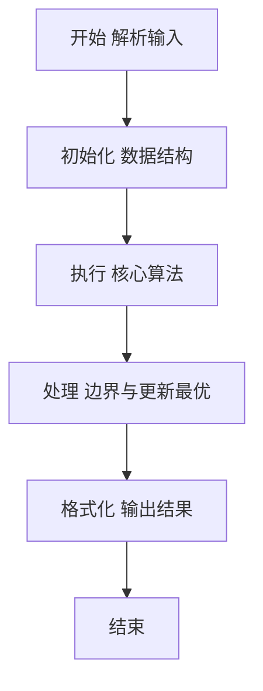
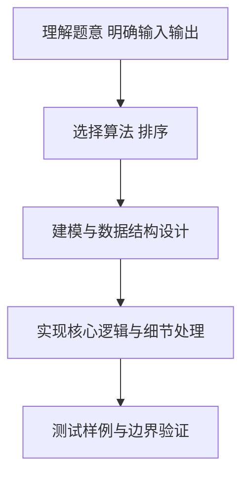

# L2-042 - 老板的作息表（25 分）

- **时间限制**: 200 ms
- **内存限制**: 65536 KB
- **代码长度限制**: 16 KB

---

## 题目描述


新浪微博上有人发了某老板的作息时间表，表示其每天 4:30 就起床了。但立刻有眼尖的网友问：这时间表不完整啊，早上九点到下午一点干啥了？

本题就请你编写程序，检查任意一张时间表，找出其中没写出来的时间段。

### 输入格式:

输入第一行给出一个正整数 $N$，为作息表上列出的时间段的个数。随后 $N$ 行，每行给出一个时间段，格式为：

```
hh:mm:ss - hh:mm:ss
```
其中 `hh`、`mm`、`ss` 分别是两位数表示的小时、分钟、秒。第一个时间是开始时间，第二个是结束时间。题目保证所有时间都在一天之内（即从 00:00:00 到 23:59:59）；每个区间间隔至少 1 秒；并且任意两个给出的时间区间最多只在一个端点有重合，没有区间重叠的情况。

### 输出格式:

按照时间顺序列出时间表中没有出现的区间，每个区间占一行，格式与输入相同。题目保证至少存在一个区间需要输出。

### 输入样例:
```in
8
13:00:00 - 18:00:00
00:00:00 - 01:00:05
08:00:00 - 09:00:00
07:10:59 - 08:00:00
01:00:05 - 04:30:00
06:30:00 - 07:10:58
05:30:00 - 06:30:00
18:00:00 - 19:00:00
```

### 输出样例:
```out
04:30:00 - 05:30:00
07:10:58 - 07:10:59
09:00:00 - 13:00:00
19:00:00 - 23:59:59
```

## 示例

### 示例 1

**输入:**
```
8
13:00:00 - 18:00:00
00:00:00 - 01:00:05
08:00:00 - 09:00:00
07:10:59 - 08:00:00
01:00:05 - 04:30:00
06:30:00 - 07:10:58
05:30:00 - 06:30:00
18:00:00 - 19:00:00
```

**输出:**
```
04:30:00 - 05:30:00
07:10:58 - 07:10:59
09:00:00 - 13:00:00
19:00:00 - 23:59:59
```

### 解题思路

本题要求根据给定的输入数据完成相应的判定或计算任务，以“L2-042_老板的作息表”为核心，需在约束条件下构造出满足题意的结果。以 Lua 实现为参照，其实现原理概括为：将时刻转为当天秒数并按起始时刻排序，相邻已知区间端点之间。

在算法选型上，针对题目数据规模与结构特征，选择了 排序 等关键技术。Lua 代码通过紧凑的表结构与迭代逻辑，将原理转化为可执行流程，既保证了正确性也兼顾了简洁性。例如代码中对输入的逐行解析、数据结构的初始化与核心循环的组织均体现了该思路。

关键在于细节处理与鲁棒性：如对空输入、重复键、边界值的正确处理，以及输出格式的精确控制。整体时间复杂度约为 O(N log N) 或 O(N)，空间复杂度 O(N)，满足题目限制（通常 1e5 级别可通过）。 结合 Lua 的快速 I/O 与表操作，能够在限制时间内完成判定并输出结果。
### 代码流程说明

1. 输入解析与预处理：按题面格式读取全部数据，将数值、字符串或图结构存入 Lua 表，必要时建立映射（如地址→节点、编号→集合）并处理边界空行。
2. 数据组织与排序：对关键对象按指定关键字排序（如按单价、按得分、按字典序），或构建哈希表/集合以支持 O(1) 判重与统计。
3. 核心逻辑处理：依据“将时刻转为当天秒数并按起始时刻排序，相邻已知区间端点之间…”的原理进行迭代计算，完成题面要求的判定、统计或构造任务，并在循环中处理相等、冲突等特殊分支。
4. 结果输出与格式化：按要求的格式拼接输出（如保留两位小数、按编号排序、输出路径或分类结果），注意末尾空格与换行控制，确保与样例一致。

### 代码实现

```lua
-- L2-042 老板的作息表
-- 实现原理：将时刻转为当天秒数并按起始时刻排序，相邻已知区间端点之间
-- 存在空档便输出。题目将端点视为区间边界，因此无需额外加减一秒。

local function parse(s)
    local h, m, sec = s:match("(%d%d):(%d%d):(%d%d)")
    return tonumber(h) * 3600 + tonumber(m) * 60 + tonumber(sec)
end
local function format(x)
    return string.format("%02d:%02d:%02d", math.floor(x / 3600), math.floor(x / 60) % 60, x % 60)
end
local n = io.read("*n")
io.read("*l")
local periods = {}
for i = 1, n do
    local line = io.read("*l")
    local a, b = line:match("(%d%d:%d%d:%d%d)%s+%-%s+(%d%d:%d%d:%d%d)")
    periods[i] = { parse(a), parse(b) }
end
table.sort(periods, function(a, b) return a[1] < b[1] end)
local current = 0
for _, period in ipairs(periods) do
    if current < period[1] then print(format(current) . " - " . format(period[1])) end
    if period[2] > current then current = period[2] end
end
if current < 86399 then print(format(current) . " - " . format(86399)) end
```

### 代码流程图



### 解题流程图



