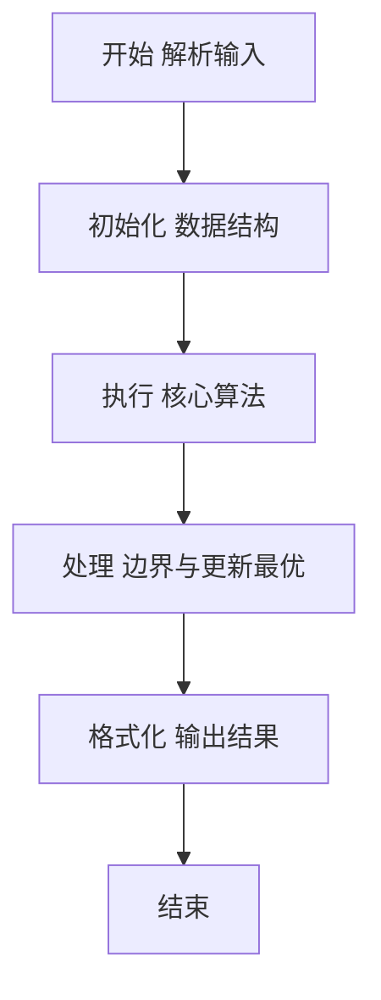
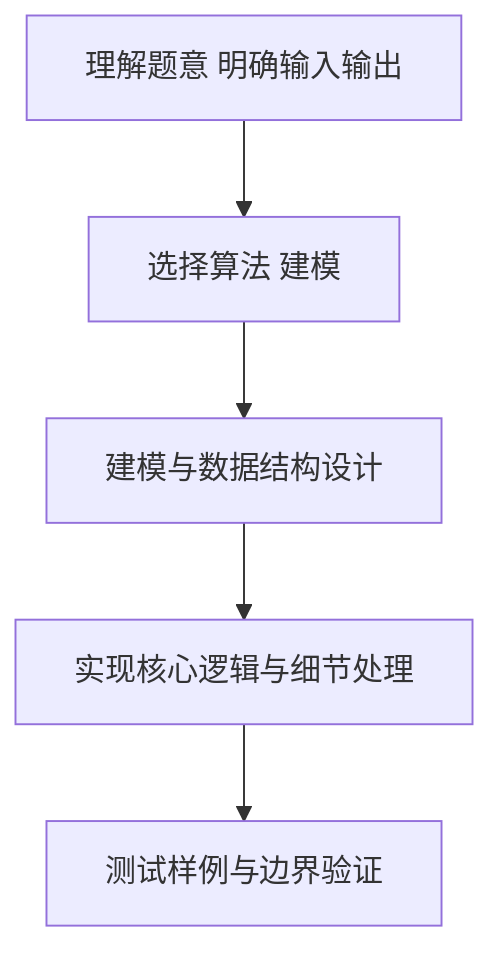

# L2-043 - 龙龙送外卖（25 分）

- **时间限制**: 400 ms
- **内存限制**: 65536 KB
- **代码长度限制**: 16 KB

---

## 题目描述


龙龙是“饱了呀”外卖软件的注册骑手，负责送帕特小区的外卖。帕特小区的构造非常特别，都是双向道路且没有构成环 —— 你可以简单地认为小区的路构成了一棵树，根结点是外卖站，树上的结点就是要送餐的地址。

每到中午 12 点，帕特小区就进入了点餐高峰。一开始，只有一两个地方点外卖，龙龙简单就送好了；但随着大数据的分析，龙龙被派了更多的单子，也就送得越来越累……

看着一大堆订单，龙龙想知道，从外卖站出发，访问所有点了外卖的地方至少一次（这样才能把外卖送到）所需的最短路程的距离到底是多少？每次新增一个点外卖的地址，他就想估算一遍整体工作量，这样他就可以搞明白新增一个地址给他带来了多少负担。

### 输入格式:

输入第一行是两个数 $N$ 和 $M$ ($2 \le N \le 10^5$, $1 \le M \le  10^5$)，分别对应树上节点的个数（包括外卖站），以及新增的送餐地址的个数。

接下来首先是一行 $N$ 个数，第 $i$ 个数表示第 $i$ 个点的双亲节点的编号。节点编号从 1 到 $N$，外卖站的双亲编号定义为 $-1$。

接下来有 $M$ 行，每行给出一个新增的送餐地点的编号 $X_i$。保证送餐地点中不会有外卖站，但地点有可能会重复。

为了方便计算，我们可以假设龙龙一开始一个地址的外卖都不用送，两个相邻的地点之间的路径长度统一设为 1，且从外卖站出发可以访问到所有地点。

注意：所有送餐地址可以按任意顺序访问，***且完成送餐后无需返回外卖站***。

### 输出格式:

对于每个新增的地点，在一行内输出题目需要求的最短路程的距离。

### 输入样例:
```in
7 4
-1 1 1 1 2 2 3
5
6
2
4
```

### 输出样例:
```out
2
4
4
6
```

## 示例

### 示例 1

**输入:**
```
7 4
-1 1 1 1 2 2 3
5
6
2
4
```

**输出:**
```
2
4
4
6
```

### 解题思路

本题要求根据给定的输入数据完成相应的判定或计算任务，以“L2-043_龙龙送外卖”为核心，需在约束条件下构造出满足题意的结果。以 Lua 实现为参照，其实现原理概括为：已出现地址与根形成一棵最小连通子树。遍历其中每条边通常要。

在算法选型上，代码遵循“先解析、再建模、后计算”的一般套路，将输入转化为便于处理的内部表示，再通过线性或近线性扫描完成核心判定。实现中注重边界条件与格式细节，以确保在 PTA 判题环境下稳定通过。

关键在于细节处理与鲁棒性：如对空输入、重复键、边界值的正确处理，以及输出格式的精确控制。整体时间复杂度约为 O(N log N) 或 O(N)，空间复杂度 O(N)，满足题目限制（通常 1e5 级别可通过）。 结合 Lua 的快速 I/O 与表操作，能够在限制时间内完成判定并输出结果。
### 代码流程说明

1. 输入解析与预处理：按题面格式读取全部数据，将数值、字符串或图结构存入 Lua 表，必要时建立映射（如地址→节点、编号→集合）并处理边界空行。
2. 数据建模与初始化：将输入转化为内部模型（图、树、链表或数组），初始化距离、访问标记、计数器等辅助数组。
3. 核心逻辑处理：依据“已出现地址与根形成一棵最小连通子树。遍历其中每条边通常要…”的原理进行迭代计算，完成题面要求的判定、统计或构造任务，并在循环中处理相等、冲突等特殊分支。
4. 结果输出与格式化：按要求的格式拼接输出（如保留两位小数、按编号排序、输出路径或分类结果），注意末尾空格与换行控制，确保与样例一致。

### 代码实现

```lua
-- L2-043 龙龙送外卖
-- 实现原理：已出现地址与根形成一棵最小连通子树。遍历其中每条边通常要
-- 往返一次，唯一路径终点可停在最深地址，故答案为 2*边数-最大深度。

local n, m = io.read("*n"), io.read("*n")
local parent, depth, root = {}, {}, nil
for i = 1, n do
    parent[i] = io.read("*n")
    if parent[i] == -1 then root = i; depth[i] = 0 end
end
local function getDepth(x)
    if depth[x] then return depth[x] end
    depth[x] = getDepth(parent[x]) + 1
    return depth[x]
end
for i = 1, n do getDepth(i) end
local used, edges, maxDepth = { [root] = true }, 0, 0
for _ = 1, m do
    local x = io.read("*n")
    maxDepth = math.max(maxDepth, depth[x])
    while not used[x] do
        used[x] = true
        edges = edges + 1
        x = parent[x]
    end
    print(2 * edges - maxDepth)
end
```

### 代码流程图



### 解题流程图



