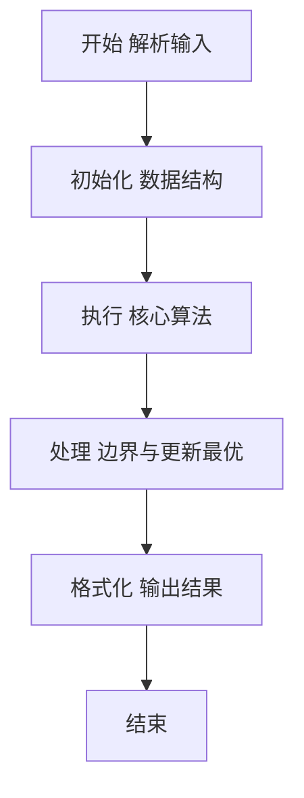
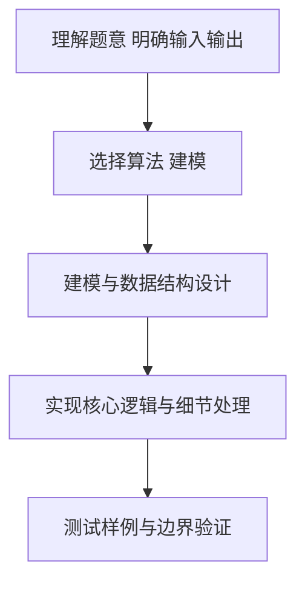

# L2-044 - 大众情人（25 分）

- **时间限制**: 400 ms
- **内存限制**: 65536 KB
- **代码长度限制**: 16 KB

---

## 题目描述


人与人之间总有一点距离感。我们假定两个人之间的亲密程度跟他们之间的距离感成反比，并且距离感是单向的。例如小蓝对小红患了单相思，从小蓝的眼中看去，他和小红之间的距离为 1，只差一层窗户纸；但在小红的眼里，她和小蓝之间的距离为 108000，差了十万八千里…… 另外，我们进一步假定，距离感在认识的人之间是可传递的。例如小绿觉得自己跟小蓝之间的距离为 2，则即使小绿并不直接认识小红，我们也默认小绿早晚会认识小红，并且因为跟小蓝很亲近的关系，小绿会觉得自己跟小红之间的距离为 1+2=3。当然这带来一个问题，如果小绿本来也认识小红，或者他通过其他人也能认识小红，但通过不同渠道推导出来的距离感不一样，该怎么算呢？我们在这里做个简单定义，就将小绿对小红的距离感定义为所有推导出来的距离感的最小值。

一个人的异性缘不是由最喜欢他/她的那个异性决定的，而是由对他/她最无感的那个异性决定的。我们记一个人 $$i$$ 在一个异性 $$j$$ 眼中的距离感为 $$D_{ij}$$；将 $$i$$ 的“异性缘”定义为 $$1/\max_{j\in S(i)} \{ D_{ij}\}$$，其中 $$S(i)$$ 是相对于 $$i$$ 的所有异性的集合。那么“大众情人”就是异性缘最好（值最大）的那个人。

本题就请你从给定的一批人与人之间的距离感中分别找出两个性别中的“大众情人”。

### 输入格式:

输入在第一行中给出一个正整数 $$N$$（$$\le 500$$），为总人数。于是我们默认所有人从 1 到 $$N$$ 编号。

随后 $$N$$ 行，第 $$i$$ 行描述了编号为 $$i$$ 的人与其他人的关系，格式为：

```
性别 K 朋友1:距离1 朋友2:距离2 …… 朋友K:距离K
```

其中 `性别` 是这个人的性别，`F` 表示女性，`M` 表示男性；`K`（$$<N$$ 的非负整数）为这个人直接认识的朋友数；随后给出的是这 `K` 个朋友的编号、以及这个人对该朋友的距离感。距离感是不超过 $$10^6$$ 的正整数。

题目保证给出的关系中一定两种性别的人都有，不会出现重复给出的关系，并且每个人的朋友中都不包含自己。

### 输出格式:

第一行给出自身为女性的“大众情人”的编号，第二行给出自身为男性的“大众情人”的编号。如果存在并列，则按编号递增的顺序输出所有。数字间以一个空格分隔，行首尾不得有多余空格。

### 输入样例:
```in
6
F 1 4:1
F 2 1:3 4:10
F 2 4:2 2:2
M 2 5:1 3:2
M 2 2:2 6:2
M 2 3:1 2:5
```

### 输出样例:
```out
2 3
4
```

## 示例

### 示例 1

**输入:**
```
6
F 1 4:1
F 2 1:3 4:10
F 2 4:2 2:2
M 2 5:1 3:2
M 2 2:2 6:2
M 2 3:1 2:5
```

**输出:**
```
2 3
4
```

### 解题思路

本题要求根据给定的输入数据完成相应的判定或计算任务，以“L2-044_大众情人”为核心，需在约束条件下构造出满足题意的结果。以 Lua 实现为参照，其实现原理概括为：Floyd-Warshall全源最短路，按性别分组求异性缘=1/max异性距离，无穷则排除，取最小max者。

在算法选型上，代码遵循“先解析、再建模、后计算”的一般套路，将输入转化为便于处理的内部表示，再通过线性或近线性扫描完成核心判定。实现中注重边界条件与格式细节，以确保在 PTA 判题环境下稳定通过。

关键在于细节处理与鲁棒性：如对空输入、重复键、边界值的正确处理，以及输出格式的精确控制。整体时间复杂度约为 O(N log N) 或 O(N)，空间复杂度 O(N)，满足题目限制（通常 1e5 级别可通过）。 结合 Lua 的快速 I/O 与表操作，能够在限制时间内完成判定并输出结果。
### 代码流程说明

1. 输入解析与预处理：按题面格式读取全部数据，将数值、字符串或图结构存入 Lua 表，必要时建立映射（如地址→节点、编号→集合）并处理边界空行。
2. 数据建模与初始化：将输入转化为内部模型（图、树、链表或数组），初始化距离、访问标记、计数器等辅助数组。
3. 核心逻辑处理：依据“Floyd-Warshall全源最短路，按性别分组求异性缘=1/max异性距离，…”的原理进行迭代计算，完成题面要求的判定、统计或构造任务，并在循环中处理相等、冲突等特殊分支。
4. 结果输出与格式化：按要求的格式拼接输出（如保留两位小数、按编号排序、输出路径或分类结果），注意末尾空格与换行控制，确保与样例一致。

### 代码实现

```lua
-- 实现原理：Floyd-Warshall全源最短路，按性别分组求异性缘=1/max异性距离，无穷则排除，取最小max者
local INF = 1e12
local line = io.read("*l")
if not line then return end
local N = tonumber(line:match("%d+"))
if not N then return end
local gender = {}
local dist = {}
for i = 1, N do
    dist[i] = {}
    for j = 1, N do
        dist[i][j] = (i == j) and 0 or INF
    end
end
for i = 1, N do
    local l = io.read("*l")
    while l ~= nil and l:match("^%s*$") do l = io.read("*l") end
    if not l then
        gender[i] = "M"
    else
        local g = l:match("^%s*([FM])")
        gender[i] = g or "M"
        for id, w in l:gmatch("(%d+):(%d+)") do
            id = tonumber(id); w = tonumber(w)
            if id >= 1 and id <= N and w < dist[i][id] then
                dist[i][id] = w
            end
        end
    end
end
-- Floyd-Warshall
for k = 1, N do
    for i = 1, N do
        local dik = dist[i][k]
        if dik < INF then
            for j = 1, N do
                local dkj = dist[k][j]
                if dkj < INF then
                    local nd = dik + dkj
                    if nd < dist[i][j] then dist[i][j] = nd end
                end
            end
        end
    end
end
-- 对每个人求到异性最远距离
local maxDist = {}
for i = 1, N do maxDist[i] = INF end
for i = 1, N do
    local md = -1
    local reachable = true
    local hasOpposite = false
    for j = 1, N do
        if gender[j] ~= gender[i] then
            hasOpposite = true
            local d = dist[j][i]
            if d >= INF/2 then reachable = false; break end
            if d > md then md = d end
        end
    end
    if not hasOpposite then maxDist[i] = INF
    elseif not reachable then maxDist[i] = INF
    else maxDist[i] = md end
end
local function collect(targetGender)
    local best = INF
    for i = 1, N do
        if gender[i] == targetGender and maxDist[i] < best then best = maxDist[i] end
    end
    local res = {}
    if best < INF then
        for i = 1, N do
            if gender[i] == targetGender and maxDist[i] == best then res[#res+1]=tostring(i) end
        end
    end
    return res
end
local femaleRes = collect("F")
local maleRes = collect("M")
if #femaleRes > 0 then print(table.concat(femaleRes, " ")) else print("") end
if #maleRes > 0 then print(table.concat(maleRes, " ")) else print("") end
```

### 代码流程图



### 解题流程图



