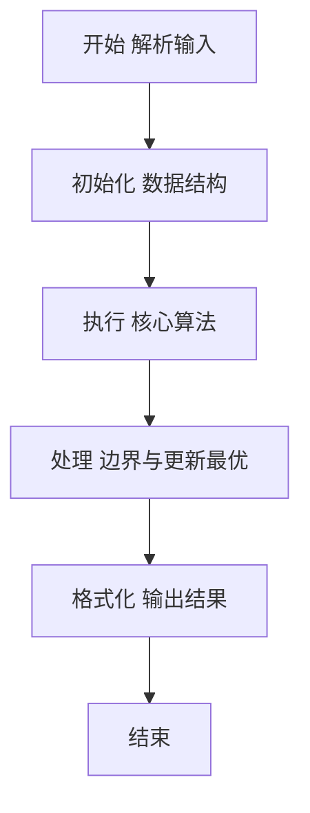
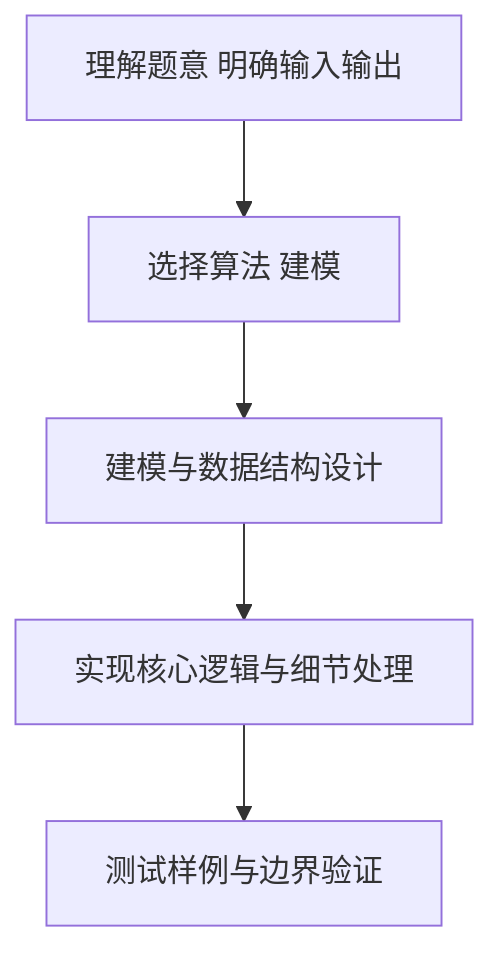

# L2-045 - 堆宝塔（25 分）

- **时间限制**: 400 ms
- **内存限制**: 65536 KB
- **代码长度限制**: 16 KB

---

## 题目描述


堆宝塔游戏是让小朋友根据抓到的彩虹圈的直径大小，按照从大到小的顺序堆起宝塔。但彩虹圈不一定是按照直径的大小顺序抓到的。聪明宝宝采取的策略如下：
- 首先准备两根柱子，一根 A 柱串宝塔，一根 B 柱用于临时叠放。
- 把第 1 块彩虹圈作为第 1 座宝塔的基座，在 A 柱放好。
- 将抓到的下一块彩虹圈 C 跟当前 A 柱宝塔最上面的彩虹圈比一下，如果比最上面的小，就直接放上去；否则把 C 跟 B 柱最上面的彩虹圈比一下：
-- 如果 B 柱是空的、或者 C 大，就在 B 柱上放好；
-- 否则把 A 柱上串好的宝塔取下来作为一件成品；然后把 B 柱上所有比 C 大的彩虹圈逐一取下放到 A 柱上，最后把 C 也放到 A 柱上。

重复此步骤，直到所有的彩虹圈都被抓完。最后 A 柱上剩下的宝塔作为一件成品，B 柱上剩下的彩虹圈被逐一取下，堆成另一座宝塔。问：宝宝一共堆出了几个宝塔？最高的宝塔有多少层？

### 输入格式:

输入第一行给出一个正整数 $N$（$\le 10^3$），为彩虹圈的个数。第二行按照宝宝抓取的顺序给出 $N$ 个不超过 100 的正整数，对应每个彩虹圈的直径。

### 输出格式:

在一行中输出宝宝堆出的宝塔个数，和最高的宝塔的层数。数字间以 1 个空格分隔，行首尾不得有多余空格。

### 输入样例:
```in
11
10 8 9 5 12 11 4 3 1 9 15
```

### 输出样例:
```out
4 5
```

## 示例

### 示例 1

**输入:**
```
11
10 8 9 5 12 11 4 3 1 9 15
```

**输出:**
```
4 5
```

### 解题思路

本题要求根据给定的输入数据完成相应的判定或计算任务，以“L2-045_堆宝塔”为核心，需在约束条件下构造出满足题意的结果。以 Lua 实现为参照，其实现原理概括为：严格按题意维护 A、B 两个栈。A 中每次完成的一座塔记录层数；。

在算法选型上，代码遵循“先解析、再建模、后计算”的一般套路，将输入转化为便于处理的内部表示，再通过线性或近线性扫描完成核心判定。实现中注重边界条件与格式细节，以确保在 PTA 判题环境下稳定通过。

关键在于细节处理与鲁棒性：如对空输入、重复键、边界值的正确处理，以及输出格式的精确控制。整体时间复杂度约为 O(N log N) 或 O(N)，空间复杂度 O(N)，满足题目限制（通常 1e5 级别可通过）。 结合 Lua 的快速 I/O 与表操作，能够在限制时间内完成判定并输出结果。
### 代码流程说明

1. 输入解析与预处理：按题面格式读取全部数据，将数值、字符串或图结构存入 Lua 表，必要时建立映射（如地址→节点、编号→集合）并处理边界空行。
2. 辅助结构初始化：初始化栈/队列等辅助容器，设定容量限制与指针位置，为后续模拟操作准备状态。
3. 核心逻辑处理：依据“严格按题意维护 A、B 两个栈。A 中每次完成的一座塔记录层数；…”的原理进行迭代计算，完成题面要求的判定、统计或构造任务，并在循环中处理相等、冲突等特殊分支。
4. 结果输出与格式化：按要求的格式拼接输出（如保留两位小数、按编号排序、输出路径或分类结果），注意末尾空格与换行控制，确保与样例一致。

### 代码实现

```lua
-- L2-045 堆宝塔
-- 实现原理：严格按题意维护 A、B 两个栈。A 中每次完成的一座塔记录层数；
-- 当无法把当前圆环放入 B 时，先结算 A，再将 B 中较大的圆环移回 A。

local n = io.read("*n")
local rings = {}
for i = 1, n do rings[i] = io.read("*n") end
local a, b, towers, highest = { rings[1] }, {}, 0, 0
local function finishA()
    if #a > 0 then towers = towers + 1; highest = math.max(highest, #a); a = {} end
end
for i = 2, n do
    local x = rings[i]
    if x < a[#a] then
        a[#a + 1] = x
    elseif #b == 0 or x > b[#b] then
        b[#b + 1] = x
    else
        finishA()
        while #b > 0 and b[#b] > x do a[#a + 1] = b[#b]; b[#b] = nil end
        a[#a + 1] = x
    end
end
finishA()
if #b > 0 then towers = towers + 1; highest = math.max(highest, #b) end
print(towers . " " . highest)
```

### 代码流程图



### 解题流程图



