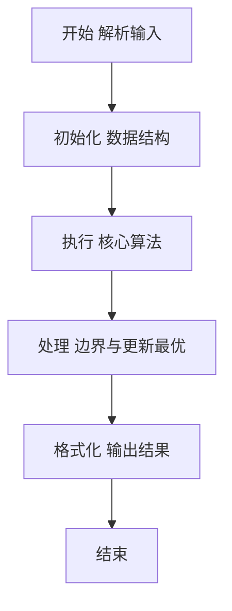
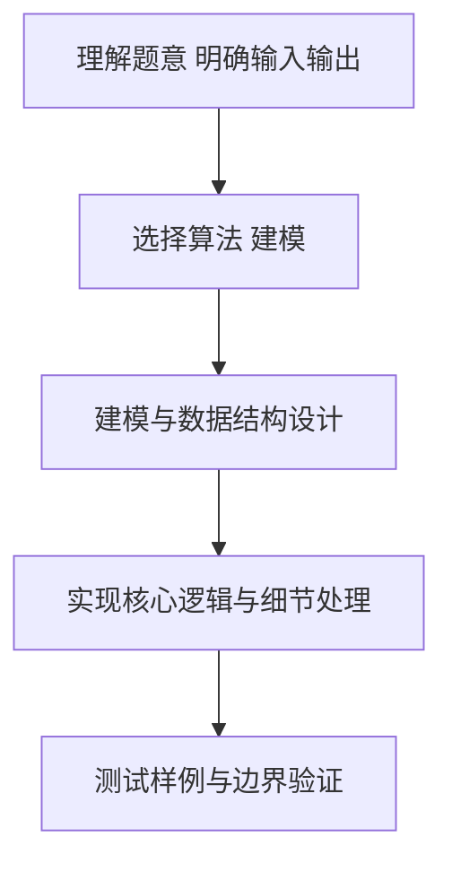

# L2-046 - 天梯赛的赛场安排（25 分）

- **时间限制**: 400 ms
- **内存限制**: 65536 KB
- **代码长度限制**: 16 KB

---

## 题目描述


天梯赛使用 OMS 监考系统，需要将参赛队员安排到系统中的虚拟赛场里，并为每个赛场分配一位监考老师。每位监考老师需要联系自己赛场内队员对应的教练们，以便发放比赛账号。为了尽可能减少教练和监考的沟通负担，我们要求赛场的安排满足以下条件：

* 每位监考老师负责的赛场里，队员人数不得超过赛场规定容量 $C$；
* 每位教练需要联系的监考人数尽可能少 —— 这里假设每所参赛学校只有一位负责联系的教练，且每个赛场的监考老师都不相同。

为此我们设计了多轮次排座算法，按照尚未安排赛场的队员人数从大到小的顺序，每一轮对当前未安排的人数最多的学校进行处理。记当前待处理的学校未安排人数为 $n$：

* 如果 $n\ge C$，则新开一个赛场，将 $C$ 位队员安排进去。剩下的人继续按人数规模排队，等待下一轮处理；
* 如果 $n<C$，则寻找剩余空位数大于等于 $n$ 的编号最小的赛场，将队员安排进去；
* 如果 $n<C$，且找不到任何非空的、剩余空位数大于等于 $n$ 的赛场了，则新开一个赛场，将队员安排进去。

由于近年来天梯赛的参赛人数快速增长，2023年超过了 480 所学校 1.6 万人，所以我们必须写个程序来处理赛场安排问题。

### 输入格式:

输入第一行给出两个正整数 $N$ 和 $C$，分别为参赛学校数量和每个赛场的规定容量，其中 $0<N\le 5000$，$10\le C \le 50$。随后 $N$ 行，每行给出一个学校的缩写（为长度不超过 6 的非空小写英文字母串）和该校参赛人数（不超过 500 的正整数），其间以空格分隔。题目保证每所学校只有一条记录。

### 输出格式:

按照输入的顺序，对每一所参赛高校，在一行中输出学校缩写和该校需要联系的监考人数，其间以 1 空格分隔。\
最后在一行中输出系统中应该开设多少个赛场。

### 输入样例:
```in
10 30
zju 30
hdu 93
pku 39
hbu 42
sjtu 21
abdu 10
xjtu 36
nnu 15
hnu 168
hsnu 20
```

### 输出样例:
```out
zju 1
hdu 4
pku 2
hbu 2
sjtu 1
abdu 1
xjtu 2
nnu 1
hnu 6
hsnu 1
16
```

## 示例

### 示例 1

**输入:**
```
10 30
zju 30
hdu 93
pku 39
hbu 42
sjtu 21
abdu 10
xjtu 36
nnu 15
hnu 168
hsnu 20
```

**输出:**
```
zju 1
hdu 4
pku 2
hbu 2
sjtu 1
abdu 1
xjtu 2
nnu 1
hnu 6
hsnu 1
16
```

### 解题思路

本题要求根据给定的输入数据完成相应的判定或计算任务，以“L2-046_天梯赛的赛场安排”为核心，需在约束条件下构造出满足题意的结果。以 Lua 实现为参照，其实现原理概括为：反复选择尚未安排人数最多的学校；人数不少于 C 时单独开满场，。

在算法选型上，代码遵循“先解析、再建模、后计算”的一般套路，将输入转化为便于处理的内部表示，再通过线性或近线性扫描完成核心判定。实现中注重边界条件与格式细节，以确保在 PTA 判题环境下稳定通过。

关键在于细节处理与鲁棒性：如对空输入、重复键、边界值的正确处理，以及输出格式的精确控制。整体时间复杂度约为 O(N log N) 或 O(N)，空间复杂度 O(N)，满足题目限制（通常 1e5 级别可通过）。 结合 Lua 的快速 I/O 与表操作，能够在限制时间内完成判定并输出结果。
### 代码流程说明

1. 输入解析与预处理：按题面格式读取全部数据，将数值、字符串或图结构存入 Lua 表，必要时建立映射（如地址→节点、编号→集合）并处理边界空行。
2. 数据建模与初始化：将输入转化为内部模型（图、树、链表或数组），初始化距离、访问标记、计数器等辅助数组。
3. 核心逻辑处理：依据“反复选择尚未安排人数最多的学校；人数不少于 C 时单独开满场，…”的原理进行迭代计算，完成题面要求的判定、统计或构造任务，并在循环中处理相等、冲突等特殊分支。
4. 结果输出与格式化：按要求的格式拼接输出（如保留两位小数、按编号排序、输出路径或分类结果），注意末尾空格与换行控制，确保与样例一致。

### 代码实现

```lua
-- L2-046 天梯赛的赛场安排
-- 实现原理：反复选择尚未安排人数最多的学校；人数不少于 C 时单独开满场，
-- 否则填入编号最小且容量足够的已有场地。记录每校被安排的场次。

local n, c = io.read("*n"), io.read("*n")
local schools = {}
for i = 1, n do
    local name, count = io.read("*s"), io.read("*n")
    schools[i] = { name = name, remain = count, rooms = 0, order = i }
end
local rooms = {}
while true do
    local chosen = nil
    for _, school in ipairs(schools) do
        if school.remain > 0 and (not chosen or school.remain > chosen.remain
            or (school.remain == chosen.remain and school.order < chosen.order)) then chosen = school end
    end
    if not chosen then break end
    local room = nil
    if chosen.remain < c then
        for i, empty in ipairs(rooms) do if empty >= chosen.remain then room = i; break end end
    end
    if room then
        rooms[room] = rooms[room] - chosen.remain
        chosen.remain = 0
    else
        local take = math.min(c, chosen.remain)
        rooms[#rooms + 1] = c - take
        chosen.remain = chosen.remain - take
    end
    chosen.rooms = chosen.rooms + 1
end
for _, school in ipairs(schools) do print(school.name . " " . school.rooms) end
print(#rooms)
```

### 代码流程图



### 解题流程图



