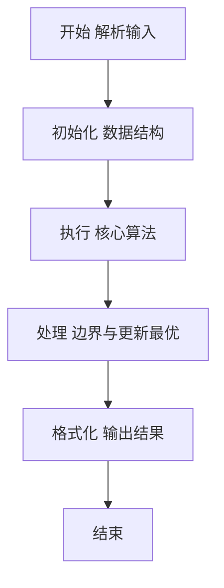
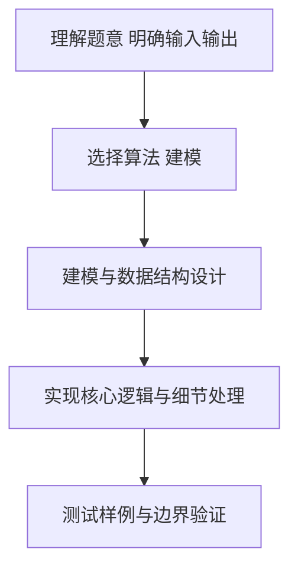

# L2-047 - 锦标赛（25 分）

- **时间限制**: 400 ms
- **内存限制**: 65536 KB
- **代码长度限制**: 16 KB

---

## 题目描述


有 $2^k$ 名选手将要参加一场锦标赛。锦标赛共有 $k$ 轮，其中第 $i$ 轮的比赛共有 $2^{k - i}$ 场，每场比赛恰有两名选手参加并从中产生一名胜者。每场比赛的安排如下：

* 对于第 $1$ 轮的第 $j$ 场比赛，由第 $(2j - 1)$ 名选手对抗第 $2j$ 名选手。
* 对于第 $i$ 轮的第 $j$ 场比赛（$i > 1$），由第 $(i - 1)$ 轮第 $(2j - 1)$ 场比赛的胜者对抗第 $(i - 1)$ 轮第 $2j$ 场比赛的胜者。

第 $k$ 轮唯一一场比赛的胜者就是整个锦标赛的最终胜者。\
举个例子，假如共有 $8$ 名选手参加锦标赛，则比赛的安排如下：

* 第 $1$ 轮共 $4$ 场比赛：选手 $1$ vs 选手 $2$，选手 $3$ vs 选手 $4$，选手 $5$ vs 选手 $6$，选手 $7$ vs 选手 $8$。
* 第 $2$ 轮共 $2$ 场比赛：第 $1$ 轮第 $1$ 场的胜者 vs 第 $1$ 轮第 $2$ 场的胜者，第 $1$ 轮第 $3$ 场的胜者 vs 第 $1$ 轮第 $4$ 场的胜者。
* 第 $3$ 轮共 $1$ 场比赛：第 $2$ 轮第 $1$ 场的胜者 vs 第 $2$ 轮第 $2$ 场的胜者。

已知每一名选手都有一个能力值，其中第 $i$ 名选手的能力值为 $a_i$。在一场比赛中，若两名选手的能力值不同，则能力值较大的选手一定会打败能力值较小的选手；若两名选手的能力值相同，则两名选手都有可能成为胜者。

令 $l_{i, j}$ 表示第 $i$ 轮第 $j$ 场比赛 **败者** 的能力值，令 $w$ 表示整个锦标赛最终胜者的能力值。给定所有满足 $1 \le i \le k$ 且 $1 \le j \le 2^{k - i}$ 的 $l_{i, j}$ 以及 $w$，请还原出 $a_1, a_2, \cdots, a_n$。

### 输入格式:

第一行输入一个整数 $k$（$1 \le k \le 18$）表示锦标赛的轮数。\
对于接下来 $k$ 行，第 $i$ 行输入 $2^{k - i}$ 个整数 $l_{i, 1}, l_{i, 2}, \cdots, l_{i, 2^{k - i}}$（$1 \le l_{i, j} \le 10^9$），其中 $l_{i, j}$ 表示第 $i$ 轮第 $j$ 场比赛 **败者** 的能力值。\
接下来一行输入一个整数 $w$（$1 \le w \le 10^9$）表示锦标赛最终胜者的能力值。

### 输出格式:

输出一行 $n$ 个由单个空格分隔的整数 $a_1, a_2, \cdots, a_n$，其中 $a_i$ 表示第 $i$ 名选手的能力值。如果有多种合法答案，请输出任意一种。如果无法还原出能够满足输入数据的答案，输出一行 `No Solution`。\
请勿在行末输出多余空格。

### 输入样例 1：
```in
3
4 5 8 5
7 6
8
9
```

### 输出样例 1：
```out
7 4 8 5 9 8 6 5
```

### 输入样例 2：
```in
2
5 8
3
9
```

### 输出样例 2：
```out
No Solution
```

## 示例

### 示例 1

**输入:**
```
3
4 5 8 5
7 6
8
9
```

**输出:**
```
7 4 8 5 9 8 6 5
```

### 示例 2

**输入:**
```
2
5 8
3
9
```

**输出:**
```
No Solution
```

### 解题思路

本题要求根据给定的输入数据完成相应的判定或计算任务，以“L2-047_锦标赛”为核心，需在约束条件下构造出满足题意的结果。以 Lua 实现为参照，其实现原理概括为：对每棵子树求其冠军能力的最小可行值 threshold。

在算法选型上，代码遵循“先解析、再建模、后计算”的一般套路，将输入转化为便于处理的内部表示，再通过线性或近线性扫描完成核心判定。实现中注重边界条件与格式细节，以确保在 PTA 判题环境下稳定通过。

关键在于细节处理与鲁棒性：如对空输入、重复键、边界值的正确处理，以及输出格式的精确控制。时间复杂度为 Dijkstra 的 O(N²)朴素实现（N≤500）或堆优化 O(M log N)，空间为 O(N+M)。 结合 Lua 的快速 I/O 与表操作，能够在限制时间内完成判定并输出结果。
### 代码流程说明

1. 输入解析与预处理：按题面格式读取全部数据，将数值、字符串或图结构存入 Lua 表，必要时建立映射（如地址→节点、编号→集合）并处理边界空行。
2. 数据建模与初始化：将输入转化为内部模型（图、树、链表或数组），初始化距离、访问标记、计数器等辅助数组。
3. 核心逻辑处理：依据“对每棵子树求其冠军能力的最小可行值 threshold。…”的原理进行迭代计算，完成题面要求的判定、统计或构造任务，并在循环中处理相等、冲突等特殊分支。
4. 结果输出与格式化：按要求的格式拼接输出（如保留两位小数、按编号排序、输出路径或分类结果），注意末尾空格与换行控制，确保与样例一致。

### 代码实现

```lua
-- L2-047 锦标赛
-- 实现原理：对每棵子树求其冠军能力的最小可行值 threshold。
-- 已知一场比赛的败者 L 时，冠军 W 必须不小于 L；递归分配 W 和 L 给两个
-- 子树，选择能满足各自 threshold 的方向，最终即可还原一组叶子能力。

local k = io.read("*n")
local leaves = 2 ^ k
local loser = {}
for round = 1, k do
    local first, count = 2 ^ (k - round), 2 ^ (k - round)
    for j = 0, count - 1 do loser[first + j] = io.read("*n") end
end
local finalWinner = io.read("*n")
local threshold = {}
for i = leaves - 1, 1, -1 do
    local l, left, right = loser[i], threshold[i * 2] or 0, threshold[i * 2 + 1] or 0
    local best = math.huge
    if right <= l then best = math.min(best, math.max(l, left)) end
    if left <= l then best = math.min(best, math.max(l, right)) end
    threshold[i] = best
end
if finalWinner < threshold[1] then
    print("No Solution")
else
    local answer, possible = {}, true
    local function assign(i, winner)
        if i >= leaves then answer[i - leaves + 1] = winner; return end
        local l, left, right = loser[i], threshold[i * 2] or 0, threshold[i * 2 + 1] or 0
        if winner < l then possible = false; return end
        if left <= winner and right <= l then
            assign(i * 2, winner); assign(i * 2 + 1, l)
        elseif right <= winner and left <= l then
            assign(i * 2, l); assign(i * 2 + 1, winner)
        else
            possible = false
        end
    end
    assign(1, finalWinner)
    print(possible and table.concat(answer, " ") or "No Solution")
end
```

### 代码流程图



### 解题流程图



