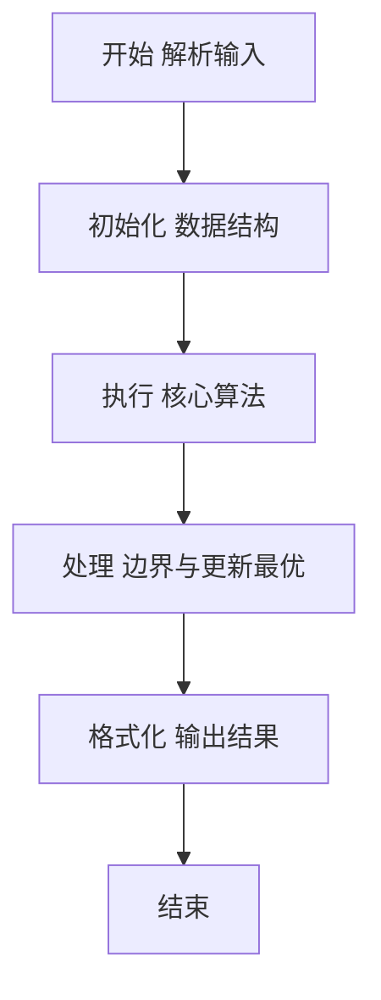
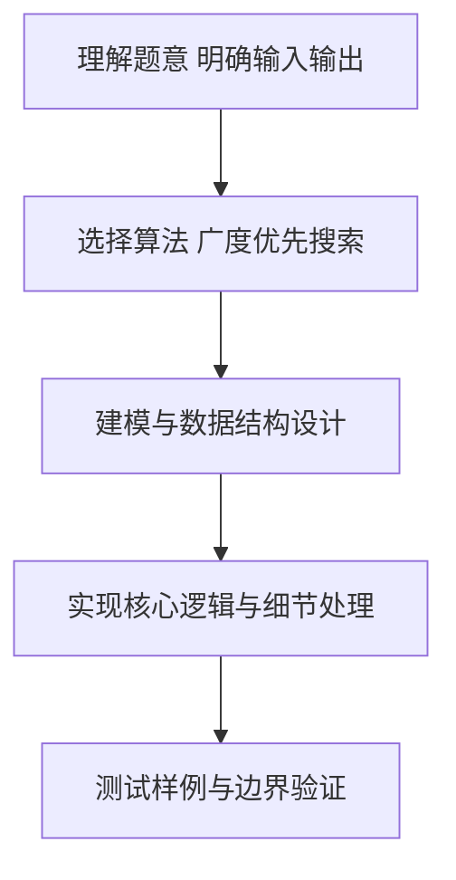

# L2-048 - 寻宝图（25 分）

- **时间限制**: 400 ms
- **内存限制**: 65536 KB
- **代码长度限制**: 16 KB

---

## 题目描述


给定一幅地图，其中有水域，有陆地。被水域完全环绕的陆地是岛屿。有些岛屿上埋藏有宝藏，这些有宝藏的点也被标记出来了。本题就请你统计一下，给定的地图上一共有多少岛屿，其中有多少是有宝藏的岛屿。

### 输入格式:

输入第一行给出 2 个正整数 $N$ 和 $M$（$1 < N\times M\le 10^5$），是地图的尺寸，表示地图由 $N$ 行 $M$ 列格子构成。随后 $N$ 行，每行给出 $M$ 位个位数，其中 `0` 表示水域，`1` 表示陆地，`2`\-`9` 表示宝藏。\
注意：两个格子共享一条边时，才是“相邻”的。宝藏都埋在陆地上。默认地图外围全是水域。

### 输出格式:

在一行中输出 2 个整数，分别是岛屿的总数量和有宝藏的岛屿的数量。

### 输入样例:
```in
10 11
01000000151
11000000111
00110000811
00110100010
00000000000
00000111000
00114111000
00110010000
00019000010
00120000001
```

### 输出样例:
```out
7 2
```

## 示例

### 示例 1

**输入:**
```
10 11
01000000151
11000000111
00110000811
00110100010
00000000000
00000111000
00114111000
00110010000
00019000010
00120000001
```

**输出:**
```
7 2
```

### 解题思路

本题要求根据给定的输入数据完成相应的判定或计算任务，以“L2-048_寻宝图”为核心，需在约束条件下构造出满足题意的结果。以 Lua 实现为参照，其实现原理概括为：对每个尚未访问的非 0 格子进行四方向 BFS，它对应一座岛屿。

在算法选型上，针对题目数据规模与结构特征，选择了 广度优先搜索 等关键技术。Lua 代码通过紧凑的表结构与迭代逻辑，将原理转化为可执行流程，既保证了正确性也兼顾了简洁性。例如代码中对输入的逐行解析、数据结构的初始化与核心循环的组织均体现了该思路。

关键在于细节处理与鲁棒性：如对空输入、重复键、边界值的正确处理，以及输出格式的精确控制。整体时间复杂度约为 O(N log N) 或 O(N)，空间复杂度 O(N)，满足题目限制（通常 1e5 级别可通过）。 结合 Lua 的快速 I/O 与表操作，能够在限制时间内完成判定并输出结果。
### 代码流程说明

1. 输入解析与预处理：按题面格式读取全部数据，将数值、字符串或图结构存入 Lua 表，必要时建立映射（如地址→节点、编号→集合）并处理边界空行。
2. 数据建模与初始化：将输入转化为内部模型（图、树、链表或数组），初始化距离、访问标记、计数器等辅助数组。
3. 搜索与统计：通过 DFS/BFS 遍历图或树结构，统计连通分量、深度或路径信息，并在遍历中更新最优解。
4. 结果输出与格式化：按要求的格式拼接输出（如保留两位小数、按编号排序、输出路径或分类结果），注意末尾空格与换行控制，确保与样例一致。

### 代码实现

```lua
-- L2-048 寻宝图
-- 实现原理：对每个尚未访问的非 0 格子进行四方向 BFS，它对应一座岛屿。
-- 搜索过程中若遇到字符 2.9，则该岛被标为藏宝岛。

local n, m = io.read("*n"), io.read("*n")
local grid = {}
for i = 1, n do grid[i] = io.read("*l") end
local seen, islands, treasure = {}, 0, 0
for i = 1, n do
    for j = 1, m do
        if grid[i]:sub(j, j) ~= "0" and not (seen[i] and seen[i][j]) then
            islands = islands + 1
            local queue, head, has = { { i, j } }, 1, false
            seen[i] = seen[i] or {}; seen[i][j] = true
            while head <= #queue do
                local x, y = queue[head][1], queue[head][2]; head = head + 1
                if grid[x]:sub(y, y) ~= "1" then has = true end
                for _, d in ipairs({ { 1, 0 }, { -1, 0 }, { 0, 1 }, { 0, -1 } }) do
                    local nx, ny = x + d[1], y + d[2]
                    if nx >= 1 and nx <= n and ny >= 1 and ny <= m and grid[nx]:sub(ny, ny) ~= "0"
                        and not (seen[nx] and seen[nx][ny]) then
                        seen[nx] = seen[nx] or {}; seen[nx][ny] = true
                        queue[#queue + 1] = { nx, ny }
                    end
                end
            end
            if has then treasure = treasure + 1 end
        end
    end
end
print(islands . " " . treasure)
```

### 代码流程图



### 解题流程图



