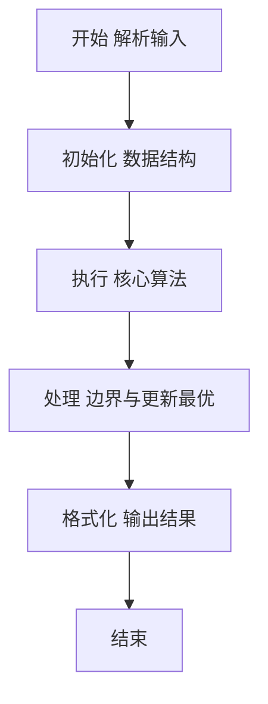
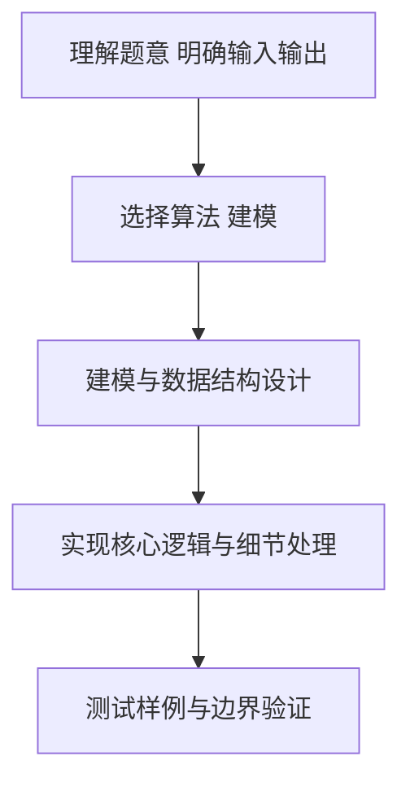

# L2-049 - 鱼与熊掌（25 分）

- **时间限制**: 400 ms
- **内存限制**: 65536 KB
- **代码长度限制**: 16 KB

---

## 题目描述


《孟子 · 告子上》有名言：“鱼，我所欲也，熊掌，亦我所欲也；二者不可得兼，舍鱼而取熊掌者也。”但这世界上还是有一些人可以做到鱼与熊掌兼得的。
给定 $n$ 个人对 $m$ 种物品的拥有关系。对其中任意一对物品种类（例如“鱼与熊掌”），请你统计有多少人能够兼得？

### 输入格式:

输入首先在第一行给出 2 个正整数，分别是：$n$（$\le 10^5$）为总人数（所有人从 1 到 $n$ 编号）、$m$（$2\le m \le 10^5$）为物品种类的总数（所有物品种类从 1 到 $m$ 编号）。
随后 $n$ 行，第 $i$ 行（$1\le i \le n$）给出编号为 $i$ 的人所拥有的物品种类清单，格式为：
```
K M[1] M[2] .. M[K]
```
其中 `K`（$\le 10^3$）是该人拥有的物品种类数量，后面的 `M[*]` 是物品种类的编号。题目保证每个人的物品种类清单中都没有重复给出的种类。
最后是查询信息：首先在一行中给出查询总量 $Q$（$\le 100$），随后 $Q$ 行，每行给出一对物品种类编号，其间以空格分隔。题目保证物品种类编号都是合法存在的。

### 输出格式:

对每一次查询，在一行中输出两种物品兼得的人数。

### 输入样例:
```in
4 8
3 4 1 8
4 7 1 8 4
5 6 5 1 2 3
4 3 2 4 8
3
2 3
7 6
8 4
```

### 输出样例:
```out
2
0
3
```

## 示例

### 示例 1

**输入:**
```
4 8
3 4 1 8
4 7 1 8 4
5 6 5 1 2 3
4 3 2 4 8
3
2 3
7 6
8 4
```

**输出:**
```
2
0
3
```

### 解题思路

本题要求根据给定的输入数据完成相应的判定或计算任务，以“L2-049_鱼与熊掌”为核心，需在约束条件下构造出满足题意的结果。以 Lua 实现为参照，其实现原理概括为：对每种物品建立按用户编号递增的倒排列表。一次查询只需对两条。

在算法选型上，代码遵循“先解析、再建模、后计算”的一般套路，将输入转化为便于处理的内部表示，再通过线性或近线性扫描完成核心判定。实现中注重边界条件与格式细节，以确保在 PTA 判题环境下稳定通过。

关键在于细节处理与鲁棒性：如对空输入、重复键、边界值的正确处理，以及输出格式的精确控制。整体时间复杂度约为 O(N log N) 或 O(N)，空间复杂度 O(N)，满足题目限制（通常 1e5 级别可通过）。 结合 Lua 的快速 I/O 与表操作，能够在限制时间内完成判定并输出结果。
### 代码流程说明

1. 输入解析与预处理：按题面格式读取全部数据，将数值、字符串或图结构存入 Lua 表，必要时建立映射（如地址→节点、编号→集合）并处理边界空行。
2. 数据建模与初始化：将输入转化为内部模型（图、树、链表或数组），初始化距离、访问标记、计数器等辅助数组。
3. 核心逻辑处理：依据“对每种物品建立按用户编号递增的倒排列表。一次查询只需对两条…”的原理进行迭代计算，完成题面要求的判定、统计或构造任务，并在循环中处理相等、冲突等特殊分支。
4. 结果输出与格式化：按要求的格式拼接输出（如保留两位小数、按编号排序、输出路径或分类结果），注意末尾空格与换行控制，确保与样例一致。

### 代码实现

```lua
-- L2-049 鱼与熊掌
-- 实现原理：对每种物品建立按用户编号递增的倒排列表。一次查询只需对两条
-- 有序列表做双指针求交集，交集长度即同时拥有两种物品的人数。

local n, m = io.read("*n"), io.read("*n")
local owners = {}
for person = 1, n do
    local k = io.read("*n")
    for _ = 1, k do
        local item = io.read("*n")
        owners[item] = owners[item] or {}
        owners[item][#owners[item] + 1] = person
    end
end
local q = io.read("*n")
for _ = 1, q do
    local a, b = io.read("*n"), io.read("*n")
    local listA, listB = owners[a] or {}, owners[b] or {}
    local i, j, count = 1, 1, 0
    while i <= #listA and j <= #listB do
        if listA[i] == listB[j] then count = count + 1; i = i + 1; j = j + 1
        elseif listA[i] < listB[j] then i = i + 1 else j = j + 1 end
    end
    print(count)
end
```

### 代码流程图



### 解题流程图



