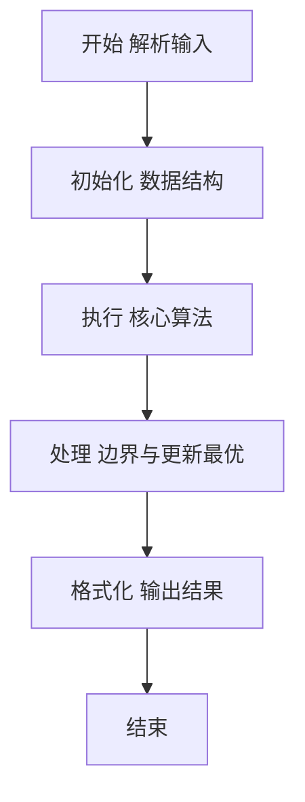
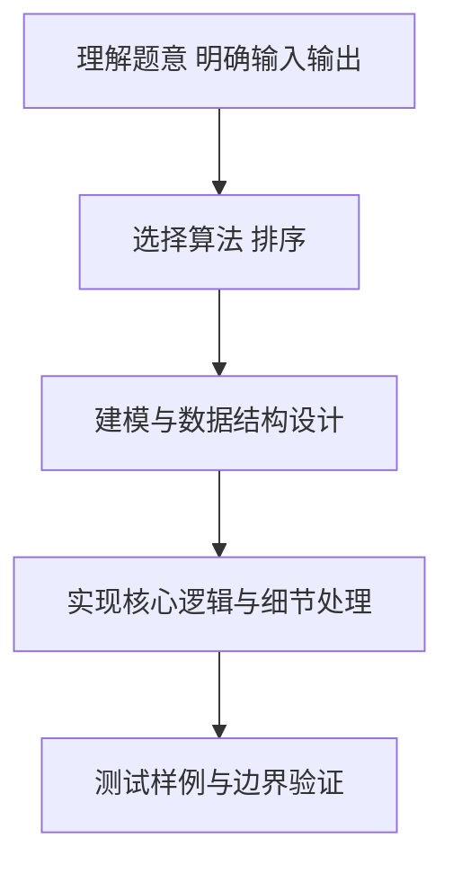

# L2-050 - 懂蛇语（25 分）

- **时间限制**: 400 ms
- **内存限制**: 65536 KB
- **代码长度限制**: 16 KB

---

## 题目描述


在《一年一度喜剧大赛》第二季中有一部作品叫《警察和我之蛇我其谁》，其中“毒蛇帮”内部用了一种加密语言，称为“蛇语”。蛇语的规则是，在说一句话 A 时，首先提取 A 的每个字的首字母，然后把整句话替换为另一句话 B，B 中每个字的首字母与 A 中提取出的字母依次相同。例如二当家说“九点下班哈”，对应首字母缩写是 `JDXBH`，他们解释为实际想说的是“京东新百货”……
本题就请你写一个蛇语的自动翻译工具，将输入的蛇语转换为实际要表达的句子。

### 输入格式:

输入第一行给出一个正整数 $$N$$（$$\le 10^5$$），为蛇语词典中句子的个数。随后 $$N$$ 行，每行用汉语拼音给出一句话。每句话由小写英文字母和空格组成，每个字的拼音由不超过 6 个小写英文字母组成，两个字的拼音之间用空格分隔。题目保证每句话总长度不超过 50 个字符，用回车结尾。注意：回车不算句中字符。
随后在一行中给出一个正整数 $$M$$（$$\le 10^3$$），为查询次数。后面跟 $$M$$ 行，每行用汉语拼音给出需要查询的一句话，格式同上。

### 输出格式:

对每一句查询，在一行中输出其对应的句子。如果句子不唯一，则按整句的字母序输出，句子间用 `|` 分隔。如果查不到，则将输入的句子原样输出。
注意：输出句子时，必须保持句中所有字符不变，包括空格。

### 输入样例:
```in
8
yong yuan de shen
yong yuan de she
jing dong xin bai huo
she yu wo ye hui shuo yi dian dian
liang wei bu yao chong dong
yi  dian dian
ni hui shuo she yu a
yong yuan de sha
7
jiu dian xia ban ha
shao ye wu ya he shui you dian duo
liu wan bu yao ci dao
ni hai shi su yan a
yao diao deng
sha ye ting bu jian
y y d s
```

### 输出样例:
```out
jing dong xin bai huo
she yu wo ye hui shuo yi dian dian
liang wei bu yao chong dong
ni hui shuo she yu a
yi  dian dian
sha ye ting bu jian
yong yuan de sha|yong yuan de she|yong yuan de shen
```

## 示例

### 示例 1

**输入:**
```
8
yong yuan de shen
yong yuan de she
jing dong xin bai huo
she yu wo ye hui shuo yi dian dian
liang wei bu yao chong dong
yi  dian dian
ni hui shuo she yu a
yong yuan de sha
7
jiu dian xia ban ha
shao ye wu ya he shui you dian duo
liu wan bu yao ci dao
ni hai shi su yan a
yao diao deng
sha ye ting bu jian
y y d s
```

**输出:**
```
jing dong xin bai huo
she yu wo ye hui shuo yi dian dian
liang wei bu yao chong dong
ni hui shuo she yu a
yi  dian dian
sha ye ting bu jian
yong yuan de sha|yong yuan de she|yong yuan de shen
```

### 解题思路

本题要求根据给定的输入数据完成相应的判定或计算任务，以“L2-050_懂蛇语”为核心，需在约束条件下构造出满足题意的结果。以 Lua 实现为参照，其实现原理概括为：一句话的“蛇语键”由各个非空单词的首字母串联而成。

在算法选型上，针对题目数据规模与结构特征，选择了 排序 等关键技术。Lua 代码通过紧凑的表结构与迭代逻辑，将原理转化为可执行流程，既保证了正确性也兼顾了简洁性。例如代码中对输入的逐行解析、数据结构的初始化与核心循环的组织均体现了该思路。

关键在于细节处理与鲁棒性：如对空输入、重复键、边界值的正确处理，以及输出格式的精确控制。整体时间复杂度约为 O(N log N) 或 O(N)，空间复杂度 O(N)，满足题目限制（通常 1e5 级别可通过）。 结合 Lua 的快速 I/O 与表操作，能够在限制时间内完成判定并输出结果。
### 代码流程说明

1. 输入解析与预处理：按题面格式读取全部数据，将数值、字符串或图结构存入 Lua 表，必要时建立映射（如地址→节点、编号→集合）并处理边界空行。
2. 数据组织与排序：对关键对象按指定关键字排序（如按单价、按得分、按字典序），或构建哈希表/集合以支持 O(1) 判重与统计。
3. 核心逻辑处理：依据“一句话的“蛇语键”由各个非空单词的首字母串联而成。…”的原理进行迭代计算，完成题面要求的判定、统计或构造任务，并在循环中处理相等、冲突等特殊分支。
4. 结果输出与格式化：按要求的格式拼接输出（如保留两位小数、按编号排序、输出路径或分类结果），注意末尾空格与换行控制，确保与样例一致。

### 代码实现

```lua
-- L2-050 懂蛇语
-- 实现原理：一句话的“蛇语键”由各个非空单词的首字母串联而成。
-- 用该键映射词典原句，查询时排序并用 | 连接所有同键句子；无键时原样输出。

local function keyOf(line)
    local out = {}
    for word in line:gmatch("%S+") do out[#out + 1] = word:sub(1, 1) end
    return table.concat(out)
end
local n = tonumber(io.read("*l"))
local dict = {}
for _ = 1, n do
    local line = io.read("*l")
    local key = keyOf(line)
    dict[key] = dict[key] or {}
    dict[key][#dict[key] + 1] = line
end
for _, list in pairs(dict) do table.sort(list) end
local q = tonumber(io.read("*l"))
for _ = 1, q do
    local line = io.read("*l")
    local list = dict[keyOf(line)]
    print(list and table.concat(list, "|") or line)
end
```

### 代码流程图



### 解题流程图



