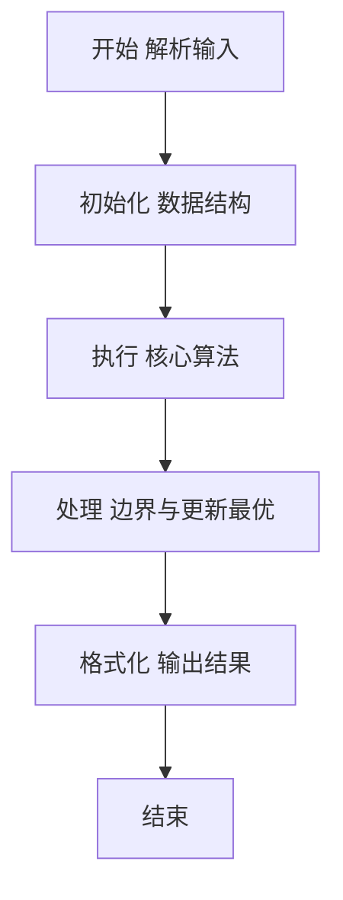
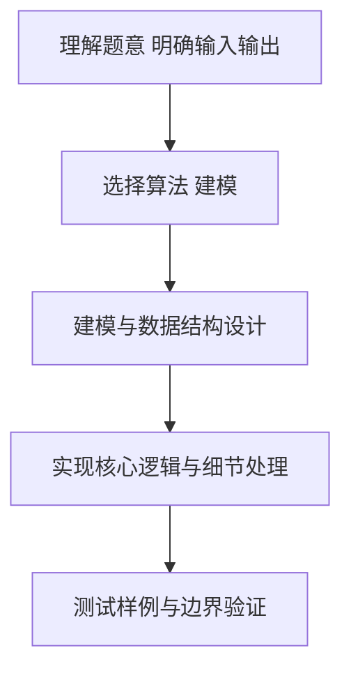

# L2-051 - 满树的遍历（25 分）

- **时间限制**: 400 ms
- **内存限制**: 65536 KB
- **代码长度限制**: 16 KB

---

## 题目描述


一棵“$k$ 阶满树”是指树中所有非叶结点的度都是 $k$ 的树。给定一棵树，你需要判断其是否为 $k$ 阶满树，并输出其前序遍历序列。

注：树中结点的度是其拥有的子树的个数，而树的度是树内各结点的度的最大值。

### 输入格式:

输入首先在第一行给出一个正整数 $n$（$\le 10^5$），是树中结点的个数。于是设所有结点从 1 到 $n$ 编号。
随后 $n$ 行，第 $i$ 行（$1\le i \le n$）给出第 $i$ 个结点的父结点编号。根结点没有父结点，则对应的父结点编号为 `0`。题目保证给出的是一棵合法多叉树，只有唯一根结点。

### 输出格式:

首先在一行中输出该树的度。如果输入的树是 $k$ 阶满树，则加 1 个空格后输出 `yes`，否则输出 `no`。最后在第二行输出该树的前序遍历序列，数字间以 1 个空格分隔，行首尾不得有多余空格。
注意：兄弟结点按编号升序访问。

### 输入样例 1：
```in
7
6
5
5
6
6
0
5
```

### 输出样例 1：
```out
3 yes
6 1 4 5 2 3 7
```

### 输入样例 2：
```in
7
6
5
5
6
6
0
4
```

### 输出样例 2：
```out
3 no
6 1 4 7 5 2 3
```

## 示例

### 示例 1

**输入:**
```
7
6
5
5
6
6
0
5
```

**输出:**
```
3 yes
6 1 4 5 2 3 7
```

### 示例 2

**输入:**
```
7
6
5
5
6
6
0
4
```

**输出:**
```
3 no
6 1 4 7 5 2 3
```

### 解题思路

本题要求根据给定的输入数据完成相应的判定或计算任务，以“L2-051_满树的遍历”为核心，需在约束条件下构造出满足题意的结果。以 Lua 实现为参照，其实现原理概括为：由父编号反建有序孩子表，最大孩子数是树的度；所有非叶节点的。

在算法选型上，代码遵循“先解析、再建模、后计算”的一般套路，将输入转化为便于处理的内部表示，再通过线性或近线性扫描完成核心判定。实现中注重边界条件与格式细节，以确保在 PTA 判题环境下稳定通过。

关键在于细节处理与鲁棒性：如对空输入、重复键、边界值的正确处理，以及输出格式的精确控制。整体时间复杂度约为 O(N log N) 或 O(N)，空间复杂度 O(N)，满足题目限制（通常 1e5 级别可通过）。 结合 Lua 的快速 I/O 与表操作，能够在限制时间内完成判定并输出结果。
### 代码流程说明

1. 输入解析与预处理：按题面格式读取全部数据，将数值、字符串或图结构存入 Lua 表，必要时建立映射（如地址→节点、编号→集合）并处理边界空行。
2. 辅助结构初始化：初始化栈/队列等辅助容器，设定容量限制与指针位置，为后续模拟操作准备状态。
3. 核心逻辑处理：依据“由父编号反建有序孩子表，最大孩子数是树的度；所有非叶节点的…”的原理进行迭代计算，完成题面要求的判定、统计或构造任务，并在循环中处理相等、冲突等特殊分支。
4. 结果输出与格式化：按要求的格式拼接输出（如保留两位小数、按编号排序、输出路径或分类结果），注意末尾空格与换行控制，确保与样例一致。

### 代码实现

```lua
-- L2-051 满树的遍历
-- 实现原理：由父编号反建有序孩子表，最大孩子数是树的度；所有非叶节点的
-- 孩子数都等于该度时为满树。用栈按孩子倒序压入即可得到前序遍历。

local n = io.read("*n")
local children, root = {}, nil
for i = 1, n do
    local p = io.read("*n")
    if p == 0 then root = i else children[p] = children[p] or {}; children[p][#children[p] + 1] = i end
end
local degree = 0
for i = 1, n do degree = math.max(degree, #(children[i] or {})) end
local full = true
for i = 1, n do if #(children[i] or {}) > 0 and #(children[i] or {}) ~= degree then full = false end end
local order, stack = {}, { root }
while #stack > 0 do
    local x = stack[#stack]; stack[#stack] = nil; order[#order + 1] = x
    local list = children[x] or {}
    for i = #list, 1, -1 do stack[#stack + 1] = list[i] end
end
print(degree . (full and " yes" or " no"))
print(table.concat(order, " "))
```

### 代码流程图



### 解题流程图



