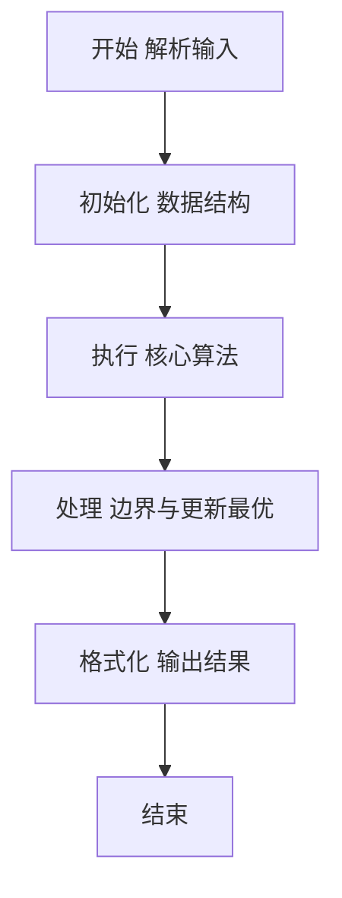
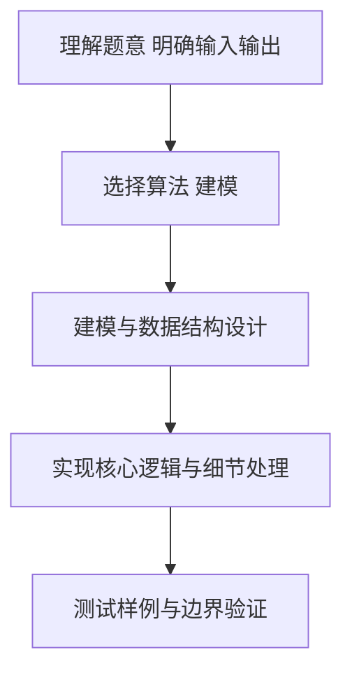

# L2-052 - 吉利矩阵（25 分）

- **时间限制**: 1000 ms
- **内存限制**: 65536 KB
- **代码长度限制**: 16 KB

---

## 题目描述


所有元素为非负整数，且各行各列的元素和都等于 $7$ 的 $3 \times 3$ 方阵称为“吉利矩阵”，因为这样的矩阵一共有 $666$ 种。
本题就请你统计一下，把 $7$ 换成任何一个 $[2, 9]$ 区间内的正整数 $L$，把矩阵阶数换成任何一个 $[2, 4]$ 区间内的正整数 $N$，满足条件“所有元素为非负整数，且各行各列的元素和都等于 $L$”的 $N \times N$ 方阵一共有多少种？

### 输入格式:

输入在一行中给出 2 个正整数 $L$ 和 $N$，意义如题面所述。数字间以空格分隔。

### 输出格式:

在一行中输出满足题目要求条件的方阵的个数。

### 输入样例:
```in
7 3
```

### 输出样例:
```out
666
```

## 示例

### 示例 1

**输入:**
```
7 3
```

**输出:**
```
666
```

### 解题思路

本题要求根据给定的输入数据完成相应的判定或计算任务，以“L2-052_吉利矩阵”为核心，需在约束条件下构造出满足题意的结果。以 Lua 实现为参照，其实现原理概括为：逐行分配每列剩余和。前 N-1 行的每行都是把 L 拆分到 N 个列中，。

在算法选型上，代码遵循“先解析、再建模、后计算”的一般套路，将输入转化为便于处理的内部表示，再通过线性或近线性扫描完成核心判定。实现中注重边界条件与格式细节，以确保在 PTA 判题环境下稳定通过。

关键在于细节处理与鲁棒性：如对空输入、重复键、边界值的正确处理，以及输出格式的精确控制。整体时间复杂度约为 O(N log N) 或 O(N)，空间复杂度 O(N)，满足题目限制（通常 1e5 级别可通过）。 结合 Lua 的快速 I/O 与表操作，能够在限制时间内完成判定并输出结果。
### 代码流程说明

1. 输入解析与预处理：按题面格式读取全部数据，将数值、字符串或图结构存入 Lua 表，必要时建立映射（如地址→节点、编号→集合）并处理边界空行。
2. 数据建模与初始化：将输入转化为内部模型（图、树、链表或数组），初始化距离、访问标记、计数器等辅助数组。
3. 核心逻辑处理：依据“逐行分配每列剩余和。前 N-1 行的每行都是把 L 拆分到 N 个列中，…”的原理进行迭代计算，完成题面要求的判定、统计或构造任务，并在循环中处理相等、冲突等特殊分支。
4. 结果输出与格式化：按要求的格式拼接输出（如保留两位小数、按编号排序、输出路径或分类结果），注意末尾空格与换行控制，确保与样例一致。

### 代码实现

```lua
-- L2-052 吉利矩阵
-- 实现原理：逐行分配每列剩余和。前 N-1 行的每行都是把 L 拆分到 N 个列中，
-- 且不超过列剩余量；最后一行由剩余列和唯一确定。记忆化避免重复状态。

local l, n = io.read("*n"), io.read("*n")
local memo = {}
local function solve(row, rem)
    if row == n then return 1 end
    local key = row . ":" . table.concat(rem, ",")
    if memo[key] then return memo[key] end
    local total = 0
    local function distribute(col, left, nextRem)
        if col == n then
            if left <= rem[col] then
                nextRem[col] = rem[col] - left
                total = total + solve(row + 1, nextRem)
            end
            return
        end
        for value = 0, math.min(left, rem[col]) do
            nextRem[col] = rem[col] - value
            distribute(col + 1, left - value, nextRem)
        end
    end
    distribute(1, l, {})
    memo[key] = total
    return total
end
local remaining = {}
for i = 1, n do remaining[i] = l end
print(solve(1, remaining))
```

### 代码流程图



### 解题流程图



