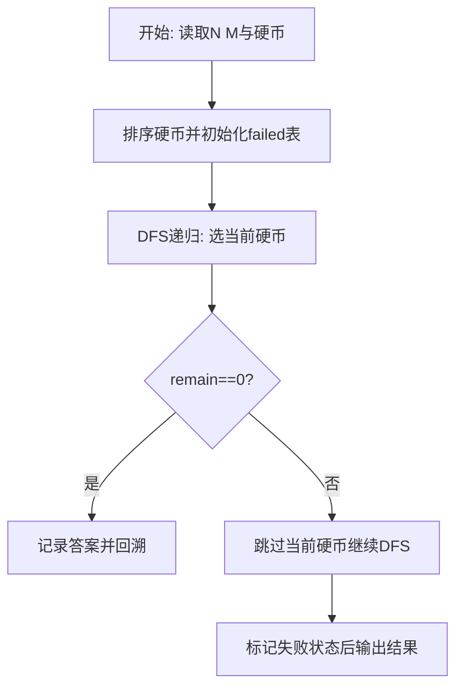
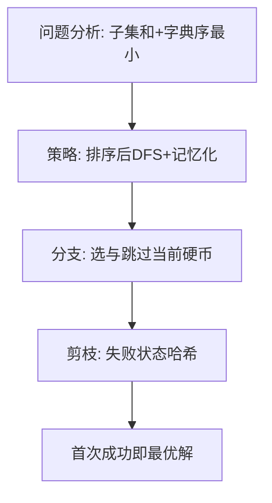

# L3-001 - 凑零钱（30 分）

- **时间限制**: 300 ms
- **内存限制**: 65536 KB
- **代码长度限制**: 16 KB

---

## 题目描述


韩梅梅喜欢满宇宙到处逛街。现在她逛到了一家火星店里，发现这家店有个特别的规矩：你可以用任何星球的硬币付钱，但是绝不找零，当然也不能欠债。韩梅梅手边有 $10^4$ 枚来自各个星球的硬币，需要请你帮她盘算一下，是否可能精确凑出要付的款额。

### 输入格式:

输入第一行给出两个正整数：$N$（$\le 10^4$）是硬币的总个数，$M$（$\le 10^2$）是韩梅梅要付的款额。第二行给出 $N$ 枚硬币的正整数面值。数字间以空格分隔。

### 输出格式:

在一行中输出硬币的面值 $V_1 \le V_2 \le \cdots \le V_k$，满足条件 $V_1 + V_2 + ... + V_k = M$。数字间以 1 个空格分隔，行首尾不得有多余空格。若解不唯一，则输出最小序列。若无解，则输出 `No Solution`。

注：我们说序列{ $A[1], A[2], \cdots$ }比{ $B[1], B[2], \cdots$ }“小”，是指存在 $k \ge 1$ 使得 $A[i]=B[i]$ 对所有 $i < k$ 成立，并且 $A[k] < B[k]$。

### 输入样例 1：
```in
8 9
5 9 8 7 2 3 4 1
```

### 输出样例 1：
```out
1 3 5
```

### 输入样例 2：
```in
4 8
7 2 4 3
```

### 输出样例 2：
```out
No Solution
```

## 示例

### 示例 1

**输入:**
```
8 9
5 9 8 7 2 3 4 1
```

**输出:**
```
1 3 5
```

### 示例 2

**输入:**
```
4 8
7 2 4 3
```

**输出:**
```
No Solution
```

### 解题思路

本题需在指数级搜索空间中找到满足约束且字典序最小的解，适合深度优先搜索配合剪枝。L3-001 凑零钱 实现原理：面额排序后，深度优先按“选当前硬币、跳过当前硬币”的顺序搜索， 并记忆 (下标,剩余金额)。结合输入规模与输出要求，需要兼顾正确性与时间复杂度。

算法选用深度优先搜索按“选当前元素 / 跳过当前元素”的分支顺序展开，并在状态 `(下标, 剩余量)` 上做记忆化去重以避免重复搜索。由于硬币已按升序排列，首次到达 `remain==0` 的路径即为题目定义的字典序最小解，搜索过程中一旦命中已失败的状态则立即回溯，显著削减无效分支。

### 代码流程说明

1. 读取 N 与目标 M，过滤大于 M 的硬币后存入 `coins` 并升序 `table.sort`，准备记忆表 `failed` 与答案 `answer`。
2. 定义递归 `dfs(i, remain, chosen)`：若 `remain==0` 则深拷贝当前选择为答案并返回真；若越界或 `remain<0` 返回假。
3. 用 `key=i:remain` 查 `failed` 剪枝，先尝试选 `coins[i]` 递归，再回溯跳过该硬币再次递归，失败则标记 `failed[key]=true`。
4. 从 `dfs(1,target,{})` 启动，成功则 `table.concat(answer," ")` 输出否则输出 `No Solution`。

### 代码实现

```lua
-- L3-001 凑零钱
-- 实现原理：面额排序后，深度优先按“选当前硬币、跳过当前硬币”的顺序搜索，
-- 并记忆 (下标,剩余金额)。首次找到的解即为题目要求的最小字典序解。

local n, target = io.read("*n"), io.read("*n")
local coins = {}
for _ = 1, n do local x = io.read("*n"); if x <= target then coins[#coins + 1] = x end end
table.sort(coins)
local failed, answer = {}, nil
local function dfs(i, remain, chosen)
    if remain == 0 then answer = {}; for j, x in ipairs(chosen) do answer[j] = x end; return true end
    if i > #coins or remain < 0 then return false end
    local key = i .. ":" .. remain
    if failed[key] then return false end
    chosen[#chosen + 1] = coins[i]
    if dfs(i + 1, remain - coins[i], chosen) then return true end
    chosen[#chosen] = nil
    if dfs(i + 1, remain, chosen) then return true end
    failed[key] = true
    return false
end
if dfs(1, target, {}) then print(table.concat(answer, " ")) else print("No Solution") end
```

### 代码流程图



### 解题流程图


