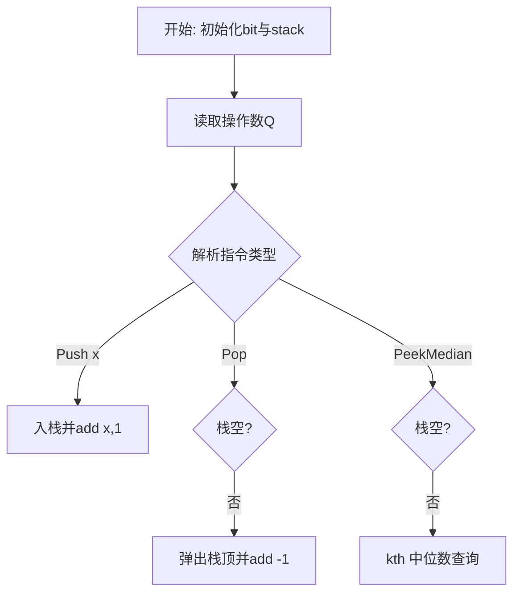
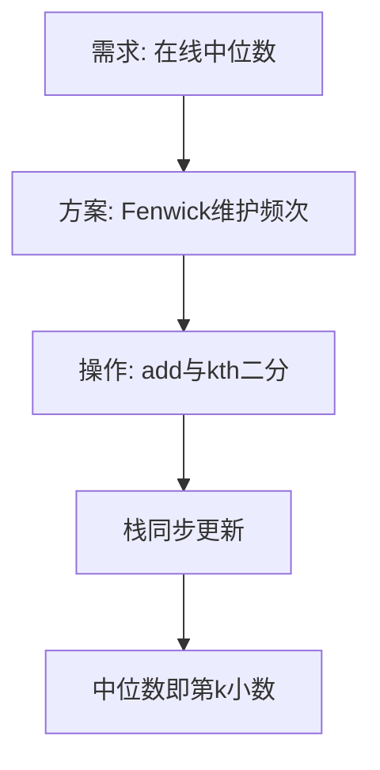

# L3-002 - 特殊堆栈（30 分）

- **时间限制**: 400 ms
- **内存限制**: 65536 KB
- **代码长度限制**: 16 KB

---

## 题目描述


堆栈是一种经典的后进先出的线性结构，相关的操作主要有“入栈”（在堆栈顶插入一个元素）和“出栈”（将栈顶元素返回并从堆栈中删除）。本题要求你实现另一个附加的操作：“取中值”——即返回所有堆栈中元素键值的中值。给定 N 个元素，如果 N 是偶数，则中值定义为第 N/2 小元；若是奇数，则为第 (N+1)/2 小元。

### 输入格式:

输入的第一行是正整数 N（$\le 10^5$）。随后 N 行，每行给出一句指令，为以下 3 种之一：

```
Push key
Pop
PeekMedian
```

其中 `key` 是不超过 $10^5$ 的正整数；`Push` 表示“入栈”；`Pop` 表示“出栈”；`PeekMedian` 表示“取中值”。

### 输出格式:

对每个 `Push` 操作，将 `key` 插入堆栈，无需输出；对每个 `Pop` 或 `PeekMedian` 操作，在一行中输出相应的返回值。若操作非法，则对应输出 `Invalid`。

### 输入样例:
```in
17
Pop
PeekMedian
Push 3
PeekMedian
Push 2
PeekMedian
Push 1
PeekMedian
Pop
Pop
Push 5
Push 4
PeekMedian
Pop
Pop
Pop
Pop
```

### 输出样例:
```out
Invalid
Invalid
3
2
2
1
2
4
4
5
3
Invalid
```

## 示例

### 示例 1

**输入:**
```
17
Pop
PeekMedian
Push 3
PeekMedian
Push 2
PeekMedian
Push 1
PeekMedian
Pop
Pop
Push 5
Push 4
PeekMedian
Pop
Pop
Pop
Pop
```

**输出:**
```
Invalid
Invalid
3
2
2
1
2
4
4
5
3
Invalid
```

### 解题思路

本题要求在动态栈上支持中位数查询，核心是在线维护多重集合的顺序统计。L3-002 特殊堆栈 实现原理：一个数组维护真实栈，Fenwick 树维护所有键值的出现次数。结合输入规模与输出要求，需要兼顾正确性与时间复杂度。

算法选用 Fenwick 树（树状数组）维护值域上各键值的频次。`add(x, delta)` 在 O(log MAX) 内更新，`kth(k)` 通过二进制倍增在 Fenwick 上二分查找第 k 小元素，恰好对应栈的中位数定义。真实栈用普通数组维护入栈/出栈，Fenwick 保证中位数查询与 Pop 操作均保持对数复杂度。

### 代码流程说明

1. 读取操作数 Q 并初始化 `maxKey=100000` 的 Fenwick 数组 `bit` 与真实栈 `stack`，定义 `add(i,delta)` 与 `kth(k)` 两个核心函数。
2. 逐行解析指令：`Push x` 则入栈并 `add(x,1)`；`Pop` 与 `PeekMedian` 先判空输出 `Invalid`。
3. Pop 时取栈顶值 `v` 并 `add(v,-1)` 后输出；PeekMedian 时计算 `k=(#stack+1)//2` 并调用 `kth(k)` 输出第 k 小即中位数。
4. 循环结束后所有操作均在 O(log MAX) 内完成，整体保持对数复杂度与正确性。

### 代码实现

```lua
-- L3-002 特殊堆栈
-- 实现原理：一个数组维护真实栈，Fenwick 树维护所有键值的出现次数。
-- Fenwick 前缀和的二分查找能在 O(log MAX) 找到第 k 小数，从而得到中位数。

local maxKey, bit, stack = 100000, {}, {}
local function add(i, delta) while i <= maxKey do bit[i] = (bit[i] or 0) + delta; i = i + (i & -i) end end
local function kth(k)
    local idx, step = 0, 1
    while step * 2 <= maxKey do step = step * 2 end
    while step > 0 do
        local nextIndex = idx + step
        if nextIndex <= maxKey and (bit[nextIndex] or 0) < k then k = k - (bit[nextIndex] or 0); idx = nextIndex end
        step = math.floor(step / 2)
    end
    return idx + 1
end
local q = tonumber(io.read("*l"))
for _ = 1, q do
    local line = io.read("*l")
    local x = line:match("Push (%d+)")
    if x then x = tonumber(x); stack[#stack + 1] = x; add(x, 1)
    elseif #stack == 0 then print("Invalid")
    elseif line == "Pop" then local v = stack[#stack]; stack[#stack] = nil; add(v, -1); print(v)
    else print(kth(math.floor((#stack + 1) / 2))) end
end
```

### 代码流程图



### 解题流程图


