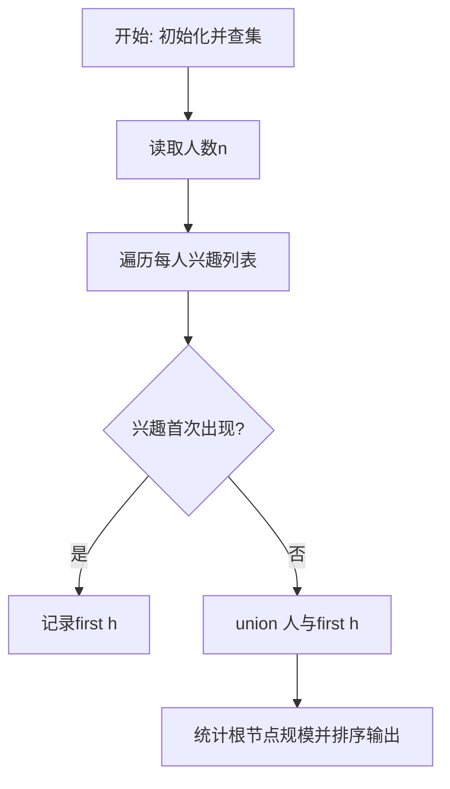
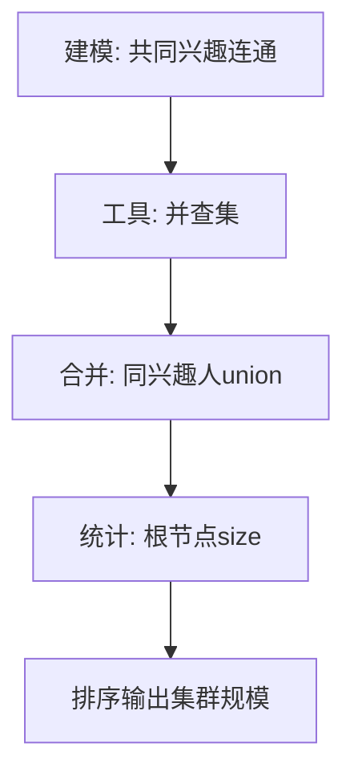

# L3-003 - 社交集群（30 分）

- **时间限制**: 1200 ms
- **内存限制**: 65536 KB
- **代码长度限制**: 16 KB

---

## 题目描述


当你在社交网络平台注册时，一般总是被要求填写你的个人兴趣爱好，以便找到具有相同兴趣爱好的潜在的朋友。一个“社交集群”是指部分兴趣爱好相同的人的集合。你需要找出所有的社交集群。

### 输入格式:

输入在第一行给出一个正整数 N（$$\le 1000$$），为社交网络平台注册的所有用户的人数。于是这些人从 1 到 N 编号。随后 N 行，每行按以下格式给出一个人的兴趣爱好列表：

$$K_i$$: $$h_i[1]$$ $$h_i[2]$$ ... $$h_i[K_i]$$

其中$$K_i (>0)$$是兴趣爱好的个数，$$h_i[j]$$是第$$j$$个兴趣爱好的编号，为区间 [1, 1000] 内的整数。

### 输出格式:

首先在一行中输出不同的社交集群的个数。随后第二行按非增序输出每个集群中的人数。数字间以一个空格分隔，行末不得有多余空格。

### 输入样例:
```in
8
3: 2 7 10
1: 4
2: 5 3
1: 4
1: 3
1: 4
4: 6 8 1 5
1: 4
```

### 输出样例:
```out
3
4 3 1
```

## 示例

### 示例 1

**输入:**
```
8
3: 2 7 10
1: 4
2: 5 3
1: 4
1: 3
1: 4
4: 6 8 1 5
1: 4
```

**输出:**
```
3
4 3 1
```

### 解题思路

本题本质是根据共同兴趣对人员分组的连通性问题。L3-003 社交集群 实现原理：拥有同一兴趣的人属于同一连通集群，故将他们在并查集中合并。结合输入规模与输出要求，需要兼顾正确性与时间复杂度。

算法选用并查集维护人的连通关系。对同一兴趣首次出现的人记录 `first[兴趣]`，后续出现该兴趣的人直接与首次记录者合并，路径压缩与按大小合并保证近常数时间。遍历所有人后，统计每个根节点的集合大小并降序排序，即可得到全部社交集群的规模。

### 代码流程说明

1. 读取人数 n，初始化并查集 `parent[i]=i, size[i]=1` 与兴趣首次出现表 `first`。
2. 对每个人解析 `k: h1 h2 ...`，跳过首个数字后对每个兴趣 h 若 `first[h]` 已存在则 `union(person, first[h])` 否则记录。
3. 遍历 1..n 统计根节点：`find(i)==i` 时收集 `size[i]` 为集群规模，存入 `groups` 数组。
4. 对 `groups` 按降序排序并输出集群数量与规模序列，完成社交集群划分。

### 代码实现

```lua
-- L3-003 社交集群
-- 实现原理：拥有同一兴趣的人属于同一连通集群，故将他们在并查集中合并。
-- 统计各根节点人数后按非增序输出，即得到所有集群规模。

local n = tonumber(io.read("*l"))
local parent, size, first = {}, {}, {}
for i = 1, n do parent[i], size[i] = i, 1 end
local function find(x) if parent[x] ~= x then parent[x] = find(parent[x]) end; return parent[x] end
local function union(a, b) a, b = find(a), find(b); if a ~= b then parent[a] = b; size[b] = size[b] + size[a] end end
for person = 1, n do
    local line = io.read("*l")
    local k = tonumber(line:match("^(%d+):"))
    local count = 0
    for h in line:gmatch("%d+") do
        if count > 0 then h = tonumber(h); if first[h] then union(person, first[h]) else first[h] = person end end
        count = count + 1
    end
end
local groups = {}
for i = 1, n do if find(i) == i then groups[#groups + 1] = size[i] end end
table.sort(groups, function(a, b) return a > b end)
print(#groups)
print(table.concat(groups, " "))
```

### 代码流程图



### 解题流程图


