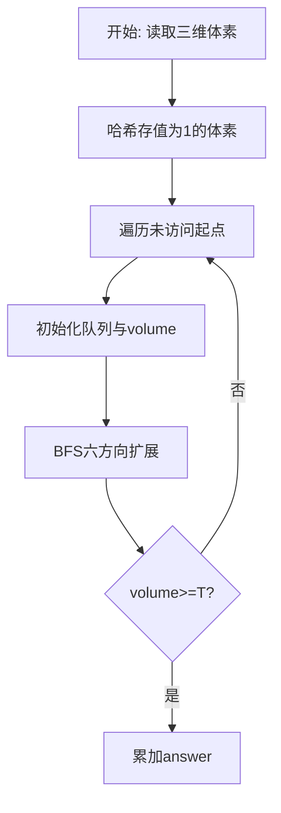
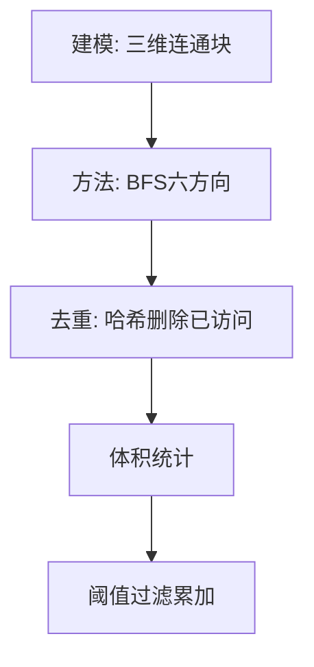

# L3-004 - 肿瘤诊断（30 分）

- **时间限制**: 600 ms
- **内存限制**: 65536 KB
- **代码长度限制**: 16 KB

---

## 题目描述


在诊断肿瘤疾病时，计算肿瘤体积是很重要的一环。给定病灶扫描切片中标注出的疑似肿瘤区域，请你计算肿瘤的体积。

### 输入格式:

输入第一行给出4个正整数：$$M$$、$$N$$、$$L$$、$$T$$，其中$$M$$和$$N$$是每张切片的尺寸（即每张切片是一个$$M\times N$$的像素矩阵。最大分辨率是$$1286\times 128$$）；$$L$$（$$\le 60$$）是切片的张数；$$T$$是一个整数阈值（若疑似肿瘤的连通体体积小于$$T$$，则该小块忽略不计）。

最后给出$$L$$张切片。每张用一个由0和1组成的$$M\times N$$的矩阵表示，其中1表示疑似肿瘤的像素，0表示正常像素。由于切片厚度可以认为是一个常数，于是我们只要数连通体中1的个数就可以得到体积了。麻烦的是，可能存在多个肿瘤，这时我们只统计那些体积不小于$$T$$的。两个像素被认为是“连通的”，如果它们有一个共同的切面，如下图所示，所有6个红色的像素都与蓝色的像素连通。


### 输出格式:

在一行中输出肿瘤的总体积。

### 输入样例:
```in
3 4 5 2
1 1 1 1
1 1 1 1
1 1 1 1
0 0 1 1
0 0 1 1
0 0 1 1
1 0 1 1
0 1 0 0
0 0 0 0
1 0 1 1
0 0 0 0
0 0 0 0
0 0 0 1
0 0 0 1
1 0 0 0
```

### 输出样例:
```out
26
```

## 示例

### 示例 1

**输入:**
```
3 4 5 2
1 1 1 1
1 1 1 1
1 1 1 1
0 0 1 1
0 0 1 1
0 0 1 1
1 0 1 1
0 1 0 0
0 0 0 0
1 0 1 1
0 0 0 0
0 0 0 0
0 0 0 1
0 0 0 1
1 0 0 0
```

**输出:**
```
26
```

### 解题思路

本题是无权图/网格上的连通或可达性问题，天然适合广度优先搜索逐层扩散。L3-004 肿瘤诊断 实现原理：把值为 1 的体素存入集合，对每个未访问体素进行六方向 BFS。结合输入规模与输出要求，需要兼顾正确性与时间复杂度。

算法选用广度优先搜索在网格/图上按六邻接或四邻接逐层扩展。把值为 1 的体素或可达节点入队，已访问节点从集合中删除以去重，队列头指针模拟 FIFO，累计连通块体积后与阈值比较决定是否计入答案，确保每个体素仅被访问一次。

### 代码流程说明

1. 读取三维尺寸 `m n layers` 与阈值 `threshold`，将所有值为 1 的体素用 `key(x,y,z)` 存入哈希 `filled`。
2. 遍历 `filled` 的每个未访问起点，初始化队列 `queue` 与头指针 `head`、体积 `volume=0`，并标记起点已访问。
3. BFS 循环中弹出队首体素，对六个方向 `(±1,0,0),(0,±1,0),(0,0,±1)` 探测邻接体素，合法且未访问则入队并删除集合标记。
4. 连通块结束后若 `volume >= threshold` 则累加至 `answer`，全部块处理完输出 `answer`。

### 代码实现

```lua
-- L3-004 肿瘤诊断
-- 实现原理：把值为 1 的体素存入集合，对每个未访问体素进行六方向 BFS。
-- 一个连通块的体素数量即为体积，只有体积不少于阈值 T 的块才计入答案。

local m, n, layers, threshold = io.read("*n"), io.read("*n"), io.read("*n"), io.read("*n")
local filled = {}
local function key(x, y, z) return (z * m + x) * n + y end
for z = 0, layers - 1 do
    for x = 0, m - 1 do
        for y = 0, n - 1 do
            if io.read("*n") == 1 then filled[key(x, y, z)] = { x, y, z } end
        end
    end
end
local answer = 0
for startKey, start in pairs(filled) do
    if filled[startKey] then
        local queue, head, volume = { start }, 1, 0
        filled[startKey] = nil
        while head <= #queue do
            local x, y, z = queue[head][1], queue[head][2], queue[head][3]
            head, volume = head + 1, volume + 1
            for _, d in ipairs({ { 1, 0, 0 }, { -1, 0, 0 }, { 0, 1, 0 }, { 0, -1, 0 }, { 0, 0, 1 }, { 0, 0, -1 } }) do
                local nx, ny, nz = x + d[1], y + d[2], z + d[3]
                if nx >= 0 and nx < m and ny >= 0 and ny < n and nz >= 0 and nz < layers then
                    local k = key(nx, ny, nz)
                    if filled[k] then filled[k] = nil; queue[#queue + 1] = { nx, ny, nz } end
                end
            end
        end
        if volume >= threshold then answer = answer + volume end
    end
end
print(answer)
```

### 代码流程图



### 解题流程图


