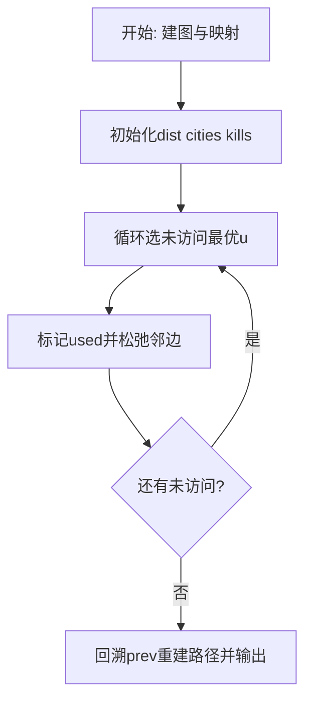
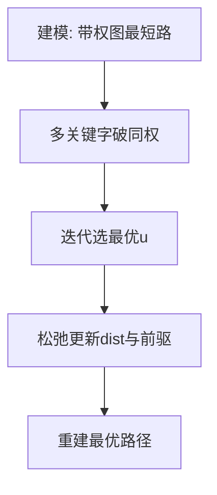

# L3-005 - 垃圾箱分布（30 分）

- **时间限制**: 200 ms
- **内存限制**: 65536 KB
- **代码长度限制**: 16 KB

---

## 题目描述


大家倒垃圾的时候，都希望垃圾箱距离自己比较近，但是谁都不愿意守着垃圾箱住。所以垃圾箱的位置必须选在到所有居民点的最短距离最长的地方，同时还要保证每个居民点都在距离它一个不太远的范围内。

现给定一个居民区的地图，以及若干垃圾箱的候选地点，请你推荐最合适的地点。如果解不唯一，则输出到所有居民点的平均距离最短的那个解。如果这样的解还是不唯一，则输出编号最小的地点。

### 输入格式:

输入第一行给出4个正整数：$N$（$\le 10^3$）是居民点的个数；$M$（$\le 10$）是垃圾箱候选地点的个数；$K$（$\le 10^4$）是居民点和垃圾箱候选地点之间的道路的条数；$D_S$是居民点与垃圾箱之间不能超过的最大距离。所有的居民点从1到$N$编号，所有的垃圾箱候选地点从$G1$到$GM$编号。

随后$K$行，每行按下列格式描述一条道路：
```
P1 P2 Dist
```
其中`P1`和`P2`是道路两端点的编号，端点可以是居民点，也可以是垃圾箱候选点。`Dist`是道路的长度，是一个正整数。

### 输出格式:

首先在第一行输出最佳候选地点的编号。然后在第二行输出该地点到所有居民点的最小距离和平均距离。数字间以空格分隔，保留小数点后1位。如果解不存在，则输出`No Solution`。

### 输入样例 1：
```in
4 3 11 5
1 2 2
1 4 2
1 G1 4
1 G2 3
2 3 2
2 G2 1
3 4 2
3 G3 2
4 G1 3
G2 G1 1
G3 G2 2
```

### 输出样例 1：
```out
G1
2.0 3.3
```

### 输入样例 2：
```in
2 1 2 10
1 G1 9
2 G1 20
```

### 输出样例 2：
```out
No Solution
```

## 示例

### 示例 1

**输入:**
```
4 3 11 5
1 2 2
1 4 2
1 G1 4
1 G2 3
2 3 2
2 G2 1
3 4 2
3 G3 2
4 G1 3
G2 G1 1
G3 G2 2
```

**输出:**
```
G1
2.0 3.3
```

### 示例 2

**输入:**
```
2 1 2 10
1 G1 9
2 G1 20
```

**输出:**
```
No Solution
```

### 解题思路

本题是带权图上的最优化路径/选址问题，需要多次求源点到其余点的最短距离。L3-005 垃圾箱分布 实现原理：分别从每个垃圾箱候选点运行 Dijkstra，取得其到所有居民的最短路。结合输入规模与输出要求，需要兼顾正确性与时间复杂度。

算法选用 Dijkstra 最短路算法，针对不同优化目标定制比较关键字：如按“时间优先、距离次之”或“距离优先、节点数次之”，并在距离相等时引入第二、第三关键字破同权。每次从未访问集合中选出当前最优节点松弛邻边，记录前驱以重建路径，适用于非负权图。

### 代码流程说明

1. 解析顶点数、边数及起点终点映射，建立邻接表 `graph` 并读入带权边与敌人数 `enemy`。
2. 初始化 `dist/cities/kills/prev/used` 数组，起点距离 0、城市数 0，其余为无穷/负无穷。
3. 循环 n 次选未访问且距离最小（同距按城市数、歼敌数破同权）的 `u`，标记已访问后松弛其邻边更新多关键字最优值与前驱。
4. 从 `target` 回溯 `prev` 链重建路径字符串，并输出路径、`cities[target] dist[target] kills[target]` 三元组。

### 代码实现

```lua
-- L3-005 垃圾箱分布
-- 实现原理：分别从每个垃圾箱候选点运行 Dijkstra，取得其到所有居民的最短路。
-- 合法候选按最小距离最大、平均距离最小、编号最小依次比较。

local n, m, k, limit = io.read("*n"), io.read("*n"), io.read("*n"), io.read("*n")
local total, graph = n + m, {}
for i = 1, total do graph[i] = {} end
local function idOf(s) local x = s:match("G(%d+)"); return x and n + tonumber(x) or tonumber(s) end
for _ = 1, k do
    local a, b, d = idOf(io.read("*s")), idOf(io.read("*s")), io.read("*n")
    graph[a][#graph[a] + 1] = { b, d }; graph[b][#graph[b] + 1] = { a, d }
end
local best = nil
for source = n + 1, n + m do
    local dist, used = {}, {}
    for i = 1, total do dist[i] = math.huge end
    dist[source] = 0
    for _ = 1, total do
        local u = nil
        for i = 1, total do if not used[i] and (not u or dist[i] < dist[u]) then u = i end end
        if not u or dist[u] == math.huge then break end
        used[u] = true
        for _, e in ipairs(graph[u]) do if dist[e[1]] > dist[u] + e[2] then dist[e[1]] = dist[u] + e[2] end end
    end
    local minD, sum, ok = math.huge, 0, true
    for i = 1, n do if dist[i] > limit then ok = false; break end; minD = math.min(minD, dist[i]); sum = sum + dist[i] end
    if ok and (not best or minD > best.minD or (minD == best.minD and sum < best.sum)) then best = { id = source, minD = minD, sum = sum } end
end
if not best then print("No Solution") else print("G" .. (best.id - n)); print(string.format("%.1f %.1f", best.minD, best.sum / n)) end
```

### 代码流程图



### 解题流程图


